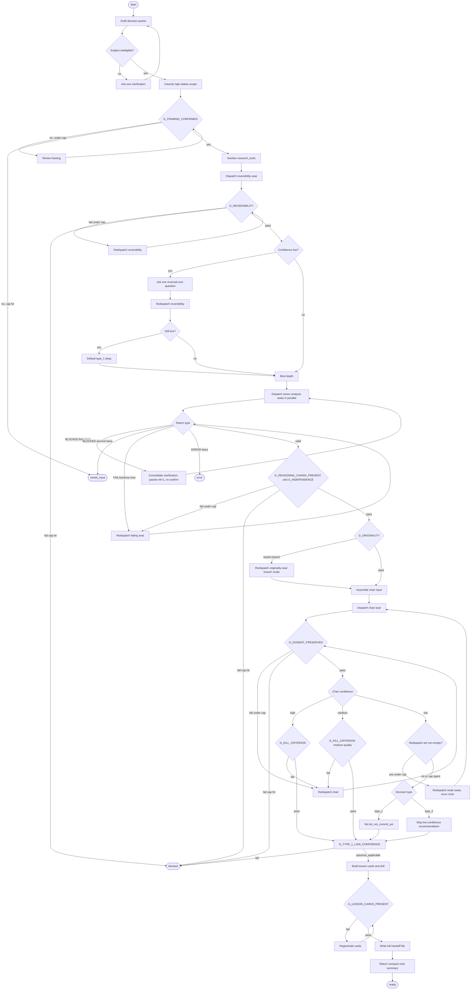

# Council Of Advisors Flow Diagram

```mermaid
flowchart TD
  START([Start]) --> INTAKE[Draft decision packet]
  INTAKE --> SUBJECT{Subject intelligible?}
  SUBJECT -->|no| ASK[Ask one clarification]
  ASK --> INTAKE
  SUBJECT -->|yes| STAKES[Classify high-stakes scope]
  STAKES --> CONFIRM{G_FRAMING_CONFIRMED}
  CONFIRM -->|no, under cap| REFRAME[Revise framing]
  REFRAME --> CONFIRM
  CONFIRM -->|no, cap hit| NEEDS([needs_input])
  CONFIRM -->|yes| TOOLS[Declare research_tools]
  TOOLS --> REV[Dispatch reversibility-seat]
  REV --> REVG{G_REVERSIBILITY}
  REVG -->|fail under cap| REVFIX[Redispatch reversibility]
  REVFIX --> REVG
  REVG -->|fail cap hit| BLOCKED([blocked])
  REVG -->|pass| REVCONF{Confidence low?}
  REVCONF -->|yes| ONEQ[Ask one reversal-cost question]
  ONEQ --> REV2[Redispatch reversibility]
  REV2 --> STILL{Still low?}
  STILL -->|yes| FAILSAFE[Default type_1 deep]
  STILL -->|no| BIND[Bind depth]
  REVCONF -->|no| BIND
  FAILSAFE --> BIND
  BIND --> SEATS[Dispatch seven analysis seats in parallel]
  SEATS --> RETURNS{Return type}
  RETURNS -->|BLOCKED first wave| CLARIFY[Consolidate clarification, packet vN+1, re-confirm]
  CLARIFY --> SEATS
  RETURNS -->|BLOCKED second wave| NEEDS
  RETURNS -->|FAIL/schema miss| SEATFIX[Redispatch failing seat]
  SEATFIX --> RETURNS
  RETURNS -->|ERROR twice| ERROR([error])
  RETURNS -->|valid| ANALYSIS{G_REASONING_CHAINS_PRESENT and G_INDEPENDENCE}
  ANALYSIS -->|fail under cap| SEATFIX
  ANALYSIS -->|fail cap hit| BLOCKED
  ANALYSIS -->|pass| ORIG{G_ORIGINALITY}
  ORIG -->|needs branch| BRANCH[Redispatch originality-seat branch mode]
  ORIG -->|pass| CHAIRIN[Assemble chair input]
  BRANCH --> CHAIRIN
  CHAIRIN --> CHAIR[Dispatch chair-seat]
  CHAIR --> DISSENT{G_DISSENT_PRESERVED}
  DISSENT -->|fail under cap| CHAIRFIX[Redispatch chair]
  CHAIRFIX --> DISSENT
  DISSENT -->|fail cap hit| BLOCKED
  DISSENT -->|pass| CONF{Chair confidence}
  CONF -->|high| KILL{G_KILL_CRITERION}
  CONF -->|medium| KILLM{G_KILL_CRITERION medium quality}
  KILL -->|fail| CHAIRFIX
  KILLM -->|fail| CHAIRFIX
  KILL -->|pass| TYPEG[G_TYPE_1_LOW_CONFIDENCE]
  KILLM -->|pass| TYPEG
  CONF -->|low| LOWSET{Redispatch set non-empty?}
  LOWSET -->|yes under cap| LOWFIX[Redispatch weak seats, rerun chair]
  LOWFIX --> CHAIR
  LOWSET -->|no or cap spent| LOWTERM{Decision type}
  LOWTERM -->|type_1| OVERRIDE[Set do_not_commit_yet]
  LOWTERM -->|type_2| FLAG[Ship low-confidence recommendation]
  OVERRIDE --> TYPEG
  FLAG --> TYPEG
  TYPEG -->|fail| BLOCKED
  TYPEG -->|pass/not_applicable| EDUCATE[Build lesson cards and drill]
  EDUCATE --> LESSON{G_LESSON_CARDS_PRESENT}
  LESSON -->|fail| REGEN[Regenerate cards]
  REGEN --> LESSON
  LESSON -->|pass| WRITE[Write full handoff file]
  WRITE --> SUMMARY[Return compact chat summary]
  SUMMARY --> READY([ready])
```
