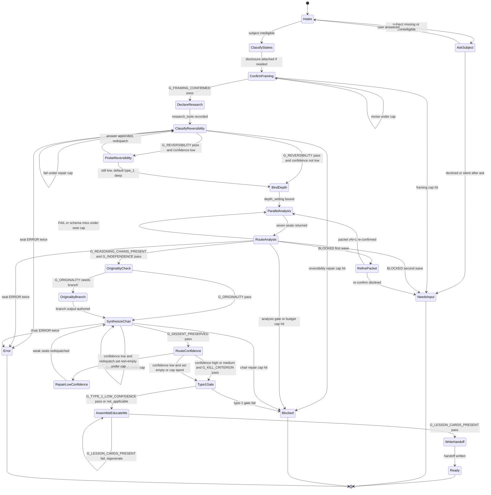

# Flow Diagram

Canonical execution model: finite state machine. Guards, budgets, and terminals
are tabulated in [`state-machine.md`](./state-machine.md). Gate predicates live
only in [`references/decision-gates.md`](./references/decision-gates.md).

