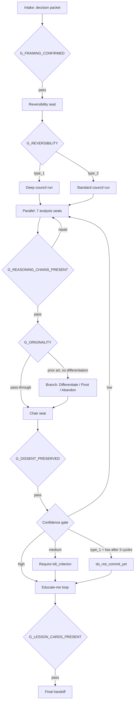

# Decision Gates

Read this file when implementing or troubleshooting a gate, or when
explaining gate behavior to the user.

## Pipeline (Mermaid)

## G_FRAMING_CONFIRMED

**Where:** Phase 1, before any seat runs.

**Pass condition:** The user explicitly confirms the orchestrator's
paraphrased decision packet.

**Failure handling:** Re-paraphrase and ask again. Do not begin analysis
on an unconfirmed packet — misframed intake corrupts every downstream
seat.

## G_REVERSIBILITY

**Where:** Phase 2, after the reversibility-seat returns.

**Pass condition:** The packet includes `decision_type` (`type_1` or
`type_2`), `reversal_cost_estimate` for all six dimensions, `rationale`,
`confidence`, and `depth_setting`. `depth_setting` is `deep` when
`decision_type` is `type_1` and `standard` when it is `type_2`.

**Failure handling:** Redispatch the reversibility-seat with the missing
field as the reason. A Type 1 classification is sticky — it may not be
downgraded to Type 2 later without explicit new evidence about reversal
cost.

## G_REASONING_CHAINS_PRESENT

**Where:** Phase 3, after the seven analysis seats return.

**Pass condition:** Every packet contains `reasoning_chain`,
`what_would_change_my_mind`, `mental_model_in_use`, `verdict`, and
`confidence`. Each `reasoning_chain` entry is a labeled object with
`premise`, `inference`, or `assumption`. No packet quotes or references
a sibling seat.

**Failure handling:** Redispatch only the seats that failed, with the
missing field as the reason. Three cycles maximum.

## G_ORIGINALITY

**Where:** Phase 4, after the originality-seat packet is inspected.

**Pass condition:** Either (a) `prior_art_exists: false` with rationale,
(b) `prior_art_exists: true` and `differentiation_named: true` with at
least one named differentiation axis, or (c) a complete branch output
(`differentiate` | `pivot` | `abandon`) with rationale.

**Failure handling:** If `prior_art_exists: true` and
`differentiation_named: false`, the pipeline must produce a branch
output before proceeding to synthesis. Do not let the chair seat
synthesize over an open originality gap.

## G_DISSENT_PRESERVED

**Where:** Phase 5, after the chair-seat returns.

**Pass condition:** Either `confidence: high` with an empty
`minority_report` field, or `confidence: medium`/`low` with a non-empty
`minority_report` containing the strongest dissenting view verbatim.

**Failure handling:** Redispatch chair-seat with the missing minority
report as the reason. A chair that fabricates consensus or erases
dissent fails this gate.

## Confidence gate

**Where:** Phase 6, after the chair packet is validated.

**Routes:**

- `high` → proceed to Phase 7.
- `medium` → require an explicit `required_kill_criterion` in the chair
  packet. If missing, redispatch chair-seat.
- `low` → return to Phase 3 for the seats whose `confidence` was `low`
  or whose `reasoning_chain` premises were marked `unverified`. Three
  cycles maximum.

## G_TYPE_1_LOW_CONFIDENCE

**Where:** Phase 6, only when `decision_type` is `type_1`.

**Trigger:** Chair `confidence` is `low` after three repair cycles.

**Effect:** Override the chair's recommendation to `do_not_commit_yet`.
The handoff still contains the chair's reasoning and minority report —
the user sees the full analysis — but the headline recommendation is to
wait. This gate exists because the cost of committing to an irreversible
decision under low confidence is asymmetrically larger than the cost of
waiting.

## G_LESSON_CARDS_PRESENT

**Where:** Phase 7, before the final handoff is assembled.

**Pass condition:** Nine lesson cards (one per seat: reversibility,
adversary, optimistic, originality, second-order, paradox-of-skill,
focus, power-questions, chair) plus the 9-question solo drill are
present and conform to the template in
`./educate-me-lesson-template.md`.

**Failure handling:** Generate the missing cards. This gate does not
require a subagent redispatch — the lesson template is deterministic.
