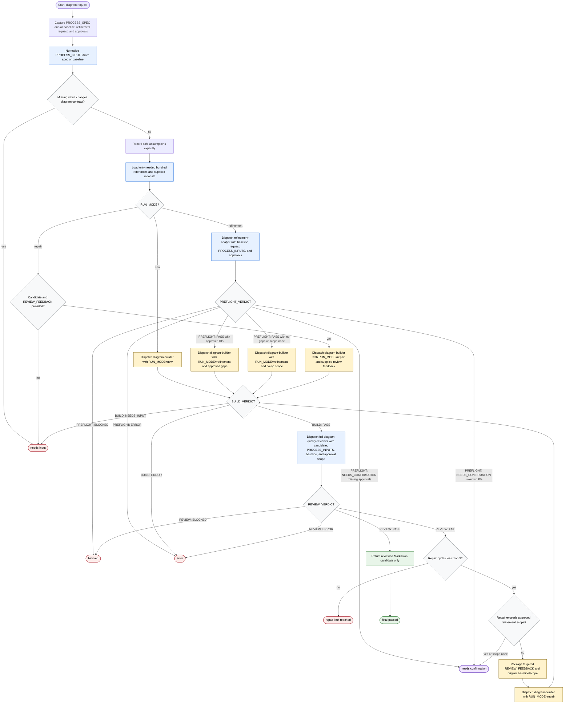

# Generate Flow Diagram

The Generate Flow Diagram workflow is a read-only orchestration contract for a skill orchestrator that turns normalized process inputs into Markdown with one Mermaid flowchart. It may inspect supplied process specs, existing flows or diagrams, approved refinement gaps, and optional external rationale; dispatches only `refinement-analyst`, `diagram-builder`, and `diagram-quality-reviewer`; and stops before file mutation, unapproved scope expansion, or unreviewed candidate release.

Readiness rule: return a candidate only after `PREFLIGHT: PASS` when refinement applies, `BUILD: PASS`, and `REVIEW: PASS`; otherwise return the exact terminal state and its recovery details.

Completion states: final passed, needs confirmation, blocked, error, needs input, or repair limit reached.
