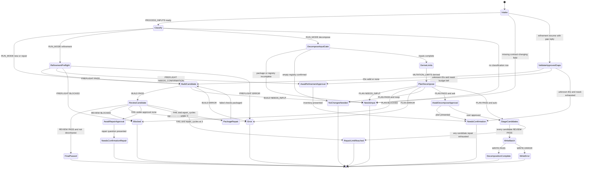

# Flow Diagram

Canonical execution model: finite state machine. Guards and terminals are
tabulated in [`state-machine.md`](./state-machine.md).

## Gate And Branch Summary

| Gate | Guard | Pass path | Stop / alternate |
| ---- | ----- | --------- | ---------------- |
| Contract-missing gate | Missing field changes authority, sensitive actions, outputs, evidence, confirmation, or terminals | `Classify` | `NeedsInput` |
| Classification gate | Precedence table row matches | Mode-specific state | `NeedsInput` |
| Refinement preflight | `PREFLIGHT: PASS` | `BuildCandidate` | Await confirmation, `Blocked`, or `Error` |
| Gap-ID validation | IDs ⊆ retained inventory or exact `none` | `BuildCandidate` | One re-ask then `NeedsConfirmation` |
| Build gate | `BUILD: PASS` | `ReviewCandidate` | `NeedsInput` or `Error` |
| Review gate | `REVIEW: PASS` | `FinalPassed` (non-decompose) | Repair, repair-under-`none`, `Blocked`, `Error`, or repair limit |
| Repair budget | `repair_cycles` < 3 | `PackageRepair` → `BuildCandidate` | `RepairLimitReached` |
| Repair-under-`none` | `approval_scope` is exact `none` and repair would change baseline | — | `NeedsConfirmationRepair` |
| Decompose input gate | Package path + non-empty registry | `DeriveLimits` | `NeedsInput` or `NoChangesNeeded` |
| Plan gate | `PLAN: PASS` and work remains | Await approval or `StageCandidates` if `auto` | No-op, `NeedsInput`, `Blocked`, `Error` |
| All-pass staging | Every staged candidate `REVIEW: PASS` | `WriteBatch` | `RepairLimitReached` (no writes) |
| Write gate | `WRITE: PASS` inside `MUTATION_LIMITS` | `DecompositionComplete` | `WriteError` |

## Terminal States

- Success: `FinalPassed`, `DecompositionComplete`, `NoChangesNeeded`
- Confirmation: `NeedsConfirmation`, `NeedsConfirmationRepair`
- Failure / stop: `NeedsInput`, `Blocked`, `Error`, `WriteError`, `RepairLimitReached`
