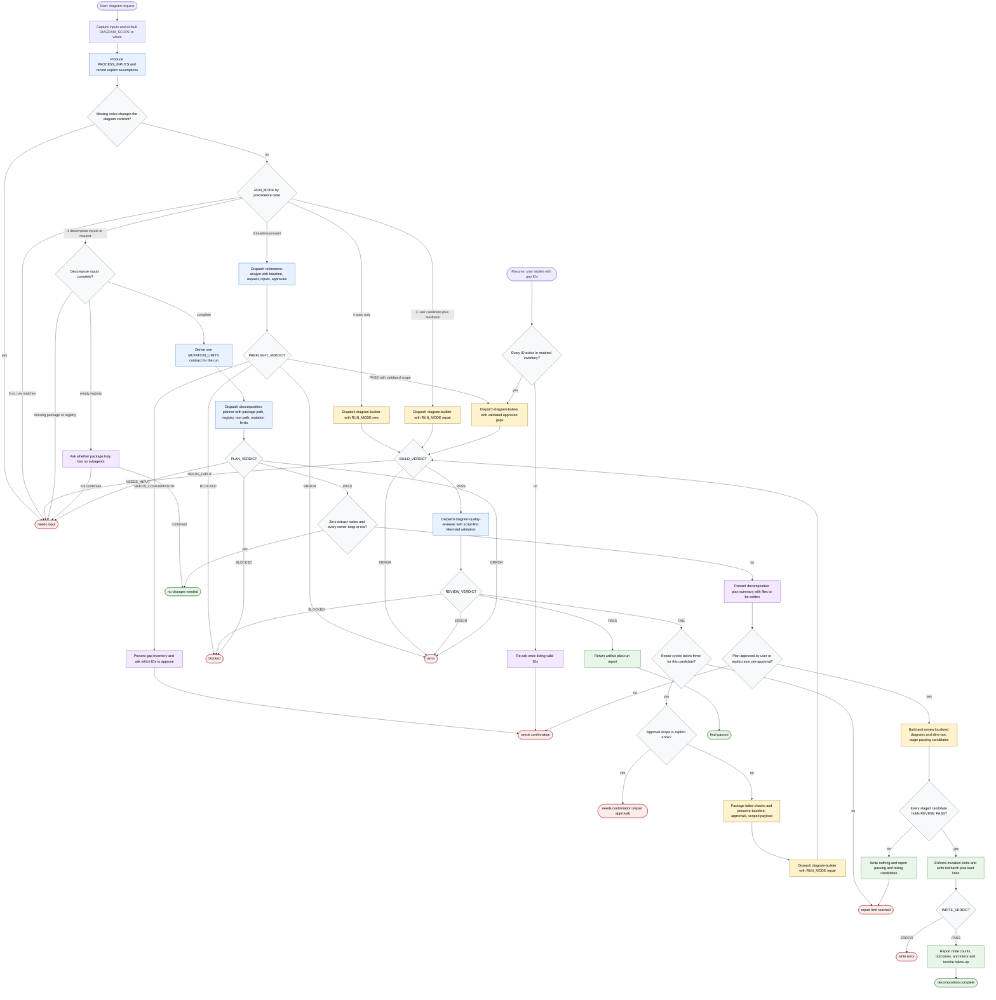

# Revised Generate Flow Diagram

This workflow turns normalized process inputs into a reviewed Markdown document
with one Mermaid flowchart, or decomposes a skill package into a slim root and
localized subagent diagrams. The orchestrator routes on documented status lines,
validates Mermaid empirically when possible, and mutates files only in decompose
mode after plan approval, all-pass staging, mutation-boundary enforcement, and a
write verdict.

Readiness rule: return a non-decompose artifact only after `BUILD: PASS` and
`REVIEW: PASS`, plus `PREFLIGHT: PASS` with validated approvals when refinement
applies. Write decompose files only after `PLAN: PASS`, a negative no-op check,
plan approval, `REVIEW: PASS` for every staged candidate, mutation-limit and
path-boundary enforcement, and `WRITE: PASS`.

Completion states: `final passed`, `decomposition complete`,
`no changes needed`, `needs confirmation`,
`needs confirmation (repair approval)`, `needs input`, `blocked`, `error`,
`write error`, and `repair limit reached`.
