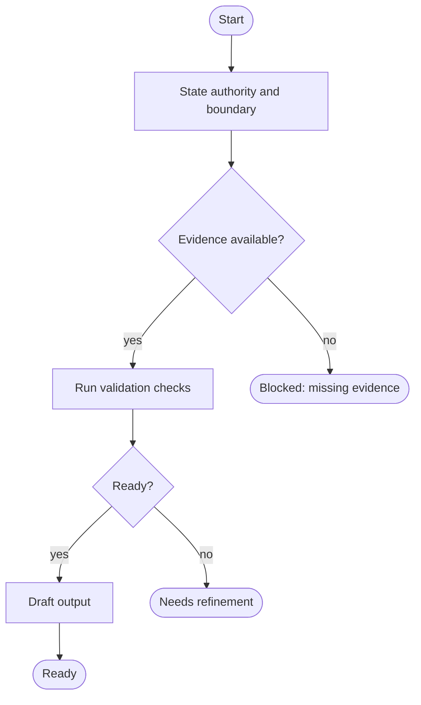
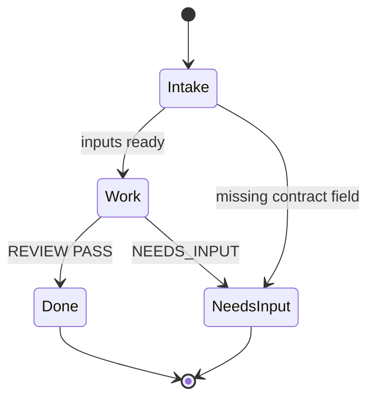

# Mermaid Style Guide

Load this file when writing or repairing Mermaid. If syntax details are
uncertain, fetch the official Mermaid documentation listed in
`external-sources.md` (flowchart or state diagram pages as needed).

## Diagram Type Selection

| Choose | When |
| ------ | ---- |
| `flowchart TD` (default) | Process maps, HITL gate maps, and most workflow artifacts |
| `flowchart LR` | Horizontal lifecycle is clearer than top-down |
| `stateDiagram-v2` | Finite-state execution models: named states, guards, wait states, and terminals |

Do not mix flowchart and state-diagram syntax in the same fenced block. Prefer
one diagram type per artifact unless the user explicitly asked for more.

## Local Rules

- Prefer short uppercase node or state IDs and readable labels.
- For flowcharts: shape starts and terminals as rounded nodes, process steps as
  rectangles, and decisions as diamonds. Label decision edges explicitly:
  `yes`, `no`, `approved`, `declined`, `blocked`, or `needs input`.
- For state diagrams: use `stateDiagram-v2`; label transitions with guards or
  events; mark terminals with transitions to `[*]`; keep every state reachable.
- Use one edge or transition per line in complex diagrams.
- Quote labels with punctuation that may confuse Mermaid parsing.
- Avoid lowercase `end` as a node or state label.
- Avoid IDs that accidentally create special edge markers after arrows.
- Assign flowchart classes only to nodes that exist (state diagrams usually omit
  the class palette below).
- During repair or refinement, change the smallest Mermaid surface that fixes the
  failed check and stays inside approved scope.

## Class Palette

```mermaid
classDef decision fill:#f8f9fa,stroke:#495057,color:#000;
classDef check fill:#e7f1ff,stroke:#0b5ed7,color:#000;
classDef human fill:#f3e8ff,stroke:#6f42c1,color:#000;
classDef output fill:#e8f5e9,stroke:#2e7d32,color:#000;
classDef success fill:#e8f5e9,stroke:#2e7d32,color:#000;
classDef refine fill:#fff3cd,stroke:#856404,color:#000;
classDef stop fill:#fdecea,stroke:#b02a37,color:#000;
```

## Minimal Flowchart Pattern



## Minimal State-Diagram Pattern


