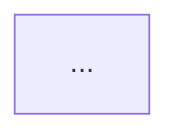
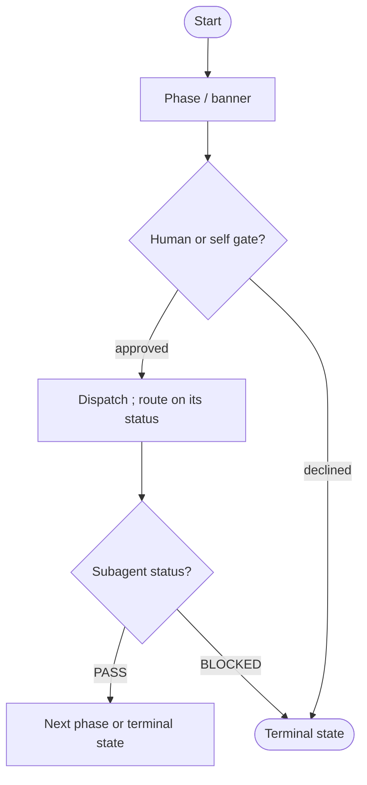
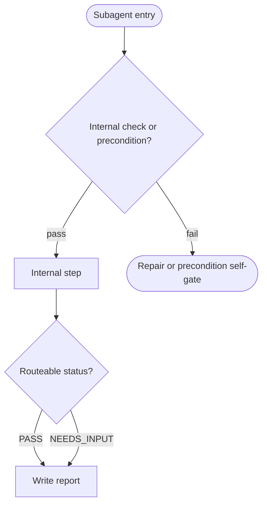

# Output Templates

> Load this file only when assembling the user-facing pre-check or final diagram
> output.

## Refinement Pre-Check Template

Use this when gap fixes need user approval before generation proceeds:

```markdown
## Refinement Pre-Check

| ID | Gap | Type | Why It Matters | Proposed Change |
| -- | --- | ---- | -------------- | --------------- |
| G1 | ... | ... | ... | ... |

Which gap IDs should I include or fix in the revised flow? Reply with IDs like
`G1, G3`, or `none`.
```

## Needs Input Response Pattern

Use this when a missing value would change the diagram contract:

```markdown
I need one detail before I can make the diagram reliable: <specific missing
field or approval question>.
```

## Final Markdown Template

````markdown
# <PROCESS_NAME>

<Short paragraph describing the workflow boundary, agent authority, trust model,
allowed actions, boundaries, and mutation limits.>



```text
Optional output/report/comment template, if useful.
```

Readiness rule: <optional completion or sensitive-action rule>
````

## Optional Report Template Pattern

Include a report template only when it helps the workflow user act:

```text
Status: ready | blocked | needs refinement | deferred | escalated
Evidence checked:
Risks:
Blockers:
Recommendations:
Unresolved questions:
Human approvals required:
```

## Slim Root Template

Use this for a `DIAGRAM_SCOPE=orchestrator` root. Each subagent dispatch is one
node; the cross-link line below it points at the localized diagram.

````markdown
# <PROCESS_NAME> — Orchestration

<Short paragraph: orchestrator authority, dispatch-only role, mutation limits,
and that subagent internals live in their own localized diagrams.>



Localized diagrams: [`<subagent>`](<LOCALIZED_DIAGRAM_RELATIVE_LINK>)
````

`LOCALIZED_DIAGRAM_RELATIVE_LINK` is the relative path from the
planner-resolved `ROOT_DIAGRAM_PATH` file to the localized
`subagents/<subagent>-flow-diagram.md` file; for the default root it is usually
`./subagents/<subagent>-flow-diagram.md`.

## Localized Subagent Diagram Template

Use this for a `DIAGRAM_SCOPE=subagent` diagram. It covers one subagent only.

````markdown
# <SUBAGENT_NAME> — Internal Flow

<Short paragraph: this subagent's role and routeable statuses. Orchestration
context lives in the root diagram, linked below.>



Orchestration context: [root diagram](<ROOT_DIAGRAM_RELATIVE_LINK>)
````

`ROOT_DIAGRAM_RELATIVE_LINK` is the relative path from the localized subagent
diagram file to the planner-resolved `ROOT_DIAGRAM_PATH`; for the default root it
is usually `../flow-diagram.md`.

## Load-Instruction Template

One line wires each owner to exactly its own diagram. The package `SKILL.md`
loads only the root; each EARNED subagent loads only its localized diagram.

Root load line in package `SKILL.md`:

```markdown
Flow diagram: [`flow-diagram.md`](./flow-diagram.md)
```

When `ROOT_DIAGRAM_PATH` uses a non-default filename, replace `flow-diagram.md`
with the root path relative to the package `SKILL.md`.

For slim root templates, derive `LOCALIZED_DIAGRAM_RELATIVE_LINK` from the
planner-resolved `ROOT_DIAGRAM_PATH` file to each localized subagent diagram; do
not hardcode `./subagents/<subagent>-flow-diagram.md` when the root path is
non-default. For localized subagent templates, derive
`ROOT_DIAGRAM_RELATIVE_LINK` from the localized diagram file to the
planner-resolved `ROOT_DIAGRAM_PATH`; do not hardcode `../flow-diagram.md` when
the root path is non-default.

Localized subagent load line in the owning subagent file:

```markdown
Flow diagram: [`<subagent-name>-flow-diagram.md`](./<subagent-name>-flow-diagram.md)
```

## Decompose Result Template

Return this after a `RUN_MODE=decompose` run.

```markdown
## Decomposition Result

Root diagram: <ROOT_DIAGRAM_PATH> — before <N> nodes, after <M> nodes

| Owner | Decision | Localized diagram | Action | Load wired |
| ----- | -------- | ----------------- | ------ | ---------- |
| <subagent> | EARNED \| NO_OP_EVIDENCED | path or `none` | created \| re-scoped \| kept \| n/a | yes/no |

- Scope-separation check: pass/fail
- No-duplication check: pass/fail
- Files written: <paths>
- Notes / evidence quotes: ...
```
