# Generate Handoff Document

This workflow is run by the handoff-document orchestrator. The orchestrator
thinks, decides, and dispatches only; extraction, claim checking, assembly, and
review are delegated to co-located subagents. Working data lives on disk as
structured artifacts, while the orchestrator keeps only verdicts, paths, counts,
warnings, and unresolved questions in context. The workflow writes resumability
artifacts, not product-code changes.

```mermaid
flowchart TD
  START([Start: handoff request]) --> INTAKE[Collect TARGET_FILE, optional SUBJECT, TRACKING_FILES, CONTEXT_SOURCE, and conversation or transcript]
  INTAKE --> TARGET_CLEAR{TARGET_FILE clear?}
  TARGET_CLEAR -->|no| ASK_TARGET[Ask one short clarification question]
  ASK_TARGET --> BLOCKED_TARGET([Blocked: unclear target path])
  TARGET_CLEAR -->|yes| CONFIRM_SCOPE[Confirm safe inputs and infer optional values when safe]

  CONFIRM_SCOPE --> WRITE_SAFE{Target and artifact writes safe?}
  WRITE_SAFE -->|unclear| ASK_TARGET
  WRITE_SAFE -->|safe| READ_CONTRACTS[Read local data contracts]

  READ_CONTRACTS --> EXTERNAL_NEEDED{Local contracts sufficient?}
  EXTERNAL_NEEDED -->|yes| PATHS[Derive TARGET_FILE, stem.context.json, stem.insights.json, optional stem.claims.json]
  EXTERNAL_NEEDED -->|no| EXTERNAL_GATE{Use external URLs?}
  EXTERNAL_GATE -->|approved or safe optional use| FETCH_EXTERNAL[Fetch minimal external background]
  EXTERNAL_GATE -->|declined| LOCAL_ONLY[Continue with bundled contracts only]
  FETCH_EXTERNAL --> PATHS
  LOCAL_ONLY --> PATHS

  PATHS --> DISPATCH_CONTEXT[Dispatch context-extractor with CONTEXT_SOURCE and CONTEXT_FILE]
  DISPATCH_CONTEXT --> CONTEXT_OK{Context extraction passed?}
  CONTEXT_OK -->|no| SUBAGENT_ERROR([Blocked: context extraction error])
  CONTEXT_OK -->|yes| DISPATCH_INSIGHTS[Dispatch insight-documenter with CONTEXT_SOURCE and INSIGHTS_FILE]

  DISPATCH_INSIGHTS --> INSIGHTS_OK{Insight documentation passed?}
  INSIGHTS_OK -->|no| SUBAGENT_ERROR
  INSIGHTS_OK -->|yes| TRACKING_EXISTS{TRACKING_FILES provided?}

  TRACKING_EXISTS -->|yes| DISPATCH_CLAIMS[Dispatch claim-validator with TRACKING_FILES, INSIGHTS_FILE, and CLAIMS_FILE]
  DISPATCH_CLAIMS --> CLAIMS_OK{Claim validation passed?}
  CLAIMS_OK -->|no| SUBAGENT_ERROR
  CLAIMS_OK -->|yes| CLAIMS_READY[Record claims verdict and counts]

  TRACKING_EXISTS -->|no| CLAIMS_SKIPPED[Record CLAIMS: SKIPPED and warning that next agent must verify factual claims independently]

  CLAIMS_READY --> ASSEMBLE[Dispatch document-assembler with TARGET_FILE, SUBJECT, CONTEXT_FILE, INSIGHTS_FILE, and optional CLAIMS_FILE]
  CLAIMS_SKIPPED --> ASSEMBLE
  ASSEMBLE --> ASSEMBLY_OK{Assembly passed?}

  ASSEMBLY_OK -->|no| SUBAGENT_ERROR
  ASSEMBLY_OK -->|yes| REVIEW[Dispatch handoff-reviewer with target handoff and structured artifacts]
  REVIEW --> REVIEW_PASS{Review passed?}

  REVIEW_PASS -->|yes| FINAL[Return handoff path, stage verdicts, review verdict, counts, warnings, and open-question count]
  FINAL --> DONE([Completed: passing review])

  REVIEW_PASS -->|no| FIX_LIMIT{Fewer than 3 fix cycles?}
  FIX_LIMIT -->|no| BLOCKED_REPAIR([Blocked: quality gates still fail after 3 repair cycles])
  FIX_LIMIT -->|yes| RERUN_SCOPE[Read reviewer guidance and rerun only named failing stages plus downstream consumers]

  RERUN_SCOPE --> FAIL_STAGE{Named failing stage}
  FAIL_STAGE -->|context| DISPATCH_CONTEXT
  FAIL_STAGE -->|insights| DISPATCH_INSIGHTS
  FAIL_STAGE -->|claims| TRACKING_EXISTS
  FAIL_STAGE -->|assembly| ASSEMBLE
  FAIL_STAGE -->|review only| REVIEW

  class TARGET_CLEAR,WRITE_SAFE,EXTERNAL_NEEDED,EXTERNAL_GATE,CONTEXT_OK,INSIGHTS_OK,TRACKING_EXISTS,CLAIMS_OK,ASSEMBLY_OK,REVIEW_PASS,FIX_LIMIT,FAIL_STAGE decision;
  class READ_CONTRACTS,FETCH_EXTERNAL,DISPATCH_CONTEXT,DISPATCH_INSIGHTS,DISPATCH_CLAIMS,ASSEMBLE,REVIEW,RERUN_SCOPE check;
  class ASK_TARGET human;
  class PATHS,LOCAL_ONLY,FINAL,CLAIMS_READY,CLAIMS_SKIPPED output;
  class DONE success;
  class BLOCKED_TARGET,SUBAGENT_ERROR,BLOCKED_REPAIR stop;
  classDef check fill:#e7f1ff,stroke:#0b5ed7,color:#000;
  classDef decision fill:#f8f9fa,stroke:#495057,color:#000;
  classDef human fill:#f3e8ff,stroke:#6f42c1,color:#000;
  classDef output fill:#e8f5e9,stroke:#2e7d32,color:#000;
  classDef success fill:#e8f5e9,stroke:#2e7d32,color:#000;
  classDef stop fill:#fdecea,stroke:#b02a37,color:#000;
```

Readiness rule: the workflow is complete only when the handoff reviewer passes
the target handoff, or when the orchestrator reports a defined blocked state. If
`TRACKING_FILES` are absent, completion is allowed with a visible claims-skipped
warning.
