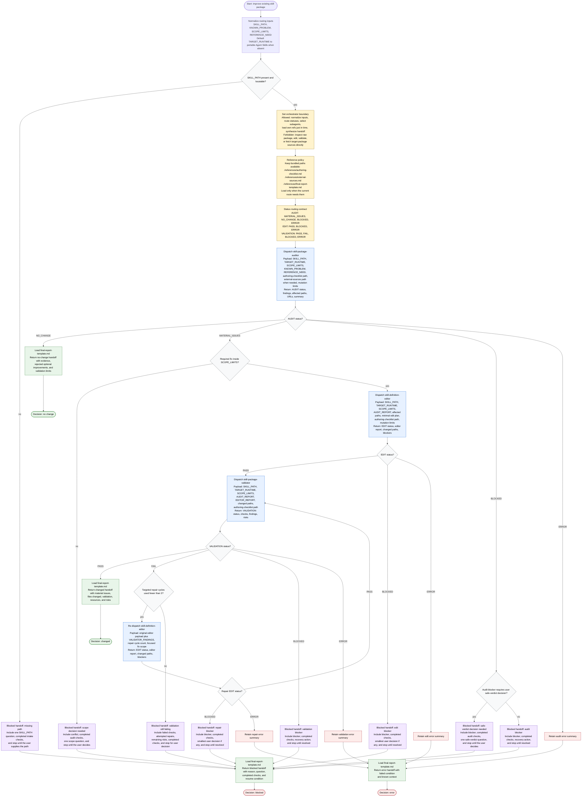

# Improve Skill Definition Flow

This workflow is run by a skill-definition improvement orchestrator. The
orchestrator may normalize routing inputs, default `TARGET_RUNTIME`, choose the
required subagent dispatches, load its own bundled references only when needed,
route on enumerated statuses, and synthesize the final handoff. Raw package
inspection, editing, validation, and target-package source lookup stay inside
focused subagents, which return compact statuses, findings, paths, URLs, and
summaries.

Readiness rule: A final handoff is ready only after
`./references/final-report-template.md` is loaded and the outcome is one of
`changed`, `no change`, `blocked`, or `error`. A `VALIDATION: FAIL` may trigger
at most three targeted editor/validator repair cycles; after the third failed
validation, return `blocked` with remaining findings and attempted repairs.

Rationale sources: [Anthropic context engineering](https://www.anthropic.com/engineering/effective-context-engineering-for-ai-agents),
[Claude Code subagents](https://code.claude.com/docs/en/sub-agents),
[Claude prompting best practices](https://platform.claude.com/docs/en/build-with-claude/prompt-engineering/claude-prompting-best-practices),
and [OpenCode agents](https://opencode.ai/docs/agents/).
