# Prompt Structurer Workflow

Prompt Structurer is a routing orchestrator for converting prose prompts into
compact structured XML prompt contracts. It captures user-provided prompt text
and context as source of truth, preserves requested terminology, selects the
smallest deterministic flow, dispatches bundled analysis subagents, and returns
final XML plus assembly notes. It may read bundled local references first and
fetch at most one targeted current URL only when required and permitted;
revision changes stay inside `CHANGE_REQUEST`.

```mermaid
flowchart TD
  START([Start: Prompt Structurer request]) --> INTAKE["Capture PROMPT_TEXT and optional RUN_STYLE, SUITE_CONTEXT, TERMINOLOGY, CHANGE_REQUEST"]
  INTAKE --> HAS_PROMPT{"PROMPT_TEXT present?"}
  HAS_PROMPT -->|no| BLOCKED_PROMPT([BLOCKED: missing required PROMPT_TEXT])
  HAS_PROMPT -->|yes| TRUST["Trust PROMPT_TEXT, TERMINOLOGY, SUITE_CONTEXT, and CHANGE_REQUEST as source of truth"]
  TRUST --> CONTRADICTION{"Contradictory rules change task meaning?"}
  CONTRADICTION -->|yes| FAIL_CLARIFY([FAIL: ask targeted clarification before assembly])
  CONTRADICTION -->|no| LOCAL_FIRST["Use bundled subagents and references first"]

  LOCAL_FIRST --> SOURCE_NEED{"Need source-backed or current external rationale?"}
  SOURCE_NEED -->|no| LOCAL_ONLY["Record LOCAL_ONLY in assembly notes"]
  SOURCE_NEED -->|yes| LOCAL_ENOUGH{"Bundled references sufficient?"}
  LOCAL_ENOUGH -->|yes| LOCAL_ONLY
  LOCAL_ENOUGH -->|no| NETWORK_OK{"Network available and permitted?"}
  NETWORK_OK -->|yes| WEB_FETCH["Fetch exactly one targeted current URL; record resource"]
  NETWORK_OK -->|no| RATIONALE_OMITTED["Record RATIONALE_OMITTED in assembly notes"]
  LOCAL_ONLY --> SELECT_REV
  WEB_FETCH --> SELECT_REV
  RATIONALE_OMITTED --> SELECT_REV

  SELECT_REV{"1. CHANGE_REQUEST targets existing structured prompt?"}
  SELECT_REV -->|yes| REVISION["Selected flow: revision"]
  SELECT_REV -->|no| SELECT_SUITE{"2. SUITE_CONTEXT must govern conventions?"}
  SELECT_SUITE -->|yes| SUITE["Selected flow: suite"]
  SELECT_SUITE -->|no| SELECT_FULL{"3. Multi-phase, autonomous, safety-sensitive, or repeatedly failing?"}
  SELECT_FULL -->|yes| FULL["Selected flow: full"]
  SELECT_FULL -->|no| LIGHT["Selected flow: light"]

  LIGHT --> P1L["Pass 1: semantic-decomposer (./subagents/semantic-decomposer.md)"]
  P1L --> P6L["Pass 6: xml-prompt-assembler (./subagents/xml-prompt-assembler.md)"]

  FULL --> P1F["Pass 1: semantic-decomposer (./subagents/semantic-decomposer.md)"]
  SUITE --> SUITE_CTX["Pass SUITE_CONTEXT and shared suite blocks into every pass"]
  SUITE_CTX --> P1F
  P1F --> P2F["Pass 2: philosophy-constraints-classifier (./subagents/philosophy-constraints-classifier.md)"]
  P2F --> P3F["Pass 3: implicit-behavior-surfacer (./subagents/implicit-behavior-surfacer.md)"]
  P3F --> P4F["Pass 4: anti-pattern-synthesizer (./subagents/anti-pattern-synthesizer.md)"]
  P4F --> P5F["Pass 5: success-criteria-builder (./subagents/success-criteria-builder.md)"]
  P5F --> P6F["Pass 6: xml-prompt-assembler (./subagents/xml-prompt-assembler.md)"]

  REVISION --> REV_BASE{"Existing XML prompt and baseline content sufficient?"}
  REV_BASE -->|no| BLOCKED_BASE([BLOCKED: clarify missing baseline content])
  REV_BASE -->|yes| REV_SCOPE{"CHANGE_REQUEST stays in scope and preserves task meaning?"}
  REV_SCOPE -->|no| BLOCKED_SCOPE([BLOCKED: reject or clarify out-of-scope revision])
  REV_SCOPE -->|yes| REV_RANGE["Identify affected pass range and required upstream prerequisites"]
  REV_RANGE --> UPSTREAM_READY{"Required upstream pass outputs available?"}
  UPSTREAM_READY -->|yes| RERUN_AFFECTED["Rerun only affected analysis pass(es) in pipeline order; preserve unaffected sections"]
  UPSTREAM_READY -->|no| RERUN_PREREQ["Rerun earliest missing prerequisite pass and downstream affected passes"]
  RERUN_PREREQ --> RERUN_AFFECTED
  RERUN_AFFECTED --> P6R["Pass 6: xml-prompt-assembler (./subagents/xml-prompt-assembler.md)"]

  P6L --> PASS_STATUS
  P6F --> PASS_STATUS
  P6R --> PASS_STATUS
  PASS_STATUS{"Any dispatched pass or resource returned BLOCKED, FAIL, or ERROR?"}
  PASS_STATUS -->|BLOCKED| BLOCKED_PASS([BLOCKED: ask smallest useful question])
  PASS_STATUS -->|FAIL| FAIL_PASS([FAIL: failed pass prevents contract assembly])
  PASS_STATUS -->|ERROR| ERROR_STOP([ERROR: surface unexpected execution failure])
  PASS_STATUS -->|none| CHECK["Check run-level success criteria: source coverage, behavioral tags, aligned constraints, assembly notes, progressive disclosure"]

  CHECK --> CRITERIA{"Criteria pass?"}
  CRITERIA -->|yes| OUTPUT["Return final XML prompt first, then assembly notes with assumptions, omitted sections, resources, LOCAL_ONLY or RATIONALE_OMITTED status, and follow-ups"]
  OUTPUT --> PASS_DONE([PASS])

  CRITERIA -->|no| REPAIR_LEFT{"Repair cycles remaining? (max 3)"}
  REPAIR_LEFT -->|no| REPAIR_NEEDED([REPAIR_NEEDED: unresolved failed checks after three targeted cycles])
  REPAIR_LEFT -->|yes| REPAIR_SCOPE["Keep repair inside selected flow and CHANGE_REQUEST; preserve unaffected sections"]
  REPAIR_SCOPE --> MAP_FAIL["Map each failed criterion to the earliest affected pass and downstream dependencies"]
  MAP_FAIL --> EARLIEST{"Earliest affected pass?"}
  EARLIEST -->|pass 1| RP1["Repair from Pass 1: semantic-decomposer (./subagents/semantic-decomposer.md), then rerun downstream"]
  EARLIEST -->|pass 2| RP2["Repair from Pass 2: philosophy-constraints-classifier (./subagents/philosophy-constraints-classifier.md), then rerun downstream"]
  EARLIEST -->|pass 3| RP3["Repair from Pass 3: implicit-behavior-surfacer (./subagents/implicit-behavior-surfacer.md), then rerun downstream"]
  EARLIEST -->|pass 4| RP4["Repair from Pass 4: anti-pattern-synthesizer (./subagents/anti-pattern-synthesizer.md), then rerun downstream"]
  EARLIEST -->|pass 5| RP5["Repair from Pass 5: success-criteria-builder (./subagents/success-criteria-builder.md), then rerun downstream"]
  EARLIEST -->|pass 6| RP6["Repair Pass 6: xml-prompt-assembler (./subagents/xml-prompt-assembler.md)"]
  RP1 --> PASS_STATUS
  RP2 --> PASS_STATUS
  RP3 --> PASS_STATUS
  RP4 --> PASS_STATUS
  RP5 --> PASS_STATUS
  RP6 --> PASS_STATUS

  classDef decision fill:#f8f9fa,stroke:#495057,color:#000;
  classDef check fill:#e7f1ff,stroke:#0b5ed7,color:#000;
  classDef output fill:#e8f5e9,stroke:#2e7d32,color:#000;
  classDef success fill:#e8f5e9,stroke:#2e7d32,color:#000;
  classDef refine fill:#fff3cd,stroke:#856404,color:#000;
  classDef stop fill:#fdecea,stroke:#b02a37,color:#000;
  classDef source fill:#f1f3f5,stroke:#495057,color:#000;

  class HAS_PROMPT,CONTRADICTION,SOURCE_NEED,LOCAL_ENOUGH,NETWORK_OK,SELECT_REV,SELECT_SUITE,SELECT_FULL,REV_BASE,REV_SCOPE,UPSTREAM_READY,PASS_STATUS,CRITERIA,REPAIR_LEFT,EARLIEST decision;
  class INTAKE,TRUST,LOCAL_FIRST,LIGHT,FULL,SUITE,SUITE_CTX,P1L,P6L,P1F,P2F,P3F,P4F,P5F,P6F,REVISION,REV_RANGE,RERUN_AFFECTED,RERUN_PREREQ,P6R,CHECK,REPAIR_SCOPE,MAP_FAIL,RP1,RP2,RP3,RP4,RP5,RP6 check;
  class LOCAL_ONLY,WEB_FETCH,RATIONALE_OMITTED source;
  class OUTPUT output;
  class PASS_DONE success;
  class BLOCKED_PROMPT,FAIL_CLARIFY,BLOCKED_BASE,BLOCKED_SCOPE,BLOCKED_PASS,FAIL_PASS,ERROR_STOP stop;
  class REPAIR_NEEDED refine;
```

Completion rule: return `PASS` only after the XML prompt is assembled and
run-level criteria pass. Return `BLOCKED`, `FAIL`, `ERROR`, or `REPAIR_NEEDED`
when missing input, contradictions, pass failures, unexpected execution errors,
or unresolved validation failures prevent a final contract.
