# Recency Guard

Recency Guard is a read-only response-validation workflow for answers that depend on current external facts. It may draft or inspect an answer, identify high-risk or time-sensitive claims, dispatch focused verification subagents one at a time, apply only flagged edits within repair caps, and produce the final user-visible answer. Current external facts require evidence from official, canonical, or otherwise authoritative sources; no external mutations, posting, purchasing, deploying, policy changes, or irreversible actions are inside this flow.

```mermaid
flowchart TD
  START([Start: USER_REQUEST received]) --> INPUTS[Collect inputs: USER_REQUEST, optional DRAFT_RESPONSE, optional TODAYS_DATE, optional RECENCY_RISK_HINT]
  INPUTS --> DATE{TODAYS_DATE present?}
  DATE -->|yes| DRAFT_CHECK{DRAFT_RESPONSE present?}
  DATE -->|no| SET_DATE[Use runtime current date]
  SET_DATE --> DRAFT_CHECK

  DRAFT_CHECK -->|yes| SCOPE[State read-only boundary and freshness scope]
  DRAFT_CHECK -->|no| DRAFT[Draft concise answer first]
  DRAFT --> SCOPE

  SCOPE --> MUTATION{External mutation requested?}
  MUTATION -->|yes| OUT_OF_SCOPE([Outside this flow: route to separate approved workflow])
  MUTATION -->|no| RISK[Identify high-risk and time-sensitive claims]
  RISK --> RECENCY[Dispatch recency-checker with focused read-only verification request]
  RECENCY --> RECENCY_STATUS{RECENCY_CHECK status?}

  RECENCY_STATUS -->|PASS| CLAIM_SELECT[Select up to 3 decision-shaping claims]
  RECENCY_STATUS -->|FAIL| RECENCY_FIX[Apply only recency-checker flagged edits]
  RECENCY_STATUS -->|TOOLS_MISSING| RECENCY_LIMIT[Keep only supportable claims and qualify freshness limits]
  RECENCY_STATUS -->|ERROR| RECENCY_ERROR{Repeated error or repair cap hit?}

  RECENCY_FIX --> RECENCY_CAP{Repair cap reached?}
  RECENCY_CAP -->|no| RECENCY
  RECENCY_CAP -->|yes| CAP_STOP([Stop at repair cap: conservative answer with uncertainty])

  RECENCY_ERROR -->|no| RECENCY
  RECENCY_ERROR -->|yes| UNCERTAIN([Escalated: material uncertainty])

  RECENCY_LIMIT --> CLAIM_SELECT
  CLAIM_SELECT --> CLAIMS[Dispatch claim-verifier for evidence strength, overstatement, and counterexamples]
  CLAIMS --> CLAIM_STATUS{CLAIM_REVIEW status?}

  CLAIM_STATUS -->|PASS| OVERLAP[Apply stricter result where recency and claim reviews overlap]
  CLAIM_STATUS -->|FAIL| CLAIM_FIX[Apply only claim-verifier flagged edits]
  CLAIM_STATUS -->|TOOLS_MISSING| CLAIM_LIMIT[Qualify claims by evidence limits and freshness scope]
  CLAIM_STATUS -->|ERROR| CLAIM_ERROR{Repeated error or repair cap hit?}

  CLAIM_FIX --> CLAIM_CAP{Repair cap reached?}
  CLAIM_CAP -->|no| CLAIMS
  CLAIM_CAP -->|yes| CAP_STOP

  CLAIM_ERROR -->|no| CLAIMS
  CLAIM_ERROR -->|yes| UNCERTAIN

  CLAIM_LIMIT --> OVERLAP
  OVERLAP --> COMPLETE{Inline completeness check passes?}
  COMPLETE -->|yes| FINALIZE[Finalize direct user-visible answer]
  COMPLETE -->|no| COMPLETE_FIX[Add missing qualifiers, scope, or unresolved uncertainty]
  COMPLETE_FIX --> FINALIZE

  FINALIZE --> OUTPUT{Output condition?}
  OUTPUT -->|ready| READY([Ready: final answer])
  OUTPUT -->|tools missing| BLOCKED([Blocked/tools missing: conservative answer])
  OUTPUT -->|material uncertainty| UNCERTAIN
  OUTPUT -->|needs repair| NEEDS_REPAIR([Needs repair/rerun])

  class DATE,DRAFT_CHECK,RECENCY_STATUS,RECENCY_CAP,RECENCY_ERROR,CLAIM_STATUS,CLAIM_CAP,CLAIM_ERROR,COMPLETE,OUTPUT,MUTATION decision;
  class RISK,RECENCY,CLAIMS,OVERLAP,COMPLETE_FIX check;
  class SCOPE,RECENCY_FIX,RECENCY_LIMIT,CLAIM_FIX,CLAIM_LIMIT guard;
  class DRAFT,SET_DATE,FINALIZE output;
  class READY success;
  class NEEDS_REPAIR refine;
  class CAP_STOP,BLOCKED,UNCERTAIN,OUT_OF_SCOPE stop;

  classDef guard fill:#fff3cd,stroke:#856404,color:#000;
  classDef check fill:#e7f1ff,stroke:#0b5ed7,color:#000;
  classDef decision fill:#f8f9fa,stroke:#495057,color:#000;
  classDef output fill:#e8f5e9,stroke:#2e7d32,color:#000;
  classDef success fill:#e8f5e9,stroke:#2e7d32,color:#000;
  classDef refine fill:#fff3cd,stroke:#856404,color:#000;
  classDef stop fill:#fdecea,stroke:#b02a37,color:#000;
```

Readiness rule: Produce the user-visible final answer, not a verification report, unless the user asks for verification details. Include date and scope qualifiers, unresolved material uncertainty, or conservative wording when evidence or tools are limited.

Mutation boundary: Any external mutation or high-impact action stays outside Recency Guard and must be routed to a separate approved workflow.
