# Review Pull Request Skill Flow

This workflow reviews exactly one pull request at a time. The orchestrator may normalize inputs, collect PR context through subagents, coordinate review phases, verify findings before they become final, write a local Markdown review artifact, and post to GitHub only after an exact preview and explicit user approval. Raw diffs, logs, API payloads, large source content, and other high-volume evidence stay inside phase subagents.

```mermaid
flowchart TD
  START([Start: review one pull request]) --> INPUTS["Receive PR_URL and optional OUTPUT_FILE, POSTING_MODE, LANGUAGE_STYLE, REVIEW_FOCUS"]
  INPUTS --> ONE_PR{"Exactly one PR URL?"}
  ONE_PR -->|multiple| ASK_PR["Ask user to choose one PR"]
  ASK_PR --> CHOSEN{"Single PR chosen?"}
  CHOSEN -->|yes| NORMALIZE["Normalize inputs and default POSTING_MODE to draft-only"]
  CHOSEN -->|cancelled| CANCELLED([Terminal: cancelled])
  ONE_PR -->|yes| NORMALIZE
  ONE_PR -->|none| FAIL_INPUT([Terminal: needs context])

  NORMALIZE --> PLAYBOOK["Load review-workflow-playbook.md"]
  PLAYBOOK --> CONTEXT["Dispatch pr-context-collector"]

  CONTEXT --> CONTEXT_STATUS{"CONTEXT status"}
  CONTEXT_STATUS -->|CONTEXT: PASS| FINDINGS["Dispatch finding-reviewer"]
  CONTEXT_STATUS -->|CONTEXT: LARGE_REVIEW_CONFIRMATION_REQUIRED| ASK_PROCEED["Ask user whether to proceed with large review"]
  ASK_PROCEED --> PROCEED{"Proceed approved?"}
  PROCEED -->|no| FAIL_LARGE([Terminal: large review not approved])
  PROCEED -->|yes| CONTEXT_APPROVED["Dispatch pr-context-collector with LARGE_REVIEW_APPROVED=true"]
  CONTEXT_APPROVED --> CONTEXT_STATUS
  CONTEXT_STATUS -->|auth or not found| FAIL_CONTEXT([Terminal: auth or not found])
  CONTEXT_STATUS -->|needs context or error| FAIL_CONTEXT2([Terminal: needs context or review error])

  FINDINGS --> FINDINGS_STATUS{"FINDINGS status"}
  FINDINGS_STATUS -->|FINDINGS: PASS| COMMENTS["Dispatch comment-drafter"]
  FINDINGS_STATUS -->|FINDINGS: NO_FINDINGS| VERIFY["Dispatch review-verifier"]
  FINDINGS_STATUS -->|FINDINGS: NEEDS_CONTEXT| NARROW_CONTEXT["Dispatch pr-context-collector once with narrow request"]
  NARROW_CONTEXT --> RETRY_FINDINGS["Retry finding-reviewer once"]
  RETRY_FINDINGS --> RETRY_FINDINGS_STATUS{"Retry findings status"}
  RETRY_FINDINGS_STATUS -->|pass or no findings| VERIFY_ROUTE{"Findings found?"}
  VERIFY_ROUTE -->|yes| COMMENTS
  VERIFY_ROUTE -->|no| VERIFY
  RETRY_FINDINGS_STATUS -->|still blocked or error| FAIL_FINDINGS([Terminal: needs context or review error])
  FINDINGS_STATUS -->|error| FAIL_FINDINGS

  COMMENTS --> COMMENTS_STATUS{"COMMENTS status"}
  COMMENTS_STATUS -->|COMMENTS: PASS| VERIFY
  COMMENTS_STATUS -->|COMMENTS: NEEDS_METADATA| COLLECT_METADATA["Collect requested metadata once"]
  COLLECT_METADATA --> RETRY_COMMENTS["Retry comment-drafter once"]
  RETRY_COMMENTS --> RETRY_COMMENTS_STATUS{"Retry comments status"}
  RETRY_COMMENTS_STATUS -->|COMMENTS: PASS| VERIFY
  RETRY_COMMENTS_STATUS -->|still blocked or error| FAIL_COMMENTS([Terminal: review error])
  COMMENTS_STATUS -->|error| FAIL_COMMENTS

  VERIFY --> VERIFY_STATUS{"VERIFY status"}
  VERIFY_STATUS -->|VERIFY: PASS| WRITE["Dispatch review-writer"]
  VERIFY_STATUS -->|VERIFY: FAIL| REPAIR_GATE{"Repair cycles fewer than two?"}
  REPAIR_GATE -->|yes| REPAIR["Repair only verifier-named Fix target phase"]
  REPAIR --> VERIFY
  REPAIR_GATE -->|no| FAIL_VERIFY([Terminal: verify fail])

  WRITE --> WRITE_STATUS{"WRITE status"}
  WRITE_STATUS -->|WRITE: PASS| LOCAL_REVIEW["Confirm verified local Markdown review file"]
  WRITE_STATUS -->|write error| FAIL_WRITE([Terminal: write error])

  LOCAL_REVIEW --> PREVIEW["Show exact file preview and report Review file, Findings, Review decision, Posting, Notes"]
  PREVIEW --> POST_MODE{"POSTING_MODE is post-after-confirmation?"}
  POST_MODE -->|no, draft-only| SUCCESS_DRAFT([Success: verified draft saved locally])
  POST_MODE -->|yes| APPROVAL["Ask for explicit final approval to post exact verified review"]
  APPROVAL --> APPROVED{"Posting approved?"}
  APPROVED -->|declined| SUCCESS_DRAFT
  APPROVED -->|approved| POST["Dispatch review-poster"]
  POST --> POST_STATUS{"POST status"}
  POST_STATUS -->|POST: PASS| SUCCESS_POSTED([Success: verified review posted to GitHub])
  POST_STATUS -->|post error| FAIL_POST([Terminal: post error])

  class ONE_PR,CHOSEN,PROCEED,CONTEXT_STATUS,FINDINGS_STATUS,RETRY_FINDINGS_STATUS,VERIFY_ROUTE,COMMENTS_STATUS,RETRY_COMMENTS_STATUS,VERIFY_STATUS,REPAIR_GATE,WRITE_STATUS,POST_MODE,APPROVED,POST_STATUS decision;
  class PLAYBOOK,CONTEXT,CONTEXT_APPROVED,FINDINGS,COMMENTS,VERIFY,WRITE,POST,NARROW_CONTEXT,RETRY_FINDINGS,COLLECT_METADATA,RETRY_COMMENTS,REPAIR check;
  class ASK_PR,ASK_PROCEED,APPROVAL human;
  class LOCAL_REVIEW,PREVIEW output;
  class SUCCESS_DRAFT,SUCCESS_POSTED success;
  class FAIL_INPUT,CANCELLED,FAIL_LARGE,FAIL_CONTEXT,FAIL_CONTEXT2,FAIL_FINDINGS,FAIL_COMMENTS,FAIL_VERIFY,FAIL_WRITE,FAIL_POST stop;
  classDef check fill:#e7f1ff,stroke:#0b5ed7,color:#000;
  classDef decision fill:#f8f9fa,stroke:#495057,color:#000;
  classDef human fill:#f3e8ff,stroke:#6f42c1,color:#000;
  classDef output fill:#e8f5e9,stroke:#2e7d32,color:#000;
  classDef success fill:#e8f5e9,stroke:#2e7d32,color:#000;
  classDef stop fill:#fdecea,stroke:#b02a37,color:#000;
```



Readiness rule: the review is ready only after `review-verifier` returns `VERIFY: PASS` and `review-writer` returns `WRITE: PASS`. Posting is never implicit; it requires `POSTING_MODE=post-after-confirmation`, an exact preview of the verified review file, and explicit final user approval.

Status report shape:

```text
Review file:
Findings:
Review decision:
Posting:
Notes:
```
