# Review Pull Request Skill Flow

This workflow reviews exactly one pull request from the supplied `PR_URL`. The orchestrator may normalize inputs, load package contracts, coordinate phase subagents, verify evidence-backed findings and GitHub-ready comments, write a local Markdown review artifact, preview the exact verified file, and post to GitHub only after `POSTING_MODE=post-after-confirmation` plus explicit approval of that exact preview. Raw diffs, logs, API payloads, fetched pages, and large source content stay inside phase subagents.

```mermaid
flowchart TD
  START([Start: review exactly one pull request]) --> INPUTS["Receive PR_URL and optional OUTPUT_FILE, POSTING_MODE, LANGUAGE_STYLE, REVIEW_FOCUS"]
  INPUTS --> ONE_PR{"Exactly one PR URL?"}
  ONE_PR -->|"multiple PR URLs"| ASK_PR["Ask user to choose one PR"]
  ASK_PR --> CHOSEN{"Single PR chosen?"}
  CHOSEN -->|"chosen"| NORMALIZE["Normalize inputs; default POSTING_MODE to draft-only"]
  CHOSEN -->|"cancelled"| FAIL_CANCELLED([Terminal: PR_REVIEW: CANCELLED])
  ONE_PR -->|"one PR URL"| NORMALIZE
  ONE_PR -->|"no PR URL"| FAIL_INPUT([Terminal: PR_REVIEW: NEEDS_CONTEXT])

  NORMALIZE --> CONTRACTS["Load contracts: ./references/review-workflow-playbook.md, ./references/status-*.md, ./references/external-review-resources.md as needed"]
  CONTRACTS --> CONTEXT["Dispatch pr-context-collector"]

  CONTEXT --> CONTEXT_STATUS{"pr-context-collector status"}
  CONTEXT_STATUS -->|"CONTEXT: PASS"| FINDINGS["Dispatch finding-reviewer"]
  CONTEXT_STATUS -->|"CONTEXT: LARGE_REVIEW_CONFIRMATION_REQUIRED"| ASK_LARGE["Show shortstat and changed-file groups; ask whether to proceed"]
  ASK_LARGE --> LARGE_DECISION{"Large review approved?"}
  LARGE_DECISION -->|"approved"| CONTEXT_APPROVED["Dispatch pr-context-collector with LARGE_REVIEW_APPROVED=true"]
  LARGE_DECISION -->|"declined"| FAIL_LARGE([Terminal: PR_REVIEW: LARGE_REVIEW])
  CONTEXT_APPROVED --> CONTEXT_STATUS
  CONTEXT_STATUS -->|"CONTEXT: AUTH"| FAIL_AUTH([Terminal: PR_REVIEW: AUTH])
  CONTEXT_STATUS -->|"CONTEXT: NOT_FOUND"| FAIL_NOT_FOUND([Terminal: PR_REVIEW: NOT_FOUND])
  CONTEXT_STATUS -->|"CONTEXT: NEEDS_CONTEXT"| FAIL_CONTEXT([Terminal: PR_REVIEW: NEEDS_CONTEXT])
  CONTEXT_STATUS -->|"CONTEXT: ERROR"| FAIL_CONTEXT_ERROR([Terminal: PR_REVIEW: REVIEW_ERROR])

  FINDINGS --> FINDINGS_STATUS{"finding-reviewer status"}
  FINDINGS_STATUS -->|"FINDINGS: PASS"| COMMENTS["Dispatch comment-drafter"]
  FINDINGS_STATUS -->|"FINDINGS: NO_FINDINGS"| NO_FINDING_DECISION["Set REVIEW_DECISION_CANDIDATE for verifier: approve when residual risks do not block approval; otherwise comment"]
  FINDINGS_STATUS -->|"FINDINGS: NEEDS_CONTEXT"| NARROW_CONTEXT["Dispatch pr-context-collector once with narrow context request"]
  FINDINGS_STATUS -->|"FINDINGS: ERROR"| FAIL_FINDINGS_ERROR([Terminal: PR_REVIEW: REVIEW_ERROR])

  NARROW_CONTEXT --> NARROW_CONTEXT_STATUS{"Narrow context status"}
  NARROW_CONTEXT_STATUS -->|"CONTEXT: PASS"| RETRY_FINDINGS["Retry finding-reviewer once"]
  NARROW_CONTEXT_STATUS -->|"CONTEXT: AUTH"| FAIL_AUTH
  NARROW_CONTEXT_STATUS -->|"CONTEXT: NOT_FOUND"| FAIL_NOT_FOUND
  NARROW_CONTEXT_STATUS -->|"CONTEXT: NEEDS_CONTEXT"| FAIL_CONTEXT
  NARROW_CONTEXT_STATUS -->|"CONTEXT: ERROR"| FAIL_CONTEXT_ERROR
  NARROW_CONTEXT_STATUS -->|"CONTEXT: LARGE_REVIEW_CONFIRMATION_REQUIRED"| ASK_NARROW_LARGE["Show shortstat and changed-file groups for narrow request; ask whether to proceed"]
  ASK_NARROW_LARGE --> NARROW_LARGE_DECISION{"Narrow large context approved?"}
  NARROW_LARGE_DECISION -->|"approved"| NARROW_CONTEXT_APPROVED["Dispatch pr-context-collector with narrow request and LARGE_REVIEW_APPROVED=true"]
  NARROW_LARGE_DECISION -->|"declined"| FAIL_LARGE
  NARROW_CONTEXT_APPROVED --> NARROW_CONTEXT_STATUS

  RETRY_FINDINGS --> RETRY_FINDINGS_STATUS{"Retry finding-reviewer status"}
  RETRY_FINDINGS_STATUS -->|"FINDINGS: PASS"| COMMENTS
  RETRY_FINDINGS_STATUS -->|"FINDINGS: NO_FINDINGS"| NO_FINDING_DECISION
  RETRY_FINDINGS_STATUS -->|"FINDINGS: NEEDS_CONTEXT"| FAIL_CONTEXT
  RETRY_FINDINGS_STATUS -->|"FINDINGS: ERROR"| FAIL_FINDINGS_ERROR

  COMMENTS --> COMMENTS_STATUS{"comment-drafter status"}
  COMMENTS_STATUS -->|"COMMENTS: PASS"| VERIFY
  COMMENTS_STATUS -->|"COMMENTS: NEEDS_METADATA"| COLLECT_METADATA["Collect requested line metadata once"]
  COMMENTS_STATUS -->|"COMMENTS: ERROR"| FAIL_COMMENTS_ERROR([Terminal: PR_REVIEW: REVIEW_ERROR])

  COLLECT_METADATA --> RETRY_COMMENTS["Retry comment-drafter once"]
  RETRY_COMMENTS --> RETRY_COMMENTS_STATUS{"Retry comment-drafter status"}
  RETRY_COMMENTS_STATUS -->|"COMMENTS: PASS"| VERIFY
  RETRY_COMMENTS_STATUS -->|"COMMENTS: NEEDS_METADATA"| FAIL_COMMENTS_ERROR
  RETRY_COMMENTS_STATUS -->|"COMMENTS: ERROR"| FAIL_COMMENTS_ERROR

  NO_FINDING_DECISION --> VERIFY

  VERIFY["Dispatch review-verifier with findings/comments and REVIEW_DECISION_CANDIDATE when present"] --> VERIFY_STATUS{"review-verifier status"}
  VERIFY_STATUS -->|"VERIFY: PASS"| WRITE["Dispatch review-writer using ./references/review-file-template.md"]
  VERIFY_STATUS -->|"VERIFY: FAIL"| REPAIR_GATE{"Repair cycles fewer than two?"}
  VERIFY_STATUS -->|"VERIFY: NEEDS_CONTEXT"| FAIL_VERIFY_CONTEXT([Terminal: PR_REVIEW: NEEDS_CONTEXT])
  VERIFY_STATUS -->|"VERIFY: ERROR"| FAIL_VERIFY_ERROR([Terminal: PR_REVIEW: REVIEW_ERROR])

  REPAIR_GATE -->|"yes"| REPAIR["Repair only verifier-named Fix target: pr-context-collector, finding-reviewer, or comment-drafter"]
  REPAIR_GATE -->|"no"| FAIL_VERIFY([Terminal: PR_REVIEW: VERIFY_FAIL])
  REPAIR --> VERIFY

  WRITE --> WRITE_STATUS{"review-writer status"}
  WRITE_STATUS -->|"WRITE: PASS"| LOCAL_REVIEW["Confirm verified local Markdown review file exists and required sections are present"]
  WRITE_STATUS -->|"WRITE: ERROR"| FAIL_WRITE([Terminal: PR_REVIEW: WRITE_ERROR])

  LOCAL_REVIEW --> PREVIEW["Preview exact verified file and report Review file, Findings, Review decision, Posting, Notes"]
  PREVIEW --> POST_MODE{"POSTING_MODE=post-after-confirmation?"}
  POST_MODE -->|"no"| SUCCESS_DRAFT([Success: verified draft saved locally])
  POST_MODE -->|"yes"| APPROVAL["Ask for explicit final approval to post the exact verified preview"]
  APPROVAL --> APPROVED{"Exact preview approved?"}
  APPROVED -->|"declined"| SUCCESS_DRAFT
  APPROVED -->|"approved"| POST["Dispatch review-poster"]

  POST --> POST_STATUS{"review-poster status"}
  POST_STATUS -->|"POST: PASS"| SUCCESS_POSTED([Success: verified review posted to GitHub])
  POST_STATUS -->|"POST: PREVIEW_REQUIRED"| FAIL_POST_PREVIEW([Terminal: PR_REVIEW: POST_ERROR])
  POST_STATUS -->|"POST: AUTH"| FAIL_POST_AUTH([Terminal: PR_REVIEW: POST_ERROR])
  POST_STATUS -->|"POST: METADATA_INVALID"| FAIL_POST_METADATA([Terminal: PR_REVIEW: POST_ERROR])
  POST_STATUS -->|"POST: ERROR"| FAIL_POST_ERROR([Terminal: PR_REVIEW: POST_ERROR])

  class ONE_PR,CHOSEN,LARGE_DECISION,NARROW_LARGE_DECISION,CONTEXT_STATUS,NARROW_CONTEXT_STATUS,FINDINGS_STATUS,RETRY_FINDINGS_STATUS,COMMENTS_STATUS,RETRY_COMMENTS_STATUS,VERIFY_STATUS,REPAIR_GATE,WRITE_STATUS,POST_MODE,APPROVED,POST_STATUS decision;
  class CONTRACTS,CONTEXT,CONTEXT_APPROVED,FINDINGS,NARROW_CONTEXT,NARROW_CONTEXT_APPROVED,RETRY_FINDINGS,COMMENTS,COLLECT_METADATA,RETRY_COMMENTS,NO_FINDING_DECISION,VERIFY,REPAIR,WRITE,POST check;
  class ASK_PR,ASK_LARGE,ASK_NARROW_LARGE,APPROVAL human;
  class LOCAL_REVIEW,PREVIEW output;
  class SUCCESS_DRAFT,SUCCESS_POSTED success;
  class FAIL_CANCELLED,FAIL_INPUT,FAIL_LARGE,FAIL_AUTH,FAIL_NOT_FOUND,FAIL_CONTEXT,FAIL_CONTEXT_ERROR,FAIL_FINDINGS_ERROR,FAIL_COMMENTS_ERROR,FAIL_VERIFY_CONTEXT,FAIL_VERIFY_ERROR,FAIL_VERIFY,FAIL_WRITE,FAIL_POST_PREVIEW,FAIL_POST_AUTH,FAIL_POST_METADATA,FAIL_POST_ERROR stop;
  classDef check fill:#e7f1ff,stroke:#0b5ed7,color:#000;
  classDef decision fill:#f8f9fa,stroke:#495057,color:#000;
  classDef human fill:#f3e8ff,stroke:#6f42c1,color:#000;
  classDef output fill:#e8f5e9,stroke:#2e7d32,color:#000;
  classDef success fill:#e8f5e9,stroke:#2e7d32,color:#000;
  classDef stop fill:#fdecea,stroke:#b02a37,color:#000;
```



Readiness rule: the review is ready only after `review-verifier` returns `VERIFY: PASS` and `review-writer` returns `WRITE: PASS`.

Posting rule: posting is never implicit. `review-poster` may run only when `POSTING_MODE=post-after-confirmation`, the exact verified review file has been previewed, and the user explicitly approves that exact preview.

Final status report shape:

```text
Review file:
Findings:
Review decision:
Posting:
Notes:
```
