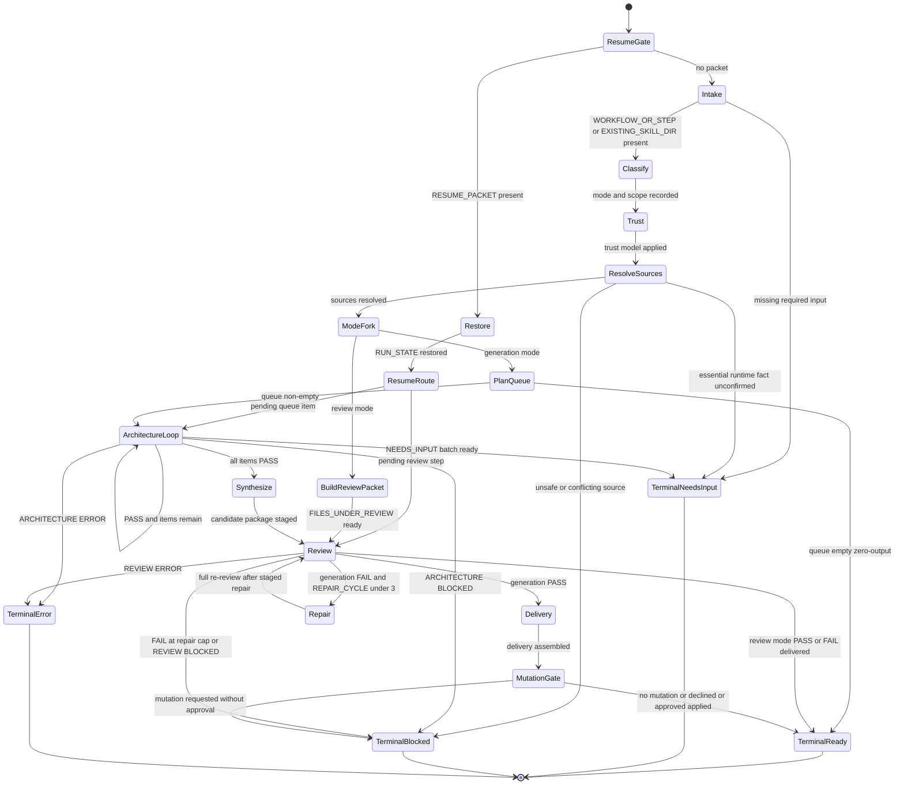

# Workflow Skill Architect Flow

Control-flow source of truth for `workflow-skill-architect`. High-level execution is a finite-state machine (`stateDiagram-v2`). Transition table: [`state-machine.md`](./state-machine.md).

## Canonical Rules

- Resume routes to the first pending queue item or the pending review step (`ResumeRoute`), never blindly into architecture when review is pending.
- Trust runs after every successful classification, including create-without- existing packages.
- Review mode: `REVIEW: PASS` and `REVIEW: FAIL` both terminate `ready`; no repair and no real-package writes.
- Generation repair: orchestrator-owned `REPAIR_CYCLE`, max 3, staged scope only, full re-review each cycle.
- Mutation: real-package writes only after explicit in-run approval that follows visibility of staged paths (see `SKILL.md` Mutation Approval).
- Every `needs_input` terminal includes a `RESUME_PACKET`.

## Mermaid validation note

Validated structurally (reachability, no dead non-terminals). Sibling `skills/generate-flow-diagram/scripts/check-mermaid.sh` returned `parser unavailable` (Chrome/puppeteer missing); recorded as fallback evidence.
