# Workflow Skill Architect Flow

Workflow Skill Architect orchestrates conversion of repeatable workflows into
portable agent-skill packages. It may clarify inputs, inspect a supplied local
skill directory, choose artifact boundaries, load bundled references just in
time, dispatch `step-architect` and `definition-reviewer`, synthesize candidate
files or review reports, and apply only validation repairs within the requested
scope. The local skill package is authoritative for runtime behavior; external
sources are optional evidence for current syntax or platform facts and never
override host, user, or local package instructions. Package mutation remains
gated by the parent orchestrator or explicit user approval.

```mermaid
flowchart TD
  START([Start: workflow skill architecture request]) --> INTAKE["Capture WORKFLOW_OR_STEP, TARGET_RUNTIME, EXISTING_PROMPT, OUTPUT_SCOPE, CONSTRAINTS, and optional existing skill directory"]
  INTAKE --> REQUIRED{"WORKFLOW_OR_STEP or existing skill directory supplied?"}
  REQUIRED -->|no| NEEDS_WORKFLOW([needs_input: ask one workflow question])
  REQUIRED -->|yes| DEFAULTS["Default TARGET_RUNTIME to portable Agent Skills when absent"]
  DEFAULTS --> BOUNDARY["Record authority, trust model, mutation limits, and completion states: ready, needs_input, blocked, error"]
  BOUNDARY --> STATUS_MAP["Normalize status mapping: PASS continues; NEEDS_INPUT maps to needs_input; BLOCKED maps to blocked; ERROR maps to error; REVIEW FAIL enters bounded repair"]
  STATUS_MAP --> EXISTING{"Existing skill directory supplied?"}

  EXISTING -->|yes| INSPECT["Inspect local package files before review, editing, or replacement generation"]
  EXISTING -->|no| CLASSIFY
  INSPECT --> CLASSIFY{"Request type?"}

  CLASSIFY -->|review| REVIEW_INVENTORY["Build FILES_UNDER_REVIEW inventory, review scope, runtime constraints, and report target"]
  CLASSIFY -->|create| SCOPE["Identify OUTPUT_SCOPE, artifact boundaries, and requested deliverables"]
  CLASSIFY -->|extend| SCOPE
  CLASSIFY -->|refactor| SCOPE

  REVIEW_INVENTORY --> REF_CONTEXT
  SCOPE --> REF_CONTEXT["Set current phase and minimal reference needs with a reason for each load"]
  REF_CONTEXT --> REF_NEEDED{"Any local reference needed for this phase?"}
  REF_NEEDED -->|no| PLAN
  REF_NEEDED -->|yes| REF_LOAD["Load only justified local references: structure, templates, quality, or external-source guidance"]
  REF_LOAD --> MORE_REFS{"Another reference justified now?"}
  MORE_REFS -->|yes| REF_LOAD
  MORE_REFS -->|no| EXTERNAL_GATE{"Current runtime syntax or platform behavior needed?"}

  EXTERNAL_GATE -->|no| PLAN
  EXTERNAL_GATE -->|yes| SOURCE_RISK{"External fetch allowed and source risk acceptable?"}
  SOURCE_RISK -->|no| EXTERNAL_RISK([blocked: external source risk or approval needed])
  SOURCE_RISK -->|yes| FETCH["Fetch smallest relevant official source and treat it as isolated evidence"]
  FETCH --> FETCH_STATUS{"Fetch status?"}
  FETCH_STATUS -->|available| CONFLICT{"External fact conflicts with local package, host, or user instructions?"}
  FETCH_STATUS -->|unavailable| LOCAL_FALLBACK{"Can proceed local-only with a documented assumption?"}
  FETCH_STATUS -->|unsafe| EXTERNAL_RISK
  LOCAL_FALLBACK -->|yes| PLAN_LOCAL["Record local-only fallback, assumption, and remaining risk"]
  LOCAL_FALLBACK -->|no| RUNTIME_BLOCKED([blocked: required current runtime fact unavailable])
  CONFLICT -->|yes| CONFLICT_BLOCKED([blocked: conflicting current fact requires user decision])
  CONFLICT -->|no| PLAN
  PLAN_LOCAL --> PLAN

  PLAN["Plan smallest correct package or review report: SKILL.md, subagents, references, scripts, assets, or findings"] --> REVIEW_ONLY_CHECK{"Review-only request?"}
  REVIEW_ONLY_CHECK -->|yes| REVIEW
  REVIEW_ONLY_CHECK -->|no| QUEUE["Derive WORK_ITEM_QUEUE from OUTPUT_SCOPE and store queue state: item, artifact type, constraints, status"]
  QUEUE --> QUEUE_EMPTY{"WORK_ITEM_QUEUE empty?"}
  QUEUE_EMPTY -->|yes| EMPTY_MANIFEST["Create empty collection manifest and note no generated artifacts requested"]
  QUEUE_EMPTY -->|no| NEXT_ITEM["Select next queued work item and pass explicit context to step-architect"]

  NEXT_ITEM --> ARCHITECT["Dispatch step-architect with item, runtime, context, existing prompt, constraints, and artifact boundary"]
  ARCHITECT --> ARCHITECT_STATUS{"ARCHITECTURE status?"}
  ARCHITECT_STATUS -->|PASS| COLLECT["Append generated file, registry row, contract, validation note, and handoff summary to COLLECTION_MANIFEST"]
  ARCHITECT_STATUS -->|NEEDS_INPUT| STEP_INPUT([needs_input: ask one precise step or artifact question])
  ARCHITECT_STATUS -->|BLOCKED| STEP_BLOCKED([blocked: runtime detail or artifact boundary unverifiable])
  ARCHITECT_STATUS -->|ERROR| STEP_ERROR([error: unexpected architecture failure])
  COLLECT --> QUEUE_REMAINING{"Queued work items remain?"}
  QUEUE_REMAINING -->|yes| NEXT_ITEM
  QUEUE_REMAINING -->|no| SYNTHESIZE
  EMPTY_MANIFEST --> SYNTHESIZE

  SYNTHESIZE["Synthesize coherent candidate package, integration notes, fetched sources, validation summary, and remaining risks"] --> REVIEW
  REVIEW["Dispatch definition-reviewer with candidate package or FILES_UNDER_REVIEW, final scope, target runtime, constraints, and collection manifest"]
  REVIEW --> REVIEW_STATUS{"REVIEW status?"}

  REVIEW_STATUS -->|PASS| OUTPUT_KIND{"Request type?"}
  OUTPUT_KIND -->|review-only| REVIEW_REPORT["Return review report, validation summary, and remaining risks without generated files"]
  OUTPUT_KIND -->|create, extend, or refactor| MUTATION_CHECK{"Package mutation requested now?"}
  MUTATION_CHECK -->|no| FINAL_FILES["Return final files, integration notes, fetched sources, validation summary, and remaining risks"]
  MUTATION_CHECK -->|yes| MUTATION_GATE{"Explicit approval from parent orchestrator or user?"}
  MUTATION_GATE -->|approved| APPROVED_HANDOFF["Hand off approved mutation plan and audit notes; apply only requested validation repairs if in scope"]
  MUTATION_GATE -->|declined| FINAL_FILES
  MUTATION_GATE -->|missing| MUTATION_BLOCKED([blocked: package mutation approval missing])
  APPROVED_HANDOFF --> FINAL_FILES
  REVIEW_REPORT --> READY([ready])
  FINAL_FILES --> READY

  REVIEW_STATUS -->|FAIL| REPAIR_CAP{"Targeted repair cycles used fewer than 3?"}
  REVIEW_STATUS -->|BLOCKED| REVIEW_BLOCKED([blocked: reviewer needs missing file, scope, or runtime fact])
  REVIEW_STATUS -->|ERROR| REVIEW_ERROR([error: unexpected review failure])
  REPAIR_CAP -->|yes| REPAIR["Apply only reviewer-required validation repairs within approved scope and update collection manifest"]
  REPAIR_CAP -->|no| REPAIR_LIMIT([blocked: repair limit reached with remaining findings])
  REPAIR --> REVIEW

  classDef guard fill:#fff3cd,stroke:#856404,color:#000;
  classDef check fill:#e7f1ff,stroke:#0b5ed7,color:#000;
  classDef decision fill:#f8f9fa,stroke:#495057,color:#000;
  classDef human fill:#f3e8ff,stroke:#6f42c1,color:#000;
  classDef output fill:#e8f5e9,stroke:#2e7d32,color:#000;
  classDef success fill:#e8f5e9,stroke:#2e7d32,color:#000;
  classDef refine fill:#fff3cd,stroke:#856404,color:#000;
  classDef stop fill:#fdecea,stroke:#b02a37,color:#000;

  class DEFAULTS,BOUNDARY,STATUS_MAP,SCOPE,REF_CONTEXT,REF_LOAD,FETCH,PLAN_LOCAL,QUEUE guard;
  class INTAKE,INSPECT,REVIEW_INVENTORY,PLAN,EMPTY_MANIFEST,NEXT_ITEM,ARCHITECT,COLLECT,SYNTHESIZE,REVIEW,APPROVED_HANDOFF check;
  class REQUIRED,EXISTING,CLASSIFY,REF_NEEDED,MORE_REFS,EXTERNAL_GATE,SOURCE_RISK,FETCH_STATUS,CONFLICT,LOCAL_FALLBACK,REVIEW_ONLY_CHECK,QUEUE_EMPTY,ARCHITECT_STATUS,QUEUE_REMAINING,REVIEW_STATUS,OUTPUT_KIND,MUTATION_CHECK,MUTATION_GATE,REPAIR_CAP decision;
  class NEEDS_WORKFLOW,STEP_INPUT human;
  class REPAIR refine;
  class REVIEW_REPORT,FINAL_FILES output;
  class READY success;
  class EXTERNAL_RISK,RUNTIME_BLOCKED,CONFLICT_BLOCKED,STEP_BLOCKED,STEP_ERROR,REVIEW_BLOCKED,REVIEW_ERROR,MUTATION_BLOCKED,REPAIR_LIMIT stop;
```

Readiness rule: return final files only after every required `step-architect`
item returns `ARCHITECTURE: PASS`, synthesis is complete, and
`definition-reviewer` returns `REVIEW: PASS`. For review-only requests, return a
review report instead of generated files after `REVIEW: PASS`.

Status mapping: `PASS` continues, `NEEDS_INPUT` returns `needs_input`,
`BLOCKED` returns `blocked`, and `ERROR` returns `error`. `REVIEW: FAIL` may
trigger at most three targeted repair cycles before returning `blocked` with
remaining findings.
