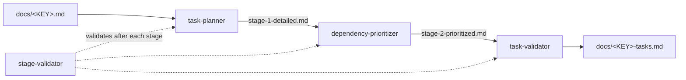
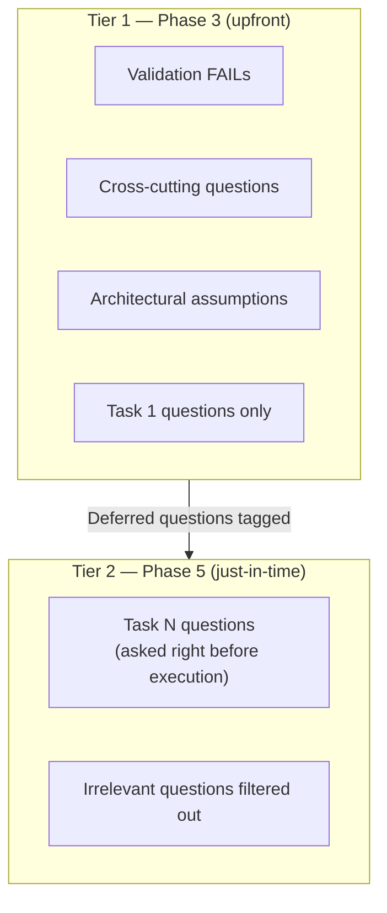
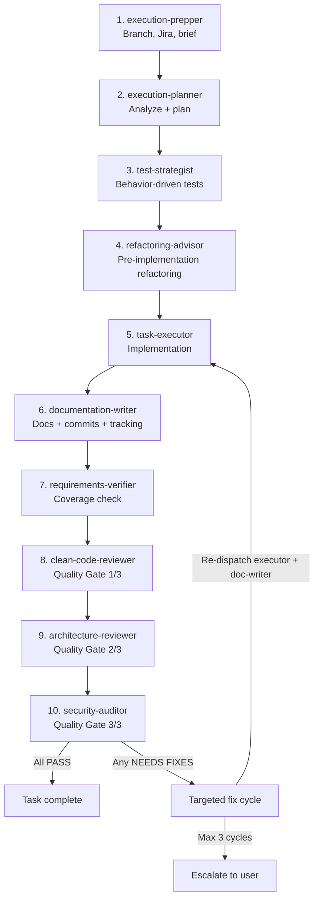
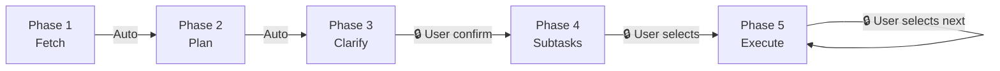

# 01 — Pipeline and Phases

> Five sequential phases take a Jira ticket from raw data to shipped code.

---

## Pipeline overview

```
Phase 1: Fetch           →  docs/<KEY>.md
Phase 2: Plan            →  docs/<KEY>-tasks.md
Phase 3: Clarify         →  docs/<KEY>-tasks.md (updated with decisions)
Phase 4: Create subtasks →  Jira subtasks created + plan updated with keys
Phase 5: Execute         →  Code changes, one task at a time
```

Each phase is handled by a dedicated downstream skill. The orchestrator reads the skill's `SKILL.md` only when invoking it and follows every step defined within — no skipping.

---

## Phase detail

### Phase 1 — Fetch ticket

| Property     | Value                             |
| ------------ | --------------------------------- |
| Skill        | `fetching-jira-ticket`            |
| Subagents    | `ticket-retriever` (1)            |
| Input        | `TICKET_KEY`, optional `JIRA_URL` |
| Output       | `docs/<KEY>.md`                   |
| Gate to next | Automatic                         |

**What happens:** The `ticket-retriever` subagent extracts every field from the Jira ticket (description, comments, subtasks, attachments metadata, labels, sprint, status, assignee, reporter, linked issues, custom fields, acceptance criteria) and writes a comprehensive Markdown snapshot. This file becomes the single source of truth for all downstream skills.

**Output contract — required sections:**

| Section                  | Required by                                 | Purpose                                 |
| ------------------------ | ------------------------------------------- | --------------------------------------- |
| `## Metadata` table      | planning-jira-tasks                         | Task decomposition needs ticket context |
| `## Description`         | planning-jira-tasks                         | Primary source for requirements         |
| `## Acceptance Criteria` | planning-jira-tasks, task-validator         | Maps to Definition of Done              |
| `## Comments`            | planning-jira-tasks                         | Contains decisions and clarifications   |
| `## Subtasks`            | planning-jira-tasks, creating-jira-subtasks | Avoids duplicating existing work        |
| `## Linked Issues`       | planning-jira-tasks                         | Dependency and context awareness        |
| `## Attachments`         | executing-jira-task                         | Implementation reference                |
| `## Custom Fields`       | planning-jira-tasks                         | May contain acceptance criteria         |

If a section has no data, the heading is kept with `_None_` beneath it — headings are never omitted because downstream skills parse them programmatically.

---

### Phase 2 — Plan tasks

| Property     | Value                                                                             |
| ------------ | --------------------------------------------------------------------------------- |
| Skill        | `planning-jira-tasks`                                                             |
| Subagents    | `task-planner`, `dependency-prioritizer`, `task-validator`, `stage-validator` (4) |
| Input        | `docs/<KEY>.md`                                                                   |
| Output       | `docs/<KEY>-tasks.md`                                                             |
| Gate to next | Automatic                                                                         |

**What happens:** A three-stage pipeline decomposes the ticket into the smallest practical set of focused, independent, executable tasks.



**Intermediate files** (cleaned up after final validation):

| Stage | File                                | Subagent               |
| ----- | ----------------------------------- | ---------------------- |
| 1     | `docs/<KEY>-stage-1-detailed.md`    | task-planner           |
| 2     | `docs/<KEY>-stage-2-prioritized.md` | dependency-prioritizer |
| 3     | `docs/<KEY>-tasks.md` (final)       | task-validator         |

**Output contract — required sections:**

| Section                              | Required by                                                         |
| ------------------------------------ | ------------------------------------------------------------------- |
| `## Ticket Summary`                  | clarifying-assumptions                                              |
| `## Assumptions and Constraints`     | clarifying-assumptions                                              |
| `## Cross-Cutting Open Questions`    | clarifying-assumptions                                              |
| `## Tasks` (each with 8 subsections) | clarifying-assumptions, creating-jira-subtasks, executing-jira-task |
| `## Execution Order Summary`         | creating-jira-subtasks                                              |
| `## Dependency Graph`                | executing-jira-task                                                 |
| `## Validation Report`               | clarifying-assumptions                                              |

**Required subsections per task:**

1. `**Objective:**`
2. `**Relevant requirements and context:**`
3. `**Questions to answer before starting:**`
4. `**Implementation notes:**`
5. `**Definition of done:**`
6. `**Likely files / artifacts affected:**`
7. `**Dependencies / prerequisites:**`
8. `**Priority:**`

---

### Phase 3 — Clarify assumptions

| Property     | Value                                                  |
| ------------ | ------------------------------------------------------ |
| Skill        | `clarifying-assumptions`                               |
| Subagents    | `decision-recorder` (1)                                |
| Input        | `docs/<KEY>-tasks.md`                                  |
| Output       | `docs/<KEY>-tasks.md` (updated in-place)               |
| Gate to next | **User confirmation required** (creates Jira subtasks) |

**What happens:** A structured interviewer walks the user through open questions and assumptions using a **progressive disclosure** model with two tiers.



**Two-tier disclosure model:**

| Tier                  | When                             | What gets asked                                                                             |
| --------------------- | -------------------------------- | ------------------------------------------------------------------------------------------- |
| Tier 1 (upfront)      | During Phase 3                   | Cross-cutting questions, architectural assumptions, validation FAILs, Task 1 questions only |
| Tier 2 (just-in-time) | During Phase 5, before each task | Only questions for the specific task about to execute; irrelevant questions filtered        |

**Output additions:**

| Addition                               | Required by            | Purpose                                                    |
| -------------------------------------- | ---------------------- | ---------------------------------------------------------- |
| `## Decisions Log` table               | creating-jira-subtasks | Subtask descriptions reflect resolved decisions            |
| Annotated assumptions (`✅`/`❌`/`⏭️`) | executing-jira-task    | Executor needs confirmed assumptions                       |
| Resolved per-task questions            | executing-jira-task    | Pre-flight check verifies no unresolved questions          |
| Updated `Implementation notes`         | executing-jira-task    | Executor follows the updated approach                      |
| Deferred question tags                 | orchestrator (Phase 5) | Orchestrator knows which questions to ask before each task |

**Gate options presented to user:**

- "Create subtasks now"
- "Review the plan first"
- "Stop here — I'll create subtasks manually"

---

### Phase 4 — Create Jira subtasks

| Property     | Value                                          |
| ------------ | ---------------------------------------------- |
| Skill        | `creating-jira-subtasks`                       |
| Subagents    | `subtask-creator` (1)                          |
| Input        | `docs/<KEY>-tasks.md`                          |
| Output       | Jira subtasks created + plan updated with keys |
| Gate to next | **User chooses which task to execute first**   |

**What happens:** The `subtask-creator` subagent reads the plan, creates corresponding subtasks in Jira under the parent ticket, and updates the plan file with subtask keys for traceability.

**End-to-end subagent flow:**

1. Parse task plan (all task sections + Decisions Log)
2. Look up parent ticket via Jira MCP (extract project key, subtask issue type)
3. Build subtask payloads in Jira wiki markup, cross-referencing resolved decisions
4. Create subtasks sequentially via Jira MCP (with retry on rate limits)
5. Handle individual failures gracefully (log + continue)
6. Update `docs/<KEY>-tasks.md`: add `## Jira Subtasks` table and `Jira Subtask: <KEY>` per task
7. Validate output contract (table exists, keys present, counts match)

**Output additions:**

| Addition                                              | Required by         | Purpose                                           |
| ----------------------------------------------------- | ------------------- | ------------------------------------------------- |
| `## Jira Subtasks` table (Task #, Key, Title, Status) | executing-jira-task | Maps task numbers to Jira keys for status updates |
| `Jira Subtask: <KEY>` line in each task section       | executing-jira-task | Executor transitions the correct Jira issue       |

---

### Phase 5 — Execute tasks (loop)

| Property  | Value                                       |
| --------- | ------------------------------------------- |
| Skill     | `executing-jira-task`                       |
| Subagents | 10 (see below)                              |
| Input     | `docs/<KEY>-tasks.md` + `docs/<KEY>.md`     |
| Output    | Code changes, tests, documentation, commits |
| Gate      | **User selects next task after each**       |

Phase 5 runs **once per task**, not once for the whole plan. Each iteration follows a 10-subagent pipeline:



**Per-iteration orchestration loop:**

1. Dispatch `progress-tracker` → get remaining tasks
2. Present remaining tasks to the user
3. User selects the next task
4. Pre-task context gathering (dispatch utility subagents as needed)
5. Progressive clarification (resolve deferred questions for this task only)
6. Invoke `executing-jira-task` (follow every step)
7. Quality gate handling (delegated to executing-jira-task internally)
8. Dispatch `progress-tracker` to mark the task complete
9. Return to step 1

**Pre-task context dispatch table:**

| Situation                        | Dispatch to             |
| -------------------------------- | ----------------------- |
| Need current ticket status       | `ticket-status-checker` |
| Need working tree / branch state | `codebase-inspector`    |
| Need to find relevant code       | `code-reference-finder` |
| Need docs or config context      | `documentation-finder`  |

---

## Phase transition summary



| Transition | Gate type         | Reason                                                   |
| ---------- | ----------------- | -------------------------------------------------------- |
| 1 → 2      | Automatic         | No external system writes                                |
| 2 → 3      | Automatic         | No external system writes                                |
| 3 → 4      | User confirmation | Creates Jira subtasks (external system writes)           |
| 4 → 5      | User selection    | User chooses which task to execute first                 |
| Within 5   | User selection    | After each task, user chooses next — never auto-continue |
