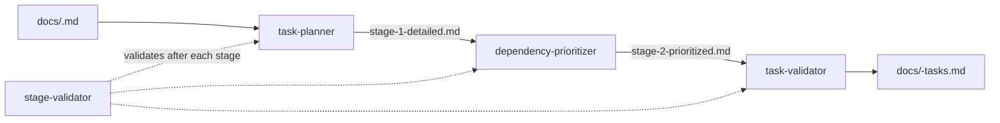
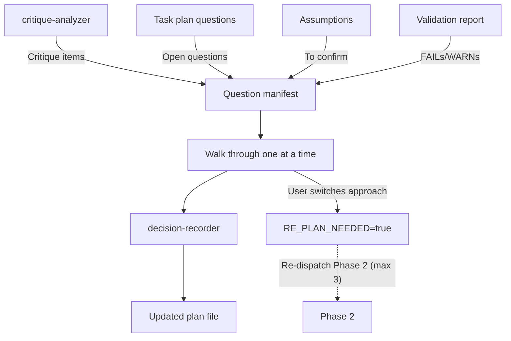
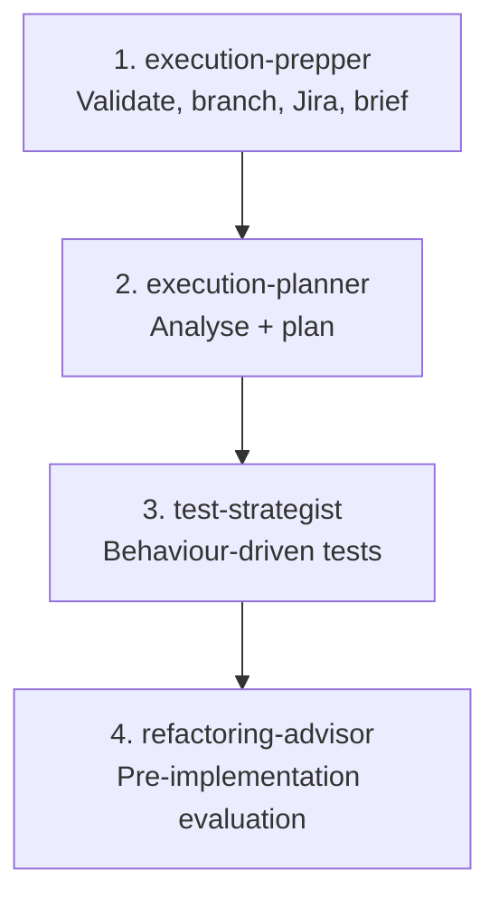
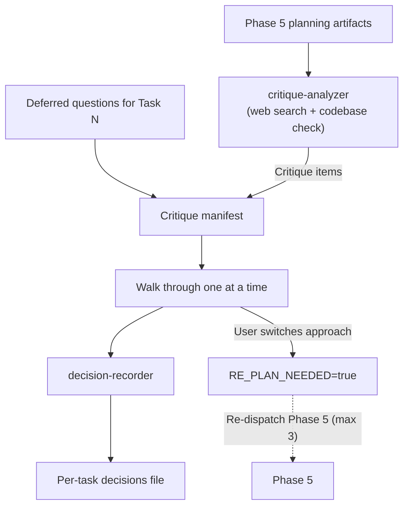
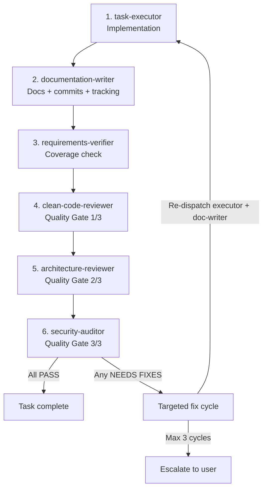
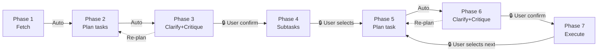

# 01 — Pipeline and Phases

> Seven sequential phases take a Jira ticket from raw data to shipped code, with critique checkpoints before every implementation step.

---

## Pipeline overview

```
Phase 1: Fetch           →  docs/<KEY>.md
Phase 2: Plan tasks      →  docs/<KEY>-tasks.md + intermediates
Phase 3: Clarify+Critique→  docs/<KEY>-tasks.md (updated with decisions)
Phase 4: Create subtasks →  Jira subtasks created + plan updated with keys
Phase 5: Plan task exec  →  docs/<KEY>-task-<N>-*.md (4 planning artifacts)
Phase 6: Clarify+Critique→  docs/<KEY>-task-<N>-decisions.md
Phase 7: Execute         →  Code changes, tests, commits
         ↑_______________↓  (Phases 5-6-7 loop per task)
```

Each phase is handled by a dedicated downstream skill. The orchestrator reads the skill's `SKILL.md` only when invoking it and follows every step defined within — no skipping.

---

## Phase detail

### Phase 1 — Fetch ticket

| Property     | Value                             |
| ------------ | --------------------------------- |
| Skill        | `fetching-jira-ticket`            |
| Subagents    | `ticket-retriever` (1)            |
| Input        | `TICKET_KEY`, optional `JIRA_URL` |
| Output       | `docs/<KEY>.md`                   |
| Gate to next | Automatic                         |

**What happens:** The `ticket-retriever` subagent extracts every field from the Jira ticket and writes a comprehensive Markdown snapshot. This file becomes the single source of truth for all downstream skills.

**Output contract — required sections:**

| Section                  | Required by                                 | Purpose                                 |
| ------------------------ | ------------------------------------------- | --------------------------------------- |
| `## Metadata` table      | planning-jira-tasks                         | Task decomposition needs ticket context |
| `## Description`         | planning-jira-tasks                         | Primary source for requirements         |
| `## Acceptance Criteria` | planning-jira-tasks                         | Maps to Definition of Done              |
| `## Comments`            | planning-jira-tasks                         | Contains decisions and clarifications   |
| `## Subtasks`            | planning-jira-tasks, creating-jira-subtasks | Avoids duplicating existing work        |
| `## Linked Issues`       | planning-jira-tasks                         | Dependency and context awareness        |
| `## Attachments`         | planning-jira-task                          | Implementation reference                |
| `## Custom Fields`       | planning-jira-tasks                         | May contain acceptance criteria         |

If a section has no data, the heading is kept with `_None_` beneath it — headings are never omitted because downstream skills parse them programmatically.

---

### Phase 2 — Plan tasks

| Property     | Value                                                                             |
| ------------ | --------------------------------------------------------------------------------- |
| Skill        | `planning-jira-tasks`                                                             |
| Subagents    | `task-planner`, `dependency-prioritizer`, `task-validator`, `stage-validator` (4) |
| Input        | `docs/<KEY>.md`                                                                   |
| Output       | `docs/<KEY>-tasks.md` + preserved intermediates                                   |
| Gate to next | Automatic                                                                         |

**What happens:** A three-stage pipeline decomposes the ticket into the smallest practical set of focused, independent, executable tasks.



**Intermediate files** (preserved, never deleted, never committed):

| Stage | File                                | Subagent               |
| ----- | ----------------------------------- | ---------------------- |
| 1     | `docs/<KEY>-stage-1-detailed.md`    | task-planner           |
| 2     | `docs/<KEY>-stage-2-prioritized.md` | dependency-prioritizer |
| 3     | `docs/<KEY>-tasks.md` (final)       | task-validator         |

Intermediates are preserved for: Phase 3 critique (the `critique-analyzer` reads them), re-plan cycles (subagents receive their prior output on re-dispatch), and debugging.

**Output contract — required sections:**

| Section                              | Required by                                                         |
| ------------------------------------ | ------------------------------------------------------------------- |
| `## Ticket Summary`                  | clarifying-assumptions                                              |
| `## Problem Framing`                 | clarifying-assumptions (Tier 3 hard gates), critique-analyzer       |
| `## Assumptions and Constraints`     | clarifying-assumptions                                              |
| `## Cross-Cutting Open Questions`    | clarifying-assumptions                                              |
| `## Tasks` (each with 8 subsections) | clarifying-assumptions, creating-jira-subtasks, executing-jira-task |
| `## Execution Order Summary`         | creating-jira-subtasks                                              |
| `## Dependency Graph`                | planning-jira-task                                                  |
| `## Validation Report`               | clarifying-assumptions                                              |

---

### Phase 3 — Clarify assumptions + critique plan

| Property     | Value                                                  |
| ------------ | ------------------------------------------------------ |
| Skill        | `clarifying-assumptions`                               |
| Subagents    | `critique-analyzer`, `decision-recorder` (2)           |
| Mode         | `upfront`                                              |
| Input        | `docs/<KEY>-tasks.md` + stage intermediates            |
| Output       | `docs/<KEY>-tasks.md` (updated with decisions)         |
| Gate to next | **User confirmation required** (creates Jira subtasks) |

**What happens:** Three things in sequence:

1. The `critique-analyzer` subagent reads the task plan and intermediates, performs two categories of critique: (a) **problem-framing critique** — challenging whether the end user is identified, the underlying need is articulated, the solution-problem fit is sound, and evidence supports the approach; and (b) **technology critique** — searching the web for alternatives, cross-checking the codebase, and producing critique items challenging unjustified defaults and unexplored alternatives.

2. A structured interviewer walks the user through problem-framing challenges, technology critique items, AND open questions/assumptions using progressive disclosure and two questioning models:
   - **Model A (Socratic)** for Tier 3 hard-gate problem-framing items: the developer articulates their own reasoning before the analysis is revealed. Cannot be skipped.
   - **Model B (evaluate-the-reasoning)** for all other items: the developer evaluates the subagent's reasoning against the critique. Can be skipped but flagged with ⚠️.

3. Problem-framing items are asked first (before technology critique), ordered by severity.



**Re-plan cycle:** If the user agrees with a critique and decides to change the approach, `RE_PLAN_NEEDED` is set. The orchestrator re-dispatches Phase 2 with all pipeline subagents, passing the new decisions. Subagents receive their prior artifacts plus the decisions and produce updated versions. Maximum 3 re-plan cycles.

**Gate options presented to user:**

- "Create subtasks now"
- "Review the plan first"
- "Stop here — I'll create subtasks manually"

---

### Phase 4 — Create Jira subtasks

| Property     | Value                                          |
| ------------ | ---------------------------------------------- |
| Skill        | `creating-jira-subtasks`                       |
| Subagents    | `subtask-creator` (1)                          |
| Input        | `docs/<KEY>-tasks.md`                          |
| Output       | Jira subtasks created + plan updated with keys |
| Gate to next | **User chooses which task to execute first**   |

**What happens:** The `subtask-creator` subagent reads the plan, creates corresponding subtasks in Jira under the parent ticket, and updates the plan file with subtask keys for traceability.

**Output additions:**

| Addition                                              | Required by        | Purpose                                           |
| ----------------------------------------------------- | ------------------ | ------------------------------------------------- |
| `## Jira Subtasks` table (Task #, Key, Title, Status) | planning-jira-task | Maps task numbers to Jira keys for status updates |
| `Jira Subtask: <KEY>` line in each task section       | planning-jira-task | Identifies which Jira issue to transition         |

---

### Phase 5 — Plan task execution (NEW)

| Property     | Value                                                                                  |
| ------------ | -------------------------------------------------------------------------------------- |
| Skill        | `planning-jira-task` (singular — one task at a time)                                   |
| Subagents    | `execution-prepper`, `execution-planner`, `test-strategist`, `refactoring-advisor` (4) |
| Input        | `docs/<KEY>-tasks.md` + `docs/<KEY>.md`                                                |
| Output       | 4 planning artifacts per task (see below)                                              |
| Gate to next | Automatic into Phase 6                                                                 |

**What happens:** A four-subagent pipeline analyses the specific task, inspects the codebase, and produces detailed planning artifacts that will be critiqued before implementation.



**Planning artifacts produced** (persisted, never deleted, never committed):

| Artifact                                  | Subagent            | Purpose                                                            |
| ----------------------------------------- | ------------------- | ------------------------------------------------------------------ |
| `docs/<KEY>-task-<N>-brief.md`            | execution-prepper   | Self-contained execution context                                   |
| `docs/<KEY>-task-<N>-execution-plan.md`   | execution-planner   | Framework, skills, approach, file strategy, user-impact assessment |
| `docs/<KEY>-task-<N>-test-spec.md`        | test-strategist     | Behaviour-driven test specification                                |
| `docs/<KEY>-task-<N>-refactoring-plan.md` | refactoring-advisor | Pre-implementation refactoring evaluation                          |

---

### Phase 6 — Clarify assumptions + critique execution plan (NEW)

| Property     | Value                                             |
| ------------ | ------------------------------------------------- |
| Skill        | `clarifying-assumptions`                          |
| Subagents    | `critique-analyzer`, `decision-recorder` (2)      |
| Mode         | `critique`                                        |
| Input        | All Phase 5 planning artifacts                    |
| Output       | `docs/<KEY>-task-<N>-decisions.md` + plan updates |
| Gate to next | **User confirmation to proceed with execution**   |

**What happens:** The `critique-analyzer` reads the four planning artifacts, searches the web for alternatives to every framework/library/tool decision, cross-checks the codebase directly, evaluates the User Impact Assessment for user-facing consequences, and produces critique items. The interviewer walks the user through ALL items (technology critique, user-impact concerns, all severities) plus any deferred questions for this task, using **Model B (evaluate-the-reasoning)** throughout.



**Re-plan cycle:** If the user agrees with a critique and decides to change the approach, Phase 5 is re-dispatched. All four subagents re-run with the prior artifacts preserved plus the new decisions. Maximum 3 re-plan cycles. User is looped in on every iteration.

**Decisions output:** Critique resolutions (technology and user-impact) and deferred question resolutions are written to `docs/<KEY>-task-<N>-decisions.md`. A reference is added to the main `## Decisions Log` in the task plan.

---

### Phase 7 — Execute task (simplified)

| Property  | Value                                                         |
| --------- | ------------------------------------------------------------- |
| Skill     | `executing-jira-task`                                         |
| Subagents | 6 (see below)                                                 |
| Input     | All Phase 5 planning artifacts + Phase 6 decisions            |
| Output    | Code changes, tests, documentation, commits                   |
| Gate      | **User selects next task after completion → loop to Phase 5** |

Phase 7 runs the implementation pipeline using planning artifacts that have already been critiqued and confirmed by the user.



**Commit discipline:** The `documentation-writer` commits only Category B files (source code, tests, config changes). Category A files (all `docs/<KEY>*.md` orchestration artifacts) are updated on disk but NEVER staged or committed to git.

**Per-task orchestration loop (Phases 5-6-7):**

1. User selects task
2. Phase 5: Plan how to execute the task (4 subagents)
3. Phase 6: Critique the plan + resolve deferred questions (user engagement)
4. Phase 7: Execute the task (6 subagents + quality gates)
5. Return to step 1 for next task

---

## Phase transition summary



| Transition | Gate type         | Reason                                                    |
| ---------- | ----------------- | --------------------------------------------------------- |
| 1 → 2      | Automatic         | No external system writes                                 |
| 2 → 3      | Automatic         | Critique is part of the planning flow                     |
| 3 → 4      | User confirmation | Creates Jira subtasks (external system writes)            |
| 4 → 5      | User selection    | User chooses which task to execute first                  |
| 5 → 6      | Automatic         | Critique is part of the per-task planning flow            |
| 6 → 7      | User confirmation | User confirms the plan is ready for implementation        |
| Within 5-7 | User selection    | After each task, user chooses next — never auto-continue  |
| 3 → 2      | Re-plan cycle     | Critique triggered changes to the task plan (max 3)       |
| 6 → 5      | Re-plan cycle     | Critique triggered changes to task execution plan (max 3) |
