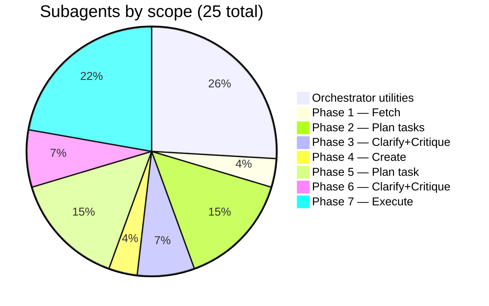

# 02 — Subagent Registry

> Every subagent in the system: orchestrator utilities, phase handlers, and their roles.

---

## Subagent distribution

> Note: Phases 3 and 6 share the same skill (`clarifying-assumptions`) and the same two subagents (`critique-analyzer`, `decision-recorder`), invoked in different modes. They are counted once each. Phase 7's 6 subagents include the 3 quality gate subagents (`clean-code-reviewer`, `architecture-reviewer`, `security-auditor`) and the `requirements-verifier` pre-gate check.

---

## Orchestrator utility subagents (7)

These handle all tool calls, file reads, and command execution on behalf of the orchestrator. The orchestrator dispatches to these instead of doing anything directly.

### preflight-checker

| Property        | Value                                                                              |
| --------------- | ---------------------------------------------------------------------------------- |
| Path            | `./subagents/preflight-checker.md`                                                 |
| Purpose         | Validate environment dependencies (MCPs, skills, CLI tools) before workflow starts |
| When dispatched | Before starting or resuming a workflow                                             |

**What it checks:**

| Dependency                     | Type  | Level    | Phase(s) |
| ------------------------------ | ----- | -------- | -------- |
| Jira MCP                       | MCP   | Required | 1, 4     |
| git CLI                        | Tool  | Required | 5, 7     |
| `/commit-work`                 | Skill | Required | 7        |
| `/humanizer`                   | Skill | Required | 7        |
| `/find-skills`                 | Skill | Required | 5        |
| `/writing-plans`               | Skill | Required | 2, 5     |
| `/executing-plans`             | Skill | Required | 7        |
| `/test-driven-development`     | Skill | Required | 5        |
| `/vitest`                      | Skill | Required | 5        |
| `/clean-code`                  | Skill | Required | 7        |
| `/architecture-patterns`       | Skill | Required | 7        |
| `/api-security-best-practices` | Skill | Required | 7        |
| context7 MCP                   | MCP   | Required | 7        |

**Verdict logic:**

| Verdict | Condition              | Orchestrator action                            |
| ------- | ---------------------- | ---------------------------------------------- |
| PASS    | All required available | Proceed silently                               |
| FAIL    | Any required missing   | Stop immediately, present install instructions |

All dependencies are required — there is no WARN verdict or optional fallback.

**Constraints:** Never installs or configures anything. Report only. Output under 40 lines (PASS) or 60 lines (FAIL).

---

### artifact-validator

| Property        | Value                                                                             |
| --------------- | --------------------------------------------------------------------------------- |
| Path            | `./subagents/artifact-validator.md`                                               |
| Purpose         | Check whether phase artifacts exist and are well-formed; return pass/fail summary |
| When dispatched | Before and after every phase                                                      |

**Validation rules:**

| Phase | Direction     | File                           | Checks                                                        |
| ----- | ------------- | ------------------------------ | ------------------------------------------------------------- |
| 1     | postcondition | `docs/<KEY>.md`                | File exists, contains `## Description`                        |
| 2     | precondition  | `docs/<KEY>.md`                | Same as Phase 1 postcondition                                 |
| 2     | postcondition | `docs/<KEY>-tasks.md`          | File exists, contains `## Tasks`, has ≥2 task entries         |
| 3     | precondition  | `docs/<KEY>-tasks.md`          | Same as Phase 2 postcondition                                 |
| 3     | postcondition | `docs/<KEY>-tasks.md`          | Contains `## Decisions Log`                                   |
| 4     | precondition  | `docs/<KEY>-tasks.md`          | Same as Phase 3 postcondition                                 |
| 4     | postcondition | `docs/<KEY>-tasks.md`          | Contains `## Jira Subtasks` with ≥1 key matching `[A-Z]+-\d+` |
| 5     | precondition  | `docs/<KEY>-tasks.md`          | Same as Phase 4 postcondition                                 |
| 5     | postcondition | `docs/<KEY>-task-<N>-brief.md` | File exists                                                   |
| 6     | precondition  | `docs/<KEY>-task-<N>-*.md`     | All 4 planning artifacts exist                                |
| 7     | precondition  | `docs/<KEY>-task-<N>-*.md`     | Same as Phase 6 precondition                                  |

**Constraints:** Never returns raw file contents. Never modifies files. Output under 10 lines.

---

### progress-tracker

| Property        | Value                                                                    |
| --------------- | ------------------------------------------------------------------------ |
| Path            | `./subagents/progress-tracker.md`                                        |
| Purpose         | Read, create, or update the progress file; return current workflow state |
| When dispatched | After every phase and task; on resume to determine starting phase        |

**Actions:** `read`, `update`, `initialize`

**State inference (when no progress file exists):**

| Artifact found                                | Inferred state  |
| --------------------------------------------- | --------------- |
| `docs/<KEY>-tasks.md` with `## Jira Subtasks` | Phases 1–4 done |
| `docs/<KEY>-tasks.md` with `## Decisions Log` | Phases 1–3 done |
| `docs/<KEY>-tasks.md` with `## Tasks`         | Phases 1–2 done |
| `docs/<KEY>.md` exists                        | Phase 1 done    |
| Nothing                                       | Fresh start     |

**Status values:** `✅ Complete`, `🔄 Active`, `❌ Failed`, `⏭️ Skipped`, `⬜ Pending`

**Constraints:** Never returns the full progress file. Uses UTC timestamps. Output under 5 lines.

---

### ticket-status-checker

| Property        | Value                                                                |
| --------------- | -------------------------------------------------------------------- |
| Path            | `./subagents/ticket-status-checker.md`                               |
| Purpose         | Query Jira for current status, assignee, and recent activity         |
| When dispatched | Before task execution in Phase 5 when current ticket state is needed |

**Constraints:** Never returns raw JSON. Truncates comments to 80 chars. Limits subtask listings to 20. Output under 30 lines (`full`) or 10 lines (others).

---

### codebase-inspector

| Property        | Value                                                                    |
| --------------- | ------------------------------------------------------------------------ |
| Path            | `./subagents/codebase-inspector.md`                                      |
| Purpose         | Report working tree state: branch, uncommitted changes, recent commits   |
| When dispatched | Before task planning in Phase 5 when branch/working tree state is needed |

**Constraints:** Never returns raw diff contents or full log output. Output under 15 lines.

---

### code-reference-finder

| Property        | Value                                                                             |
| --------------- | --------------------------------------------------------------------------------- |
| Path            | `./subagents/code-reference-finder.md`                                            |
| Purpose         | Search codebase for symbols, patterns, or file references; return concise matches |
| When dispatched | Before task planning when relevant code needs to be located                       |

**Constraints:** Never returns full file contents. Matching lines truncated to 120 chars. Limited to 10 most relevant matches. Output under 25 lines.

---

### documentation-finder

| Property        | Value                                                                    |
| --------------- | ------------------------------------------------------------------------ |
| Path            | `./subagents/documentation-finder.md`                                    |
| Purpose         | Locate relevant docs, READMEs, or wiki pages; return summaries and paths |
| When dispatched | Before task planning when documentation context is needed                |

**Constraints:** Never returns full file contents. Summaries limited to 2–3 sentences per file. Max 8 results. Output under 30 lines.

---

## Phase 1 subagents (1)

### ticket-retriever

| Property | Value                                                                          |
| -------- | ------------------------------------------------------------------------------ |
| Skill    | `fetching-jira-ticket`                                                         |
| Purpose  | Retrieve all ticket data from Jira and write a comprehensive Markdown snapshot |

Handles everything end-to-end: input validation, MCP tool discovery, field retrieval, pagination, error handling, document assembly, file writing, and output validation.

---

## Phase 2 subagents (4)

### task-planner

| Property       | Value                                                 |
| -------------- | ----------------------------------------------------- |
| Skill          | `planning-jira-tasks`                                 |
| Pipeline stage | 1 of 3                                                |
| Purpose        | Decompose ticket into detailed tasks (the WHAT + HOW) |
| Output         | `docs/<KEY>-stage-1-detailed.md`                      |
| Depends on     | `/writing-plans` (required)                           |

---

### dependency-prioritizer

| Property       | Value                                                                |
| -------------- | -------------------------------------------------------------------- |
| Skill          | `planning-jira-tasks`                                                |
| Pipeline stage | 2 of 3                                                               |
| Purpose        | Build dependency graph, score tasks, determine final execution order |
| Output         | `docs/<KEY>-stage-2-prioritized.md`                                  |
| Depends on     | `/writing-plans` (required)                                          |

---

### task-validator

| Property       | Value                                                 |
| -------------- | ----------------------------------------------------- |
| Skill          | `planning-jira-tasks`                                 |
| Pipeline stage | 3 of 3                                                |
| Purpose        | QA gate running 19 validation checks against the plan |
| Output         | `docs/<KEY>-tasks.md` (final plan)                    |

---

### stage-validator

| Property       | Value                                                 |
| -------------- | ----------------------------------------------------- |
| Skill          | `planning-jira-tasks`                                 |
| Pipeline stage | Runs after every stage                                |
| Purpose        | Pre-flight, inter-stage, and post-pipeline validation |

---

## Phase 3 subagents (2)

### critique-analyzer (NEW)

| Property        | Value                                                                                                    |
| --------------- | -------------------------------------------------------------------------------------------------------- |
| Skill           | `clarifying-assumptions`                                                                                 |
| Mode            | `upfront`                                                                                                |
| Purpose         | Reads task plan artifacts, searches web for alternatives, cross-checks codebase, produces critique items |
| Input artifacts | `docs/<KEY>-tasks.md`, `docs/<KEY>-stage-1-detailed.md`, `docs/<KEY>-stage-2-prioritized.md`             |
| Output          | Structured critique report with severity-rated items                                                     |

The `critique-analyzer` is an unbiased, critical analyst designed to counter the Matthew Effect — the documented bias where AI tools favor mainstream frameworks and libraries over potentially better-fit alternatives. It MUST perform web searches to discover current alternatives (not rely on training data alone) and MUST cross-check the codebase directly (not trust other subagents' descriptions).

**Behavioral contract:**

- For every technology decision, identify at least 2 alternatives with concrete trade-offs
- Flag when a decision follows the "popular default" without project-specific justification
- Never sugarcoat or hedge — state what it sees directly
- Never recommend changes purely for novelty
- Never critique decisions constrained by the existing stack
- Present critique as structured questions with evidence, not opinions

**Severity levels:**

- **HIGH** — signs of default bias, or a clearly better-fit alternative exists, or trade-offs not acknowledged
- **MEDIUM** — reasonable alternatives exist that were not discussed
- **LOW** — minor preference difference, both options reasonable

---

### decision-recorder

| Property | Value                                                                         |
| -------- | ----------------------------------------------------------------------------- |
| Skill    | `clarifying-assumptions`                                                      |
| Purpose  | Apply all file edits (Decisions Log, annotations, deferred tags) and validate |

Handles: appending/updating the `## Decisions Log` table, annotating assumptions, striking through resolved questions, tagging deferred questions, updating implementation notes, creating per-task decisions file references, and validating all updates.

---

## Phase 4 subagents (1)

### subtask-creator

| Property | Value                                                                                  |
| -------- | -------------------------------------------------------------------------------------- |
| Skill    | `creating-jira-subtasks`                                                               |
| Purpose  | Parse plan → lookup parent → build payloads → create subtasks → update plan → validate |

---

## Phase 5 subagents (4)

### execution-prepper

| Property      | Value                                                                                    |
| ------------- | ---------------------------------------------------------------------------------------- |
| Skill         | `planning-jira-task`                                                                     |
| Pipeline step | 1                                                                                        |
| Purpose       | Validate task, set up branch, transition Jira to "In Progress", assemble execution brief |
| Output        | `docs/<KEY>-task-<N>-brief.md`                                                           |

---

### execution-planner

| Property      | Value                                                                              |
| ------------- | ---------------------------------------------------------------------------------- |
| Skill         | `planning-jira-task`                                                               |
| Pipeline step | 2                                                                                  |
| Purpose       | Analyze the task, inspect codebase, produce execution plan with recommended skills |
| Output        | `docs/<KEY>-task-<N>-execution-plan.md`                                            |
| Depends on    | `/find-skills` (required), `/writing-plans` (required)                             |

---

### test-strategist

| Property      | Value                                                                                    |
| ------------- | ---------------------------------------------------------------------------------------- |
| Skill         | `planning-jira-task`                                                                     |
| Pipeline step | 3                                                                                        |
| Purpose       | Define behavior-driven tests based on business requirements, not implementation details  |
| Output        | `docs/<KEY>-task-<N>-test-spec.md`                                                       |
| Depends on    | `/test-driven-development` (required), `/vitest` (required), `/writing-plans` (required) |

---

### refactoring-advisor

| Property      | Value                                                                            |
| ------------- | -------------------------------------------------------------------------------- |
| Skill         | `planning-jira-task`                                                             |
| Pipeline step | 4                                                                                |
| Purpose       | Evaluate whether existing code needs refactoring before or during task execution |
| Output        | `docs/<KEY>-task-<N>-refactoring-plan.md`                                        |
| Depends on    | `/writing-plans` (required)                                                      |

---

## Phase 6 subagents (2)

Phase 6 uses the same `clarifying-assumptions` skill and subagents as Phase 3, invoked in `critique` mode.

### critique-analyzer

| Property        | Value                                                                                      |
| --------------- | ------------------------------------------------------------------------------------------ |
| Skill           | `clarifying-assumptions`                                                                   |
| Mode            | `critique`                                                                                 |
| Purpose         | Reads per-task planning artifacts, searches web for alternatives, cross-checks codebase    |
| Input artifacts | `docs/<KEY>-task-<N>-brief.md`, `execution-plan.md`, `test-spec.md`, `refactoring-plan.md` |
| Output          | Structured critique report (respects prior decisions on re-critique)                       |

In `critique` mode, the analyzer also reads the per-task decisions file (if this is iteration 2 or 3) to avoid re-raising concerns that were already consciously resolved by the user.

### decision-recorder

Same subagent as Phase 3. In `critique` mode, it additionally creates the per-task decisions file (`docs/<KEY>-task-<N>-decisions.md`) and adds a reference row to the main `## Decisions Log`.

---

## Phase 7 subagents (6)

### task-executor

| Property      | Value                                                                                                               |
| ------------- | ------------------------------------------------------------------------------------------------------------------- |
| Skill         | `executing-jira-task`                                                                                               |
| Pipeline step | 1                                                                                                                   |
| Purpose       | Perform actual implementation. Operates under a **cautious execution model** — stops and escalates on any ambiguity |
| Depends on    | `/executing-plans` (required), all Phase 5 planning artifacts, Phase 6 decisions                                    |

---

### documentation-writer

| Property      | Value                                                                                               |
| ------------- | --------------------------------------------------------------------------------------------------- |
| Skill         | `executing-jira-task`                                                                               |
| Pipeline step | 2                                                                                                   |
| Purpose       | Document changes, commit Category B files only, update Category A files on disk (never commit them) |
| Depends on    | `/commit-work` (required), `/humanizer` (required)                                                  |

**Critical:** The documentation-writer commits only Category B files (source code, tests, config changes). All `docs/<KEY>*.md` files are Category A orchestration artifacts — they are updated on disk but MUST NOT be staged or committed to git.

---

### requirements-verifier

| Property      | Value                                                                                     |
| ------------- | ----------------------------------------------------------------------------------------- |
| Skill         | `executing-jira-task`                                                                     |
| Pipeline step | 3 (pre-gate)                                                                              |
| Purpose       | Cross-check every Definition of Done item against actual changes before quality gates run |

---

### clean-code-reviewer (Quality Gate 1/3)

| Property      | Value                                                 |
| ------------- | ----------------------------------------------------- |
| Skill         | `executing-jira-task`                                 |
| Pipeline step | 4                                                     |
| Purpose       | Review for Clean Code and SOLID principles compliance |
| Depends on    | `/clean-code` (required), context7 MCP (required)     |

---

### architecture-reviewer (Quality Gate 2/3)

| Property      | Value                                                                                          |
| ------------- | ---------------------------------------------------------------------------------------------- |
| Skill         | `executing-jira-task`                                                                          |
| Pipeline step | 5                                                                                              |
| Purpose       | Review for DDD and functional programming principles. Explicitly does NOT enforce OOP patterns |
| Depends on    | `/architecture-patterns` (required), context7 MCP (required)                                   |

---

### security-auditor (Quality Gate 3/3)

| Property      | Value                                                                       |
| ------------- | --------------------------------------------------------------------------- |
| Skill         | `executing-jira-task`                                                       |
| Pipeline step | 6                                                                           |
| Purpose       | Audit for security vulnerabilities, credential leaks, and insecure patterns |
| Depends on    | `/api-security-best-practices` (required), context7 MCP (required)          |
