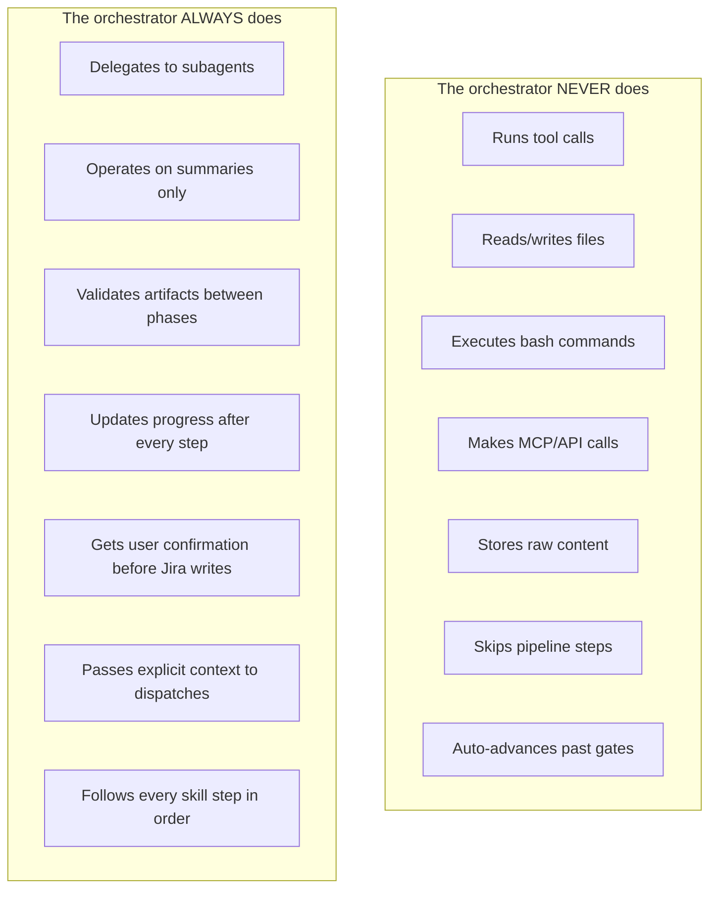

# 03 — Rules and Constraints

> Non-negotiable behavioral constraints for the orchestrator and safety rules for Phase 5 execution.

---

## Orchestrator rules (8 non-negotiable)

These exist because violating any one of them degrades the system in ways that compound across every subsequent step.

---

### Rule 1 — Delegate everything

The orchestrator **must not** perform any tool call, bash command, file read/write, web search, MCP call, or direct task execution under any circumstance. Every action — no matter how small — must be delegated to a subagent.

**Mental model:** A project manager who can only communicate through written memos to specialists. They can think, decide, prioritize, and synthesize — but the moment work needs to happen, they dispatch.

**Common traps:**

| Impulse                                            | Correct dispatch          |
| -------------------------------------------------- | ------------------------- |
| "Let me quickly read the file to see if it exists" | → `artifact-validator`    |
| "I'll just run a git status"                       | → `codebase-inspector`    |
| "Let me check the Jira ticket"                     | → `ticket-status-checker` |
| "I'll update the progress file"                    | → `progress-tracker`      |

---

### Rule 2 — Follow every step in every skill file

When invoking a downstream skill, the orchestrator must follow **every step** defined in that skill's `SKILL.md` — in order, without skipping any.

**Why:** Skill files are carefully designed pipelines where each step depends on the outputs of the previous step.

| Skipping...       | Causes...                            |
| ----------------- | ------------------------------------ |
| Validation        | Bad artifacts propagate downstream   |
| Pre-flight checks | Dependencies are not verified        |
| Documentation     | Reviewers cannot assess completeness |

If a step feels unnecessary, execute it anyway. The subagent will report "nothing to do" quickly, and the cost is negligible compared to debugging a pipeline failure.

---

### Rule 3 — Protect the context window aggressively

The orchestrator's context window should contain **only**:

- Decision-relevant summaries from subagents
- The current workflow state (phase, task, status)
- User instructions and confirmations
- Error reports that require orchestrator judgment

The orchestrator **must never** index or store:

- Raw file contents of any file a subagent has read or changed
- Full git diffs, command outputs, or API responses
- Complete execution reports — only their summary verdicts
- Full code review reports — only their verdict and issue count
- Any artifact content that is already stored on disk

**Rule of thumb:** When a subagent returns a result, extract the verdict, summary, and any data needed for the next dispatch decision. Discard everything else. If you need details later, dispatch a subagent to retrieve them.

---

### Rule 4 — Verify via subagent

Always use `artifact-validator` to check artifacts. Reading files "to quickly check" is how context pollution starts.

---

### Rule 5 — One phase at a time

Phase dependencies are strict. Partial artifacts cause cascading failures. Never run phases in parallel or skip ahead.

---

### Rule 6 — Explicit handoffs

Pass file paths, ticket keys, and context summaries explicitly to every dispatch. Subagents cannot see conversation history.

---

### Rule 7 — Gate destructive actions

Any phase modifying external systems (Jira writes, git push) requires explicit user confirmation before proceeding.

---

### Rule 8 — Maintain resumability

Update `progress-tracker` after every phase and task. The workflow can be interrupted and resumed without loss at any point.

---

## Phase 5 safety rules

These apply specifically to the `executing-jira-task` skill.

| Rule                             | Description                                                                                                                                         |
| -------------------------------- | --------------------------------------------------------------------------------------------------------------------------------------------------- |
| One task at a time               | Never auto-continue to the next task                                                                                                                |
| Scope discipline                 | Do not implement anything outside the task's scope, even if it seems like a quick win                                                               |
| Fail loudly                      | If any subagent encounters ambiguity or a blocker, surface it to the user immediately rather than making assumptions                                |
| Preserve the plan                | The task plan is the source of truth. If execution reveals the plan needs changes, propose the change to the user — do not silently modify the plan |
| Respect pipeline order           | Do not skip subagent steps or reorder them. Each step depends on the output of the previous one                                                     |
| Limit retries                    | Task-executor: max 3 retry cycles for ambiguity. Targeted fix cycle: max 3 iterations. Full pipeline re-runs require user approval                  |
| Quality gates are non-negotiable | All three quality gates (clean-code, architecture, security) must pass. There is no override, no "good enough"                                      |

---

## Rules visualized

---

## Behavioral guardrails (Phase 3 — clarification)

These govern how the orchestrator/skill interacts with users during the clarification phase:

| Guardrail                                | Description                                                                   |
| ---------------------------------------- | ----------------------------------------------------------------------------- |
| One question per message                 | Never batch multiple questions in a single turn                               |
| Manifest is source of truth              | Every question comes from it. New questions get added before being asked      |
| Defer, don't discard                     | Questions for future tasks are tagged as deferred, not deleted                |
| Teacher, not interrogator                | Context should help the user understand the problem space                     |
| Respect "skip"                           | Note the fallback, move on, no pressure                                       |
| Stay neutral on options                  | Frame recommendations as "I'd lean toward X because..." not "You should do X" |
| Keep blocks scannable                    | Each question readable in under 30 seconds                                    |
| Never ask about what hasn't happened yet | If relevance depends on a future task outcome, defer the question             |
