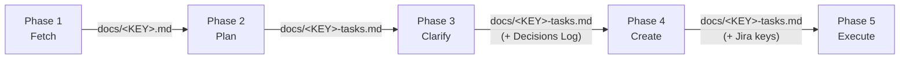
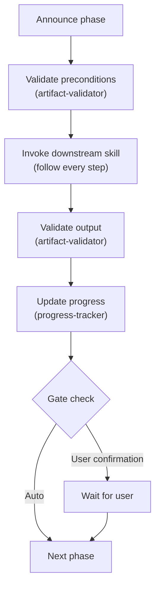
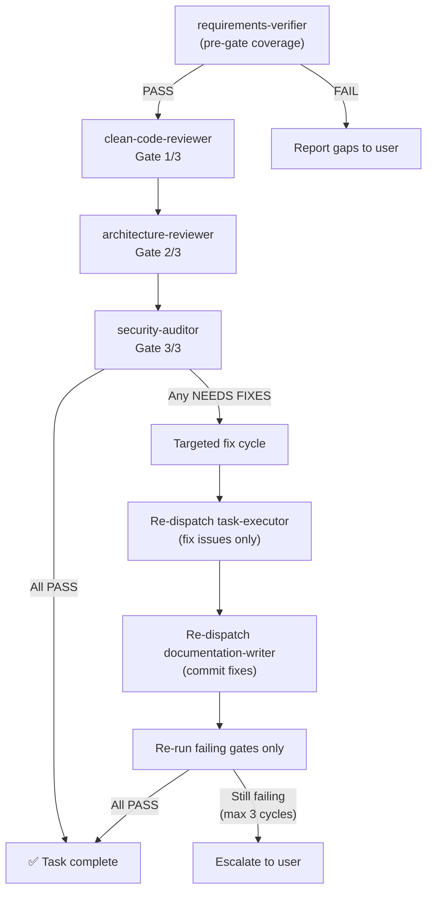

# 04 — Data Contracts and Gates

> Artifact validation, phase transition gates, quality gate architecture, and error handling.

---

## Artifact flow

Each phase produces an artifact that the next phase consumes. The `artifact-validator` subagent checks every artifact before the orchestrator advances.

---

## Data contracts between phases

### Phase 1 → Phase 2

| Artifact   | `docs/<KEY>.md`                                |
| ---------- | ---------------------------------------------- |
| Validation | File exists, contains `## Description` section |

**Required sections in artifact:**

| Section                  | Why                                     |
| ------------------------ | --------------------------------------- |
| `## Metadata` table      | Task decomposition needs ticket context |
| `## Description`         | Primary source for requirements         |
| `## Acceptance Criteria` | Maps to Definition of Done              |
| `## Comments`            | Contains decisions and clarifications   |
| `## Subtasks`            | Avoids duplicating existing work        |
| `## Linked Issues`       | Dependency and context awareness        |
| `## Attachments`         | Implementation reference                |
| `## Custom Fields`       | May contain acceptance criteria         |

---

### Phase 2 → Phase 3

| Artifact   | `docs/<KEY>-tasks.md`                                         |
| ---------- | ------------------------------------------------------------- |
| Validation | File exists, contains `## Tasks` section, has ≥2 task entries |

**Required sections in artifact:**

| Section                              | Consumed by                                                         |
| ------------------------------------ | ------------------------------------------------------------------- |
| `## Ticket Summary`                  | clarifying-assumptions                                              |
| `## Assumptions and Constraints`     | clarifying-assumptions                                              |
| `## Cross-Cutting Open Questions`    | clarifying-assumptions                                              |
| `## Tasks` (each with 8 subsections) | clarifying-assumptions, creating-jira-subtasks, executing-jira-task |
| `## Execution Order Summary`         | creating-jira-subtasks                                              |
| `## Dependency Graph`                | executing-jira-task                                                 |
| `## Validation Report`               | clarifying-assumptions                                              |

---

### Phase 3 → Phase 4

| Artifact   | `docs/<KEY>-tasks.md` (updated)     |
| ---------- | ----------------------------------- |
| Validation | Contains `## Decisions Log` section |

**Additions made by Phase 3:**

| Addition                               | Purpose                                         |
| -------------------------------------- | ----------------------------------------------- |
| `## Decisions Log` table               | Subtask descriptions reflect resolved decisions |
| Annotated assumptions (`✅`/`❌`/`⏭️`) | Executor needs confirmed assumptions            |
| Resolved per-task questions            | Pre-flight verifies no unresolved questions     |
| Updated `Implementation notes`         | Executor follows updated approach               |
| Deferred question tags                 | Orchestrator knows what to ask before each task |

---

### Phase 4 → Phase 5

| Artifact   | `docs/<KEY>-tasks.md` (with keys)                                   |
| ---------- | ------------------------------------------------------------------- |
| Validation | Contains `## Jira Subtasks` table with ≥1 key matching `[A-Z]+-\d+` |

**Additions made by Phase 4:**

| Addition                                              | Purpose                                   |
| ----------------------------------------------------- | ----------------------------------------- |
| `## Jira Subtasks` table (Task #, Key, Title, Status) | Maps task numbers to Jira keys            |
| `Jira Subtask: <KEY>` in each task section            | Identifies which Jira issue to transition |

---

### Phase 5 output (per task)

| Addition                                        | Consumed by        | Purpose                                |
| ----------------------------------------------- | ------------------ | -------------------------------------- |
| `**Status:** ✅ Complete (<date>)` on task      | Orchestrator, self | Progress tracking; dependency checking |
| `**Implementation summary:**` on task           | Orchestrator       | Concise summary for progress file      |
| `**Files changed:**` list on task               | Orchestrator       | Progress reporting                     |
| `## Jira Subtasks` table status updated to Done | Orchestrator       | Reflects current state                 |

---

## Phase transition gates

Every phase follows this execution cycle:

| Transition | Gate type         | Details                                                                    |
| ---------- | ----------------- | -------------------------------------------------------------------------- |
| 1 → 2      | Automatic         | —                                                                          |
| 2 → 3      | Automatic         | —                                                                          |
| 3 → 4      | User confirmation | Present options: "Create subtasks now" / "Review plan first" / "Stop here" |
| 4 → 5      | User selection    | User chooses which task to execute first — never auto-start                |
| Within 5   | User selection    | After each task, user chooses next — never auto-continue                   |

---

## Quality gate architecture (Phase 5)

Three mandatory quality gates run after the requirements verifier confirms coverage is complete. **All three must return PASS** for a task to be considered complete.

### Quality gate detail

| Gate                    | Concern                                              | Skill dependency           | Fallback                   |
| ----------------------- | ---------------------------------------------------- | -------------------------- | -------------------------- |
| `clean-code-reviewer`   | Clean Code, SOLID, test quality, docs                | `/clean-code`              | Built-in checklist         |
| `architecture-reviewer` | DDD, functional programming, bounded contexts        | `/architecture-patterns`   | Built-in DDD/FP checklists |
| `security-auditor`      | Vulnerabilities, credential leaks, insecure patterns | `/security-best-practices` | Built-in OWASP checklist   |

All three gates also use `context7` MCP (recommended) to validate library docs for recency.

### Verdicts

| Verdict                          | Meaning                             |
| -------------------------------- | ----------------------------------- |
| PASS                             | No issues found                     |
| PASS WITH SUGGESTIONS/ADVISORIES | Minor suggestions, non-blocking     |
| NEEDS FIXES                      | Issues found that must be addressed |

### Targeted fix cycle

When any gate returns NEEDS FIXES:

1. Collect all feedback from all failing gates (run all three before fixing)
2. Re-dispatch `task-executor` with original brief + consolidated fix brief (address only flagged issues)
3. Re-dispatch `documentation-writer` to commit fixes as atomic commits
4. Re-run **only previously failing gates** (passed gates are not re-run)
5. If still failing, repeat (max 3 cycles total)
6. After 3 failed cycles, escalate to user with options: accept current state / provide guidance / request full pipeline re-run

### Commit discipline rule

All three quality gates enforce this: if **any gate detects uncommitted changes** in the working tree, it stops immediately and reports to the orchestrator. The orchestrator then requires the `documentation-writer` to commit all pending changes before gates can re-run. This ensures reviewers always review committed, traceable code.

---

## Error handling

| Error type                          | Response                                                                                                                    |
| ----------------------------------- | --------------------------------------------------------------------------------------------------------------------------- |
| **Skill failure**                   | Record via `progress-tracker`. Report to user: retry, skip, or abort                                                        |
| **Missing artifact**                | `artifact-validator` reports failure → do NOT proceed. Tell user which phase needs to run/re-run                            |
| **Jira MCP unavailable**            | Tell user to connect it. Offer to resume when ready                                                                         |
| **Subagent failure (non-critical)** | Proceed without (e.g., `documentation-finder`)                                                                              |
| **Subagent failure (critical)**     | Halt (e.g., `artifact-validator`)                                                                                           |
| **User interruption**               | Progress file ensures resumability. Tell user: "Say 'resume ticket `<KEY>`' to pick up"                                     |
| **Quality gate failure**            | Handled internally by `executing-jira-task` via targeted fix cycles. Orchestrator acts only if fix cycle limit is exhausted |
| **Task-executor ambiguity**         | Executor stops and reports. Orchestrator resolves with user, re-dispatches with updated brief                               |

### Resumability

The workflow can be interrupted and resumed at any point. The `progress-tracker` subagent maintains a file at `docs/<KEY>-progress.md` that records the status of every phase and task. On resume:

1. Run `preflight-checker` (only for remaining phases)
2. Dispatch `progress-tracker` with `read` action
3. Determine starting phase from progress state
4. Ask user for confirmation before proceeding (if past Phase 1)

| Progress indicates                    | Resume from |
| ------------------------------------- | ----------- |
| No artifacts found                    | Phase 1     |
| Phase 1 complete, Phase 2 not started | Phase 2     |
| Phases 1–2 complete, Phase 3 not done | Phase 3     |
| Phases 1–3 complete, Phase 4 not done | Phase 4     |
| Phases 1–4 complete, tasks remaining  | Phase 5     |
