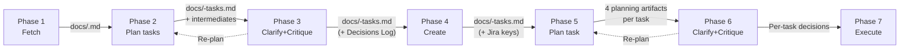
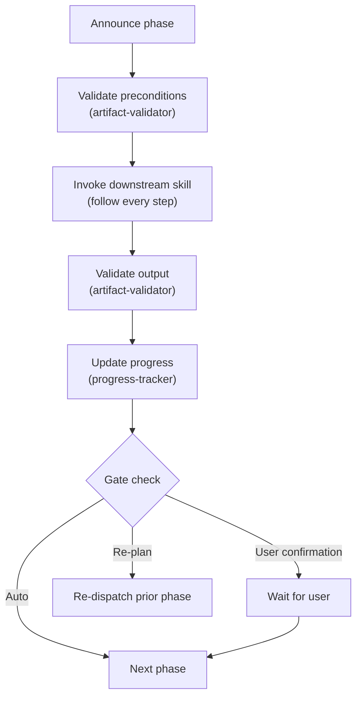
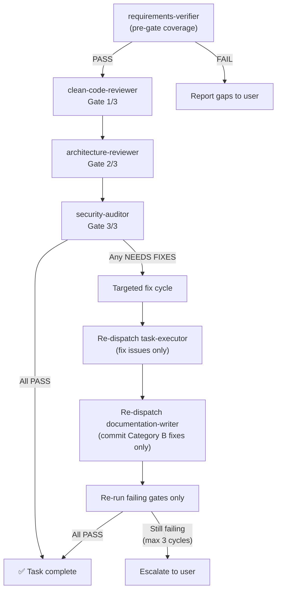

# 04 — Data Contracts and Gates

> Artifact validation, phase transition gates, quality gate architecture, and error handling.

---

## Artifact flow

Each phase produces artifacts that the next phase consumes. The `artifact-validator` subagent checks every artifact before the orchestrator advances. No artifact is ever deleted.

### Artifact categories

| Category | Scope                   | Committed to git | Deleted   |
| -------- | ----------------------- | ---------------- | --------- |
| A        | Orchestration artifacts | **NEVER**        | **NEVER** |
| B        | Implementation output   | Yes              | N/A       |

**Category A files** (all matching `docs/<KEY>*.md`):

- `docs/<KEY>.md` — ticket snapshot
- `docs/<KEY>-tasks.md` — task plan with decisions
- `docs/<KEY>-progress.md` — progress tracking
- `docs/<KEY>-stage-1-detailed.md` — task-planner output
- `docs/<KEY>-stage-2-prioritized.md` — dependency-prioritizer output
- `docs/<KEY>-task-<N>-brief.md` — execution brief
- `docs/<KEY>-task-<N>-execution-plan.md` — execution plan
- `docs/<KEY>-task-<N>-test-spec.md` — test specification
- `docs/<KEY>-task-<N>-refactoring-plan.md` — refactoring plan
- `docs/<KEY>-task-<N>-decisions.md` — per-task decisions

**Category B files** (committed by `documentation-writer`):

- Source code files
- Test files
- Updated inline docs, docstrings, comments in source files
- Config changes

---

## Data contracts between phases

### Phase 1 → Phase 2

| Artifact   | `docs/<KEY>.md`                                |
| ---------- | ---------------------------------------------- |
| Validation | File exists, contains `## Description` section |

**Required sections in artifact:**

| Section                  | Why                                     |
| ------------------------ | --------------------------------------- |
| `## Metadata` table      | Task decomposition needs ticket context |
| `## Description`         | Primary source for requirements         |
| `## Acceptance Criteria` | Maps to Definition of Done              |
| `## Comments`            | Contains decisions and clarifications   |
| `## Subtasks`            | Avoids duplicating existing work        |
| `## Linked Issues`       | Dependency and context awareness        |
| `## Attachments`         | Implementation reference                |
| `## Custom Fields`       | May contain acceptance criteria         |

---

### Phase 2 → Phase 3

| Artifact   | `docs/<KEY>-tasks.md` + intermediates                    |
| ---------- | -------------------------------------------------------- |
| Validation | File exists, contains `## Tasks` section, has ≥2 entries |

**Required sections in final plan:**

| Section                              | Consumed by                                                         |
| ------------------------------------ | ------------------------------------------------------------------- |
| `## Ticket Summary`                  | clarifying-assumptions                                              |
| `## Assumptions and Constraints`     | clarifying-assumptions                                              |
| `## Cross-Cutting Open Questions`    | clarifying-assumptions                                              |
| `## Tasks` (each with 8 subsections) | clarifying-assumptions, creating-jira-subtasks, executing-jira-task |
| `## Execution Order Summary`         | creating-jira-subtasks                                              |
| `## Dependency Graph`                | planning-jira-task                                                  |
| `## Validation Report`               | clarifying-assumptions                                              |

**Preserved intermediates** (consumed by `critique-analyzer` in Phase 3):

| File                                | Consumed by       |
| ----------------------------------- | ----------------- |
| `docs/<KEY>-stage-1-detailed.md`    | critique-analyzer |
| `docs/<KEY>-stage-2-prioritized.md` | critique-analyzer |

---

### Phase 3 → Phase 4

| Artifact   | `docs/<KEY>-tasks.md` (updated)     |
| ---------- | ----------------------------------- |
| Validation | Contains `## Decisions Log` section |

**Additions made by Phase 3:**

| Addition                               | Purpose                                         |
| -------------------------------------- | ----------------------------------------------- |
| `## Decisions Log` table               | Subtask descriptions reflect resolved decisions |
| Annotated assumptions (`✅`/`❌`/`⏭️`) | Executor needs confirmed assumptions            |
| Resolved per-task questions            | Pre-flight verifies no unresolved questions     |
| Updated `Implementation notes`         | Executor follows updated approach               |
| Deferred question tags                 | Phase 6 knows which questions to ask            |
| Critique resolutions                   | Documents technology decisions and rationale    |

---

### Phase 4 → Phase 5

| Artifact   | `docs/<KEY>-tasks.md` (with keys)                                   |
| ---------- | ------------------------------------------------------------------- |
| Validation | Contains `## Jira Subtasks` table with ≥1 key matching `[A-Z]+-\d+` |

**Additions made by Phase 4:**

| Addition                                              | Purpose                                   |
| ----------------------------------------------------- | ----------------------------------------- |
| `## Jira Subtasks` table (Task #, Key, Title, Status) | Maps task numbers to Jira keys            |
| `Jira Subtask: <KEY>` in each task section            | Identifies which Jira issue to transition |

---

### Phase 5 → Phase 6

| Artifact   | 4 planning artifact files per task              |
| ---------- | ----------------------------------------------- |
| Validation | All 4 files exist for the specified task number |

**Artifacts produced by Phase 5:**

| File                                      | Produced by         | Consumed by                      |
| ----------------------------------------- | ------------------- | -------------------------------- |
| `docs/<KEY>-task-<N>-brief.md`            | execution-prepper   | critique-analyzer, task-executor |
| `docs/<KEY>-task-<N>-execution-plan.md`   | execution-planner   | critique-analyzer, task-executor |
| `docs/<KEY>-task-<N>-test-spec.md`        | test-strategist     | critique-analyzer, task-executor |
| `docs/<KEY>-task-<N>-refactoring-plan.md` | refactoring-advisor | critique-analyzer, task-executor |

---

### Phase 6 → Phase 7

| Artifact   | Per-task decisions file (if critique resolved any items) |
| ---------- | -------------------------------------------------------- |
| Validation | Planning artifacts still exist (Phase 5 outputs)         |

**Additions made by Phase 6:**

| Addition                                             | Purpose                                           |
| ---------------------------------------------------- | ------------------------------------------------- |
| `docs/<KEY>-task-<N>-decisions.md`                   | Records critique resolutions and question answers |
| Reference row in main `## Decisions Log`             | Lightweight index to per-task decisions           |
| Resolved deferred questions                          | Task-level questions answered just-in-time        |
| Updated `Implementation notes` (if approach changed) | Executor follows the confirmed approach           |

---

### Phase 7 output (per task)

| Addition                                        | Consumed by        | Purpose                                |
| ----------------------------------------------- | ------------------ | -------------------------------------- |
| `**Status:** ✅ Complete (<date>)` on task      | Orchestrator, self | Progress tracking; dependency checking |
| `**Implementation summary:**` on task           | Orchestrator       | Concise summary for progress file      |
| `**Files changed:**` list on task               | Orchestrator       | Progress reporting                     |
| `## Jira Subtasks` table status updated to Done | Orchestrator       | Reflects current state                 |

All Phase 7 outputs to Category A files are written to disk but NOT committed to git.

---

## Phase transition gates

Every phase follows this execution cycle:

| Transition | Gate type         | Details                                                                    |
| ---------- | ----------------- | -------------------------------------------------------------------------- |
| 1 → 2      | Automatic         | —                                                                          |
| 2 → 3      | Automatic         | Critique is part of planning flow                                          |
| 3 → 4      | User confirmation | Present options: "Create subtasks now" / "Review plan first" / "Stop here" |
| 3 → 2      | Re-plan cycle     | Critique triggered changes (max 3 iterations)                              |
| 4 → 5      | User selection    | User chooses which task to execute first — never auto-start                |
| 5 → 6      | Automatic         | Critique is part of per-task planning flow                                 |
| 6 → 7      | User confirmation | User confirms plan is ready for implementation                             |
| 6 → 5      | Re-plan cycle     | Critique triggered changes (max 3 iterations)                              |
| Within 5-7 | User selection    | After each task, user chooses next — never auto-continue                   |

---

## Quality gate architecture (Phase 7)

Three mandatory quality gates run after the requirements verifier confirms coverage is complete. **All three must return PASS** for a task to be considered complete.

### Quality gate detail

| Gate                    | Concern                                              | Skill dependency (required)    |
| ----------------------- | ---------------------------------------------------- | ------------------------------ |
| `clean-code-reviewer`   | Clean Code, SOLID, test quality, docs                | `/clean-code`                  |
| `architecture-reviewer` | DDD, functional programming, bounded contexts        | `/architecture-patterns`       |
| `security-auditor`      | Vulnerabilities, credential leaks, insecure patterns | `/api-security-best-practices` |

All three gates also use `context7` MCP (required). All skill dependencies are required — subagents will STOP and return a BLOCKED verdict if any skill is missing.

### Verdicts

| Verdict                          | Meaning                                                   |
| -------------------------------- | --------------------------------------------------------- |
| BLOCKED                          | Missing required skill — subagent stopped before any work |
| PASS                             | No issues found                                           |
| PASS WITH SUGGESTIONS/ADVISORIES | Minor suggestions, non-blocking                           |
| NEEDS FIXES                      | Issues found that must be addressed                       |

### Targeted fix cycle

When any gate returns NEEDS FIXES:

1. Collect all feedback from all failing gates (run all three before fixing)
2. Re-dispatch `task-executor` with original planning artifacts + consolidated fix brief
3. Re-dispatch `documentation-writer` to commit fixes (Category B only)
4. Re-run **only previously failing gates**
5. If still failing, repeat (max 3 cycles total)
6. After 3 failed cycles, escalate to user

### Commit discipline rule

All three quality gates enforce this: if **any gate detects uncommitted changes** in the working tree, it stops immediately and reports to the orchestrator. The orchestrator then requires the `documentation-writer` to commit all pending Category B changes before gates can re-run.

---

## Re-plan cycle architecture

Two re-plan loops exist in the pipeline:

| Loop        | Triggered by     | Affects           | Max iterations | User engagement           |
| ----------- | ---------------- | ----------------- | -------------- | ------------------------- |
| Phase 3 → 2 | Phase 3 critique | Phase 2 subagents | 3              | Looped in every iteration |
| Phase 6 → 5 | Phase 6 critique | Phase 5 subagents | 3              | Looped in every iteration |

### Re-plan mechanics

1. Phase 3/6 sets `RE_PLAN_NEEDED=true` when the user agrees with a critique and switches to an alternative approach.
2. The orchestrator re-dispatches all subagents in Phase 2/5 with the same inputs plus the new decisions.
3. Subagents receive their prior artifacts (on disk) plus the decisions file. They update their output, preserving unaffected work.
4. Phase 3/6 runs again. The `critique-analyzer` reads the updated artifacts and the prior decisions file, only raising new or still-unresolved concerns.
5. If `RE_PLAN_NEEDED` is false after Phase 3/6, the pipeline advances.
6. After 3 iterations, escalate to user.

---

## Error handling

| Error type                          | Response                                                                                                                    |
| ----------------------------------- | --------------------------------------------------------------------------------------------------------------------------- |
| **Missing required skill**          | Subagent returns BLOCKED verdict. Present install command to user. Wait for confirmation. Re-dispatch subagent from scratch |
| **Skill failure**                   | Record via `progress-tracker`. Report to user: retry, skip, or abort                                                        |
| **Missing artifact**                | `artifact-validator` reports failure → do NOT proceed. Tell user which phase needs to run/re-run                            |
| **Jira MCP unavailable**            | Tell user to connect it. Offer to resume when ready                                                                         |
| **Subagent failure (non-critical)** | Proceed without (e.g., `documentation-finder`)                                                                              |
| **Subagent failure (critical)**     | Halt (e.g., `artifact-validator`)                                                                                           |
| **User interruption**               | Progress file ensures resumability. Tell user: "Say 'resume ticket `<KEY>`' to pick up"                                     |
| **Quality gate failure**            | Handled internally by `executing-jira-task` via targeted fix cycles. Orchestrator acts only if fix cycle limit is exhausted |
| **Task-executor ambiguity**         | Executor stops and reports. Orchestrator resolves with user, re-dispatches with updated brief                               |
| **Re-plan cycle exhausted**         | After 3 iterations, present accumulated critique to user and ask how to proceed                                             |

### Resumability

The workflow can be interrupted and resumed at any point. The `progress-tracker` subagent maintains a file at `docs/<KEY>-progress.md` that records the status of every phase and task. On resume:

1. Run `preflight-checker` (only for remaining phases)
2. Dispatch `progress-tracker` with `read` action
3. Determine starting phase from progress state
4. Ask user for confirmation before proceeding (if past Phase 1)

| Progress indicates                    | Resume from |
| ------------------------------------- | ----------- |
| No artifacts found                    | Phase 1     |
| Phase 1 complete, Phase 2 not started | Phase 2     |
| Phases 1–2 complete, Phase 3 not done | Phase 3     |
| Phases 1–3 complete, Phase 4 not done | Phase 4     |
| Phases 1–4 complete, tasks remaining  | Phase 5     |
