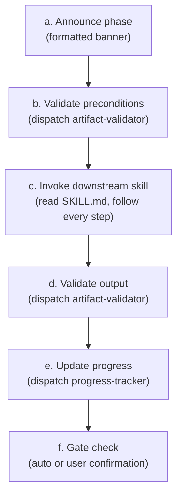
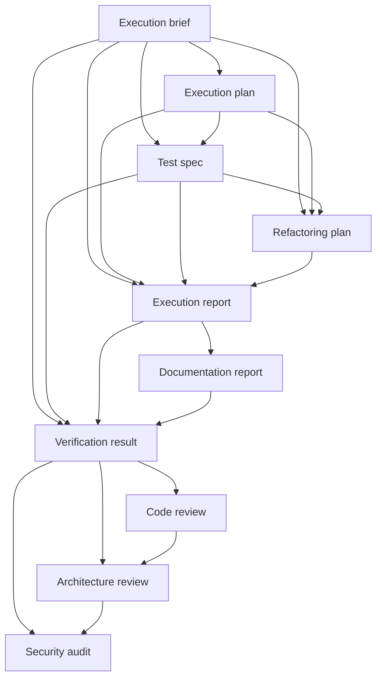
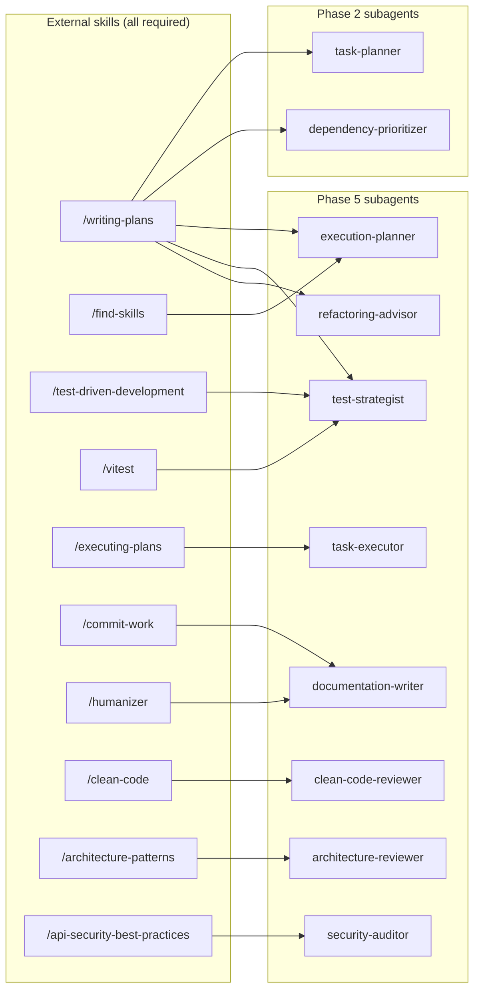

# 05 — Principles and Patterns

> Architectural principles, execution patterns, dispatch mechanics, and cross-platform compatibility.

---

## Architectural principles

These shape every decision the orchestrator makes. They are ordered by impact.

### 1. Context window is the most expensive resource

Every byte of raw content that leaks into the orchestrator degrades decision-making for every subsequent step. The orchestrator operates only on concise summaries from subagents. This is not a preference — it is the architecture.

### 2. Summaries in, summaries out

When a subagent returns a result, the orchestrator extracts the verdict, summary, and any data needed for the next dispatch decision. Everything else is discarded. If details are needed later, a subagent is dispatched to retrieve them — the orchestrator never caches raw data "just in case."

### 3. Sequential by default, parallel only for independent calls

Subagents run sequentially. Parallel dispatch is acceptable **only** for independent utility calls (e.g., `codebase-inspector` + `documentation-finder` before a task), never for dependent operations.

### 4. Progressive clarification

Questions are asked only when they are relevant to the work about to happen. Cross-cutting questions are asked upfront (Phase 3). Per-task questions are deferred and asked just before each task executes (Phase 5). Questions that become irrelevant through prior decisions are filtered out.

### 5. Validate-before-advance

Every phase follows a strict cycle:

```
Announce → Validate preconditions → Invoke skill → Validate output → Update progress → Gate check
```

No step is skipped. Validation failures halt the pipeline.

### 6. Quality gate delegation

The `executing-jira-task` skill manages its own fix cycles internally (up to 3 attempts). The orchestrator only intervenes when the fix cycle limit is exhausted — then it escalates to the user.

### 7. Preflight validation on every start/resume

Run `preflight-checker` before starting any workflow. On resume, check only remaining phases.

| Verdict | Action                                         |
| ------- | ---------------------------------------------- |
| FAIL    | Stop immediately, present install instructions |
| PASS    | Proceed silently                               |

All dependencies are required — there is no WARN verdict. Missing any skill or MCP results in FAIL.

### 8. Fail loudly, recover gracefully

Subagent failures, missing artifacts, and ambiguities are surfaced immediately. The progress file ensures any interruption — user-initiated or error-caused — can be recovered from without repeating completed work.

---

## Execution patterns

### Phase execution cycle

Every phase, without exception, follows this pattern:



**Phase announcement format:**

```
━━━━━━━━━━━━━━━━━━━━━━━━━━━━━━━━━━━━━━━━
Phase <N>/5 — <Phase name>
━━━━━━━━━━━━━━━━━━━━━━━━━━━━━━━━━━━━━━━━
```

---

### Phase 5 task execution pipeline

Each task in Phase 5 runs through a 10-step subagent pipeline, plus a targeted fix cycle if quality gates fail.

| Step | Subagent                | Category         | Output artifact                |
| ---- | ----------------------- | ---------------- | ------------------------------ |
| 1    | `execution-prepper`     | Setup            | `docs/<KEY>-task-<N>-brief.md` |
| 2    | `execution-planner`     | Planning         | Execution plan                 |
| 3    | `test-strategist`       | Testing          | Test specification             |
| 4    | `refactoring-advisor`   | Preparation      | Refactoring recommendation     |
| 5    | `task-executor`         | Implementation   | Execution report               |
| 6    | `documentation-writer`  | Documentation    | Documentation report + commits |
| 7    | `requirements-verifier` | Pre-gate         | Verification verdict           |
| 8    | `clean-code-reviewer`   | Quality gate 1/3 | Code review                    |
| 9    | `architecture-reviewer` | Quality gate 2/3 | Architecture review            |
| 10   | `security-auditor`      | Quality gate 3/3 | Security audit                 |

**Data flow between steps:**



---

### Cautious execution model

The `task-executor` operates under a cautious execution model. It will **stop and report back** to the orchestrator whenever it encounters:

- Ambiguity in requirements
- Unclear intent
- Uncertain architectural decisions
- Any situation where the correct course of action is not explicitly documented

The orchestrator then resolves the ambiguity (with the user if needed), updates the execution brief, and re-dispatches. Max 3 retry cycles per task.

---

### Targeted fix cycle pattern

When quality gates fail, the system does **not** re-run the full pipeline. Instead:

```
1. Collect feedback from ALL failing gates
2. Re-dispatch task-executor (fix flagged issues only)
3. Re-dispatch documentation-writer (commit fixes)
4. Re-run ONLY previously failing gates
5. If still failing → repeat (max 3 cycles)
6. If limit exhausted → escalate to user
```

**User escalation options:**

- Accept current state and move on
- Provide guidance for a different approach
- Request full pipeline re-run (reserved for fundamental approach failures)

---

## Dispatch mechanics

### How subagent dispatch works

Subagent `.md` files are co-located reference documents. To dispatch:

1. Read the subagent's `.md` file from the path in the registry
2. Spawn a subagent using the **Task tool**, passing the `.md` content as the prompt and the step's inputs as the user message
3. Collect the returned summary — use that summary (not raw output) for all downstream decisions

### Cross-platform compatibility

| Platform        | Dispatch method                                                                |
| --------------- | ------------------------------------------------------------------------------ |
| Claude Code CLI | `Task(prompt=<.md content>, description=<step summary>)`                       |
| Cursor IDE      | `Task(subagent_type="general-purpose", prompt=<.md content + inputs>)`         |
| OpenCode CLI    | `Task(prompt=<.md content>, description=<step summary>)` — same as Claude Code |

**Cursor note:** Use `subagent_type="general-purpose"` and embed the `.md` content directly in the prompt. This is more reliable than defining custom named agents, which have known dispatch issues with the Task tool.

---

## File system layout

### Artifacts produced during a workflow

```
docs/
├── <KEY>.md                        # Phase 1 output: ticket snapshot
├── <KEY>-tasks.md                  # Phase 2–5: evolving task plan
├── <KEY>-progress.md               # Progress tracking file
├── <KEY>-stage-1-detailed.md       # Phase 2 intermediate (cleaned up)
├── <KEY>-stage-2-prioritized.md    # Phase 2 intermediate (cleaned up)
├── <KEY>-task-<N>-brief.md         # Phase 5 per-task (cleaned up after each)
└── <KEY>-subtask-manifest.md       # Phase 4 temporary (cleaned up)
```

### Cleanup rules

| File                             | Cleaned up when                              |
| -------------------------------- | -------------------------------------------- |
| Stage 1 and 2 intermediate files | After final plan passes validation (Phase 2) |
| Task execution brief             | After task completion (Phase 5)              |
| Subtask manifest/results         | After subtask creation (Phase 4)             |

Intermediate files are **not** cleaned up on failure — they help with debugging.

---

## Workflow summary format

When all tasks are complete (or the user stops), the orchestrator presents:

```markdown
## Workflow Summary — <TICKET_KEY>

| Phase | Status      | Key outcome                 |
| ----- | ----------- | --------------------------- |
| 1     | ✅ Complete | Ticket fetched (N comments) |
| 2     | ✅ Complete | N tasks planned             |
| 3     | ✅ Complete | N/N questions resolved      |
| 4     | ✅ Complete | N subtasks created in Jira  |
| 5     | ✅ Complete | N/N tasks executed          |

All artifacts are in docs/<TICKET_KEY>\*.
```

---

## Skill dependency map

Subagents across Phase 2 and Phase 5 depend on external skills. All are **required** — subagents will STOP and return a BLOCKED verdict if any skill is missing. There is no fallback to built-in logic. This is enforced at two layers: the `preflight-checker` validates all skills before the workflow starts, and each subagent independently checks for its own skills at runtime (defense-in-depth).



| Subagent                 | Skill dependency (required)    | Install command                                                                 |
| ------------------------ | ------------------------------ | ------------------------------------------------------------------------------- |
| `task-planner`           | `/writing-plans`               | `skills install obra/superpowers/writing-plans`                                 |
| `dependency-prioritizer` | `/writing-plans`               | `skills install obra/superpowers/writing-plans`                                 |
| `execution-planner`      | `/find-skills`                 | `skills install vercel-labs/skills/find-skills`                                 |
| `execution-planner`      | `/writing-plans`               | `skills install obra/superpowers/writing-plans`                                 |
| `test-strategist`        | `/test-driven-development`     | `skills install obra/superpowers/test-driven-development`                       |
| `test-strategist`        | `/vitest`                      | `skills install antfu/skills/vitest`                                            |
| `test-strategist`        | `/writing-plans`               | `skills install obra/superpowers/writing-plans`                                 |
| `refactoring-advisor`    | `/writing-plans`               | `skills install obra/superpowers/writing-plans`                                 |
| `task-executor`          | `/executing-plans`             | `skills install obra/superpowers/executing-plans`                               |
| `documentation-writer`   | `/commit-work`                 | `skills install softaworks/agent-toolkit/commit-work`                           |
| `documentation-writer`   | `/humanizer`                   | `skills install blader/humanizer`                                               |
| `clean-code-reviewer`    | `/clean-code`                  | `skills install sickn33/antigravity-awesome-skills/clean-code`                  |
| `architecture-reviewer`  | `/architecture-patterns`       | `skills install wshobson/agents/architecture-patterns`                          |
| `security-auditor`       | `/api-security-best-practices` | `skills install sickn33/antigravity-awesome-skills/api-security-best-practices` |
| All quality gates        | context7 MCP                   | Connect context7 MCP in your IDE/CLI settings                                   |
