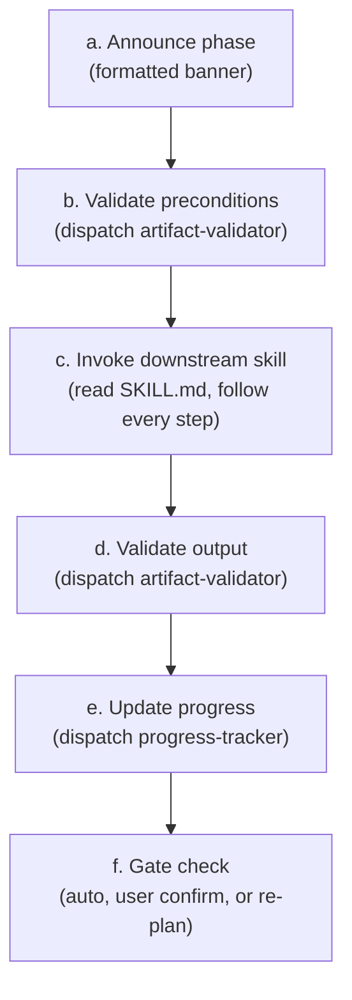
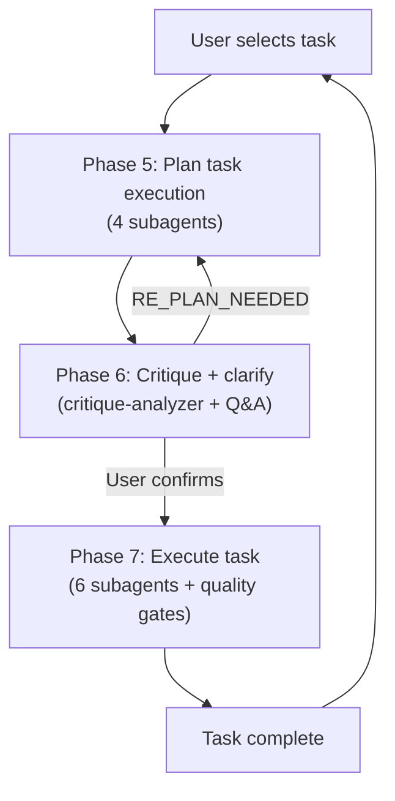
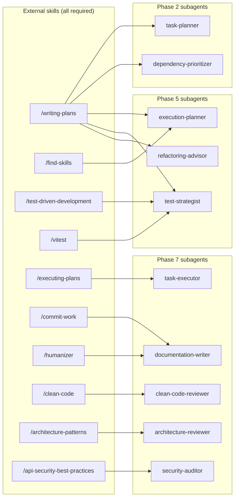

# 05 — Principles and Patterns

> Architectural principles, execution patterns, dispatch mechanics, and cross-platform compatibility.

---

## Architectural principles

These shape every decision the orchestrator makes. They are ordered by impact.

### 1. Context window is the most expensive resource

Every byte of raw content that leaks into the orchestrator degrades decision-making for every subsequent step. The orchestrator operates only on concise summaries from subagents. This is not a preference — it is the architecture.

### 2. Summaries in, summaries out

When a subagent returns a result, the orchestrator extracts the verdict, summary, and any data needed for the next dispatch decision. Everything else is discarded. If details are needed later, a subagent is dispatched to retrieve them — the orchestrator never caches raw data "just in case."

### 3. Sequential by default, parallel only for independent calls

Subagents run sequentially. Parallel dispatch is acceptable **only** for independent utility calls (e.g., `codebase-inspector` + `documentation-finder` before a task), never for dependent operations.

### 4. Design Thinking — problem before solution

Before decomposing work or choosing technology, validate that the ticket solves the right problem for the right user. Jira tickets describe solutions; the pipeline's job is to surface whether those solutions connect to validated user needs. The `task-planner` produces a Problem Framing section (end user, underlying need, solution-problem fit, evidence basis), and the `critique-analyzer` challenges it. During Phase 3, the developer is Socratically questioned on problem framing fundamentals using two models:

- **Model A (Socratic)** for Tier 3 hard-gate questions: the developer articulates their own answer before seeing the analysis. Used for: who is the end user, what is the underlying need, what evidence supports the solution. These cannot be skipped.
- **Model B (evaluate-the-reasoning)** for Tier 2 items: the developer evaluates the subagent's reasoning against the critique. Used for technology choices, assumptions, and non-foundational critique items. These can be skipped but are visibly flagged.

The goal is not just to validate the plan — it is to develop the developer's critical thinking. The pipeline operates as a mentorship engine, not a task-completion machine.

### 5. Progressive clarification and critique

Questions and critique are applied only when they are relevant to the work about to happen:

- **Phase 3** (upfront): Problem-framing critique (Tier 3 hard gates first), technology critique, cross-cutting questions, architectural assumptions, validation failures, Task 1 questions.
- **Phase 6** (per-task): Technology and approach critique of per-task planning artifacts, user-impact assessment of implementation decisions, AND deferred per-task questions.

Questions that become irrelevant through prior decisions are filtered out. Critique items that were already consciously resolved by the user are not re-raised.

### 6. Challenge bias before implementation

Two systemic biases are actively countered:

- **The Matthew Effect (technology bias).** AI tools disproportionately recommend mainstream frameworks. The `critique-analyzer` counters this by searching the web for current alternatives, cross-checking the codebase directly, and presenting trade-offs.
- **Solution-first thinking (problem-framing bias).** Tickets describe solutions without articulating user needs or evidence. The `critique-analyzer` challenges the Problem Framing section, and the `clarifying-assumptions` skill uses Socratic questioning to force the developer to think about who the user is and why this solution is right.

This happens at two strategic checkpoints:

- After task planning (Phase 3) — catches both problem-framing gaps and technology bias in task decomposition
- After per-task planning (Phase 6) — catches technology bias in framework choices, plus evaluates user-impact of implementation decisions

The user sees every critique item (problem-framing and technology, all severities) and makes every decision. Nothing is auto-acknowledged.

### 7. Validate-before-advance

Every phase follows a strict cycle:

```
Announce → Validate preconditions → Invoke skill → Validate output → Update progress → Gate check
```

No step is skipped. Validation failures halt the pipeline.

### 8. Quality gate delegation

The `executing-jira-task` skill manages its own fix cycles internally (up to 3 attempts). The orchestrator only intervenes when the fix cycle limit is exhausted — then it escalates to the user.

### 9. Preflight validation on every start/resume

Run `preflight-checker` before starting any workflow. On resume, check only remaining phases.

| Verdict | Action                                         |
| ------- | ---------------------------------------------- |
| FAIL    | Stop immediately, present install instructions |
| PASS    | Proceed silently                               |

### 10. Preserve everything, commit selectively

No orchestration artifact (Category A) is ever deleted. All `docs/<KEY>*.md` files persist for the lifetime of the workflow. Only implementation output (Category B — source code, tests, configs) is committed to git.

### 11. Fail loudly, recover gracefully

Subagent failures, missing artifacts, and ambiguities are surfaced immediately. The progress file ensures any interruption — user-initiated or error-caused — can be recovered from without repeating completed work.

---

## Execution patterns

### Phase execution cycle

Every phase, without exception, follows this pattern:



**Phase announcement format:**

```
━━━━━━━━━━━━━━━━━━━━━━━━━━━━━━━━━━━━━━━━
Phase <N>/7 — <Phase name>
━━━━━━━━━━━━━━━━━━━━━━━━━━━━━━━━━━━━━━━━
```

---

### Phase 5 task planning pipeline

Each task's planning phase runs through a 4-subagent pipeline:

| Step | Subagent              | Category    | Output artifact                           |
| ---- | --------------------- | ----------- | ----------------------------------------- |
| 1    | `execution-prepper`   | Setup       | `docs/<KEY>-task-<N>-brief.md`            |
| 2    | `execution-planner`   | Planning    | `docs/<KEY>-task-<N>-execution-plan.md`   |
| 3    | `test-strategist`     | Testing     | `docs/<KEY>-task-<N>-test-spec.md`        |
| 4    | `refactoring-advisor` | Preparation | `docs/<KEY>-task-<N>-refactoring-plan.md` |

All outputs are written to disk as persistent artifacts.

---

### Phase 7 task execution pipeline

Each task's execution phase runs through a 6-subagent pipeline, plus a targeted fix cycle if quality gates fail:

| Step | Subagent                | Category         | Output                    |
| ---- | ----------------------- | ---------------- | ------------------------- |
| 1    | `task-executor`         | Implementation   | Execution report          |
| 2    | `documentation-writer`  | Documentation    | Docs + Category B commits |
| 3    | `requirements-verifier` | Pre-gate         | Verification verdict      |
| 4    | `clean-code-reviewer`   | Quality gate 1/3 | Code review               |
| 5    | `architecture-reviewer` | Quality gate 2/3 | Architecture review       |
| 6    | `security-auditor`      | Quality gate 3/3 | Security audit            |

---

### Critique-plan-execute loop (Phases 5-6-7)

The per-task loop runs for every task selected by the user:



---

### Re-plan cycle pattern

When critique triggers a re-plan (Phase 3 → Phase 2 or Phase 6 → Phase 5):

```
1. Critique identifies concerns, user agrees to change approach
2. RE_PLAN_NEEDED=true
3. Re-dispatch ALL subagents in the prior phase
   - Each receives prior artifacts (on disk) + new decisions
   - Each updates its output, preserving unaffected work
4. Artifacts are overwritten with updated versions
5. Critique runs again (critique-analyzer checks updated artifacts)
   - Prior decisions are respected — already-resolved concerns not re-raised
6. If RE_PLAN_NEEDED is false → advance
7. If still true after 3 iterations → escalate to user
```

---

### Cautious execution model

The `task-executor` operates under a cautious execution model. It will **stop and report back** to the orchestrator whenever it encounters:

- Ambiguity in requirements
- Unclear intent
- Uncertain architectural decisions
- Any situation where the correct course of action is not explicitly documented

The orchestrator then resolves the ambiguity (with the user if needed), updates the execution brief, and re-dispatches. Max 3 retry cycles per task.

---

### Targeted fix cycle pattern

When quality gates fail, the system does **not** re-run the full pipeline. Instead:

```
1. Collect feedback from ALL failing gates
2. Re-dispatch task-executor (fix flagged issues only)
3. Re-dispatch documentation-writer (commit Category B fixes only)
4. Re-run ONLY previously failing gates
5. If still failing → repeat (max 3 cycles)
6. If limit exhausted → escalate to user
```

---

## Dispatch mechanics

### How subagent dispatch works

Subagent `.md` files are co-located reference documents. To dispatch:

1. Read the subagent's `.md` file from the path in the registry
2. Spawn a subagent using the **Task tool**, passing the `.md` content as the prompt and the step's inputs as the user message
3. Collect the returned summary — use that summary (not raw output) for all downstream decisions

### Cross-platform compatibility

| Platform        | Dispatch method                                                                |
| --------------- | ------------------------------------------------------------------------------ |
| Claude Code CLI | `Task(prompt=<.md content>, description=<step summary>)`                       |
| Cursor IDE      | `Task(subagent_type="generalPurpose", prompt=<.md content + inputs>)`          |
| OpenCode CLI    | `Task(prompt=<.md content>, description=<step summary>)` — same as Claude Code |

---

## File system layout

### Artifacts produced during a workflow

```
docs/
├── <KEY>.md                             # Phase 1 output: ticket snapshot
├── <KEY>-tasks.md                       # Phase 2–7: evolving task plan
├── <KEY>-progress.md                    # Workflow-level progress (phases 1–4 + task summary)
├── <KEY>-stage-1-detailed.md            # Phase 2 intermediate (preserved)
├── <KEY>-stage-2-prioritized.md         # Phase 2 intermediate (preserved)
├── <KEY>-task-<N>-progress.md           # Per-task progress (phases 5–7, preserved)
├── <KEY>-task-<N>-brief.md              # Phase 5: execution brief (preserved)
├── <KEY>-task-<N>-execution-plan.md     # Phase 5: execution plan (preserved)
├── <KEY>-task-<N>-test-spec.md          # Phase 5: test specification (preserved)
├── <KEY>-task-<N>-refactoring-plan.md   # Phase 5: refactoring plan (preserved)
└── <KEY>-task-<N>-decisions.md          # Phase 6: per-task decisions (preserved)
```

### Artifact lifecycle rules

| File                        | Created in | Overwritten during | Deleted | Committed to git |
| --------------------------- | ---------- | ------------------ | ------- | ---------------- |
| Ticket snapshot             | Phase 1    | Never              | Never   | Never            |
| Task plan                   | Phase 2    | Phases 3–7         | Never   | Never            |
| Main progress file          | Phase 1    | Every phase/task   | Never   | Never            |
| Stage intermediates         | Phase 2    | Re-plan cycles     | Never   | Never            |
| Per-task progress file      | Phase 5    | Every task phase   | Never   | Never            |
| Per-task planning artifacts | Phase 5    | Re-plan cycles     | Never   | Never            |
| Per-task decisions          | Phase 6    | Re-plan cycles     | Never   | Never            |

---

## Workflow summary format

When all tasks are complete (or the user stops), the orchestrator presents:

```markdown
## Workflow Summary — <TICKET_KEY>

| Phase | Status      | Key outcome                            |
| ----- | ----------- | -------------------------------------- |
| 1     | ✅ Complete | Ticket fetched (N comments)            |
| 2     | ✅ Complete | N tasks planned                        |
| 3     | ✅ Complete | N/N questions resolved, N critiqued    |
| 4     | ✅ Complete | N subtasks created in Jira             |
| 5–7   | ✅ Complete | N/N tasks planned, critiqued, executed |

Per-task detail in docs/<TICKET_KEY>-task-<N>-progress.md.
All artifacts are in docs/<TICKET_KEY>\*.
```

---

## Skill dependency map

Subagents across Phases 2, 5, and 7 depend on external skills. All are **required** — subagents will STOP and return a BLOCKED verdict if any skill is missing.



| Subagent                 | Skill dependency (required)    | Phase | Install command                                                                 |
| ------------------------ | ------------------------------ | ----- | ------------------------------------------------------------------------------- |
| `task-planner`           | `/writing-plans`               | 2     | `skills install obra/superpowers/writing-plans`                                 |
| `dependency-prioritizer` | `/writing-plans`               | 2     | `skills install obra/superpowers/writing-plans`                                 |
| `execution-planner`      | `/find-skills`                 | 5     | `skills install vercel-labs/skills/find-skills`                                 |
| `execution-planner`      | `/writing-plans`               | 5     | `skills install obra/superpowers/writing-plans`                                 |
| `test-strategist`        | `/test-driven-development`     | 5     | `skills install obra/superpowers/test-driven-development`                       |
| `test-strategist`        | `/vitest`                      | 5     | `skills install antfu/skills/vitest`                                            |
| `test-strategist`        | `/writing-plans`               | 5     | `skills install obra/superpowers/writing-plans`                                 |
| `refactoring-advisor`    | `/writing-plans`               | 5     | `skills install obra/superpowers/writing-plans`                                 |
| `task-executor`          | `/executing-plans`             | 7     | `skills install obra/superpowers/executing-plans`                               |
| `documentation-writer`   | `/commit-work`                 | 7     | `skills install softaworks/agent-toolkit/commit-work`                           |
| `documentation-writer`   | `/humanizer`                   | 7     | `skills install blader/humanizer`                                               |
| `clean-code-reviewer`    | `/clean-code`                  | 7     | `skills install sickn33/antigravity-awesome-skills/clean-code`                  |
| `architecture-reviewer`  | `/architecture-patterns`       | 7     | `skills install wshobson/agents/architecture-patterns`                          |
| `security-auditor`       | `/api-security-best-practices` | 7     | `skills install sickn33/antigravity-awesome-skills/api-security-best-practices` |
| All quality gates        | context7 MCP                   | 7     | Connect context7 MCP in your IDE/CLI settings                                   |
