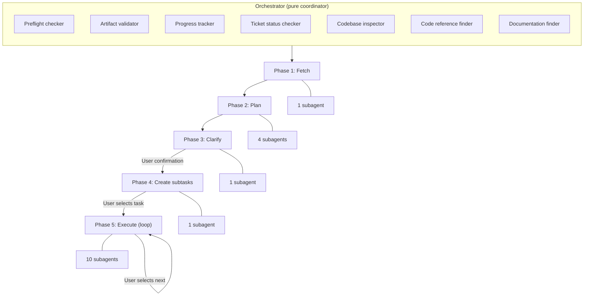

# Orchestrating Jira Workflow — Architecture Reference

> A pure-coordinator orchestrator that drives Jira tickets through five sequential phases, delegating all work to specialized subagents and downstream skills.

---

## At a glance

| Metric                      | Value |
| --------------------------- | ----- |
| Sequential phases           | 5     |
| Orchestrator utility agents | 7     |
| Downstream skill subagents  | 17    |
| Total subagents in system   | 24    |
| Required external skills    | 11    |
| Non-negotiable rules        | 8     |
| Quality gates (Phase 5)     | 3     |
| Max fix cycles per task     | 3     |

---

## High-level architecture

---

## Core design philosophy

The orchestrator's context window is the most expensive resource in the system. Every byte of raw file content, git diff, API response, or command output that leaks into it degrades decision-making for every subsequent step. **Delegation is not optional — it is the architecture.**

The mental model: the orchestrator is a project manager who can only communicate through written memos to specialists. It can think, decide, prioritize, and synthesize — but the moment work needs to happen, it dispatches.

---

## Document index

| Document                                                          | Contents                                                                                   |
| ----------------------------------------------------------------- | ------------------------------------------------------------------------------------------ |
| [01 — Pipeline and phases](./01-pipeline-and-phases.md)           | The five sequential phases, their inputs/outputs, downstream skills, and transition gates  |
| [02 — Subagent registry](./02-subagent-registry.md)               | Every subagent in the system: purpose, inputs, outputs, and constraints                    |
| [03 — Rules and constraints](./03-rules-and-constraints.md)       | The eight non-negotiable orchestrator rules plus Phase 5 safety rules                      |
| [04 — Data contracts and gates](./04-data-contracts-and-gates.md) | Artifact validation, phase transition gates, quality gate architecture, and error handling |
| [05 — Principles and patterns](./05-principles-and-patterns.md)   | Architectural principles, execution patterns, dispatch mechanics, and resumability         |
