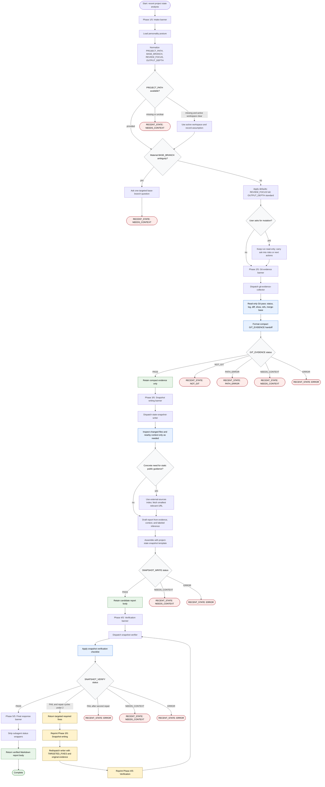

# Analyzing Recent Project State

This flow diagram was generated with the `generate-flow-diagram` skill in `new` mode and describes the workflow boundary of `skills/analyzing-recent-project-state/` as written. The workflow is read-only: it may inspect local Git state and narrow repository context, then produce a verified Markdown snapshot or a `RECENT_STATE` escalation; it does not stage, commit, merge, deploy, reset, push, format, fetch remote state, or bypass CI.



```text
RECENT_STATE: <NOT_GIT | PATH_ERROR | NEEDS_CONTEXT | ERROR>
Reason: <one line>
Next step: <one clear action>
```

Readiness rule: the workflow is complete only when it returns a verified `# Project State Snapshot` report body with unsupported claims removed or labeled, or a documented `RECENT_STATE` escalation with the smallest recovery action.

## Run Report

- Run mode and scope: `new`, whole target skill workflow.
- Assumptions: `DOCS_DIR=docs/`; target skill slug is `analyzing-recent-project-state`; existing target `flow-diagram.md` was source evidence, not the sole output.
- Repair cycles used: 0 for this generated diagram after review.
- Mermaid validation method: inspected-only; `.agents/skills/generate-flow-diagram/scripts/check-mermaid.sh` was run, but no Mermaid parser (`mmdc`, `node`, `npm`, or `npx`) was available in this shell.
- Dispatch method: inline.
- External sources fetched: none for diagram generation.
- Decompose approval path: n/a.
- Mirror/lockfile follow-up disclosed: n/a.
