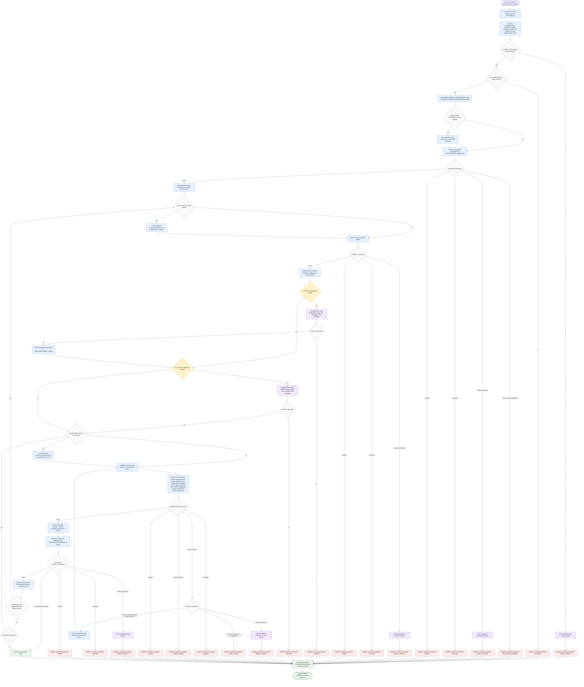

# Committing Scoped Changes Workflow

This workflow creates reviewable atomic git commits only after explicit user commit authority. The orchestrator may normalize inputs, route specialist subagents, ask targeted gate questions, and format reports; mutation is limited to approved scoped commit execution. `CHANGE_PATHS` is the initial trust boundary, `APPROVED_COMMIT_SCOPE` expands only by exact approved paths, existing staged changes are protected facts rather than permission, and every created commit is followed by a scoped state refresh before the next action.

Readiness rule: continue only when commit authority is explicit, `CHANGE_PATHS` is unambiguous, planned groups stay inside `APPROVED_COMMIT_SCOPE`, required human gates have been approved, the executor can preserve unrelated staged entries, verification has passed or been safely routed, and post-commit refresh has supplied the next source of truth.

Output contract: every success, no-change, blocked, waiting, verification-failed, commit-error, or error result loads `references/report-contract-orchestrator.md`. Success reports list created commits, summaries, verification, remaining scoped changes, unrelated changes left untouched, post-commit refreshes, and fetched references. Status reports use `COMMIT_SCOPED_CHANGES: BLOCKED | NEEDS_CONTEXT | NO_SCOPED_CHANGES | VERIFY_FAILED | COMMIT_ERROR | ERROR` with commits created before status, reason, and next step.

Source grounding: the workflow is traced to `skills/committing-scoped-changes/SKILL.md`, `skills/committing-scoped-changes/flow-diagram.md`, `references/personality.md`, the three subagent files, and the four report-contract references in the target skill package.
