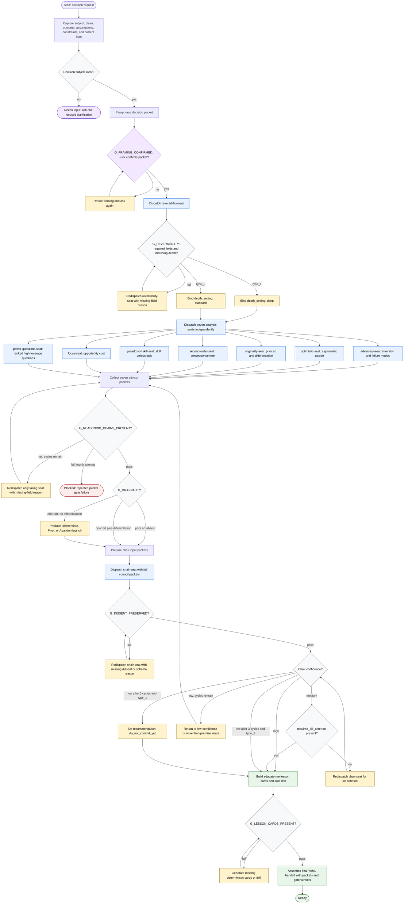

# Council of Advisors Workflow

The orchestrator coordinates a decision council, enforces framing and validation gates, and assembles the final handoff. It may dispatch the named seats and validate their packets; it must preserve analysis-seat independence, stop for user framing confirmation, avoid invented external facts, and escalate after repeated gate failure.

Readiness rule: the workflow is ready only when the final handoff includes the recommendation, confidence, every seat packet, every gate verdict, nine lesson cards, and the 9-question solo drill. A gate that fails a fourth time routes to `blocked` rather than silent continuation.

Build notes: generated as a new whole-process diagram following the `generate-flow-diagram` skill. The candidate represents intake, boundary, dispatch, validation, synthesis, human confirmation, repair loops, terminal states, and output contract checks from `skills/council-of-advisors/SKILL.md` and `references/decision-gates.md`; Mermaid syntax and one-diagram output were reviewed against the helper skill's local quality checklist.
