# Diagnosing Root Causes

This workflow describes the `diagnosing-root-causes` skill as defined in its source files. The orchestrator is read-first and mutation-limited: it may inspect artifacts, run safe non-destructive local checks, reproduce safely outside production, trace, and report. It must hand off or stop before any code change, data mutation, dependency change, deployment, rollback, production configuration change, credential action, CI bypass, destructive command, or production-touching validation.

```mermaid
flowchart TD
  START([Start: ISSUE and RESOURCES received]) --> INTAKE["Capture inputs, reporter claims, resources, reproduction, environment, and approved actions"]
  INTAKE --> BOUNDARY["State safety boundary: read, inspect, safe local checks, safe reproduction, trace, and report only"]
  BOUNDARY --> SPLIT["Separate facts, assumptions, risks, blockers, and open questions"]
  SPLIT --> CLASSIFY{"Classify ISSUE_SOURCE"}

  CLASSIFY -->|runtime| RUNTIME_MIN["Minimum runtime evidence: traces, logs, failing behavior, code paths, config, data shape, dependencies, recent changes"]
  CLASSIFY -->|CI/CD| CICD_MIN["Minimum CI/CD evidence: failing job and step logs, pipeline config, runner environment, dependency or pipeline changes, diff since last green run"]
  CLASSIFY -->|user-report| USER_MIN["Minimum user-report evidence: reproduction steps, environment, versions, expected behavior, actual behavior, supporting code, logs, and config"]
  CLASSIFY -->|uncertain| UNCERTAIN["Record uncertainty and gather evidence for the most likely source first"]

  RUNTIME_MIN --> HAVE_MIN{"Minimum evidence available?"}
  CICD_MIN --> HAVE_MIN
  USER_MIN --> HAVE_MIN
  UNCERTAIN --> HAVE_MIN

  HAVE_MIN -->|no| ASK_INPUT["Ask for the smallest missing evidence set"]
  ASK_INPUT --> NEEDS_INPUT([needs_input or blocked])
  HAVE_MIN -->|yes| DISPATCH_EVIDENCE["Dispatch evidence-collector with issue frame, source classification, and resources"]

  DISPATCH_EVIDENCE --> COLLECT_VERDICT{"EVIDENCE_VERDICT"}
  COLLECT_VERDICT -->|COLLECT: NEEDS_INPUT| NEEDS_INPUT
  COLLECT_VERDICT -->|COLLECT: BLOCKED| BLOCKED([blocked])
  COLLECT_VERDICT -->|COLLECT: ERROR| ERROR([error])
  COLLECT_VERDICT -->|COLLECT: PASS| VALIDATE["Validate freshness, reliability, environment match, affected version, and contradictions"]

  VALIDATE --> WEAK_EVIDENCE{"Evidence too weak or contradictory for analysis?"}
  WEAK_EVIDENCE -->|yes| NEEDS_VALIDATION([needs validation])
  WEAK_EVIDENCE -->|no| REPRO_TRACE{"Safe reproduction possible outside production?"}

  REPRO_TRACE -->|yes| SAFE_REPRO["Run safe non-destructive reproduction or focused local check"]
  REPRO_TRACE -->|no| STATIC_TRACE["Trace statically from symptoms through code, config, data shape, dependencies, and changes"]
  SAFE_REPRO --> EVIDENCE_BASE["Return concise evidence base, observations, and trust summary"]
  STATIC_TRACE --> EVIDENCE_BASE

  EVIDENCE_BASE --> DISPATCH_ANALYST["Dispatch root-cause-analyst with evidence base, issue, source, and approved actions"]
  DISPATCH_ANALYST --> ANALYSIS_VERDICT{"ANALYSIS_VERDICT"}

  ANALYSIS_VERDICT -->|ANALYSIS: NEEDS_INPUT| NEEDS_INPUT
  ANALYSIS_VERDICT -->|ANALYSIS: ERROR| ERROR
  ANALYSIS_VERDICT -->|ANALYSIS: UNSUPPORTED| MORE_HYPOTHESES{"More plausible hypotheses or focused evidence remain?"}
  MORE_HYPOTHESES -->|yes| DISPATCH_ANALYST
  MORE_HYPOTHESES -->|no| ESCALATED_UNKNOWN([escalated: no supported root cause])

  ANALYSIS_VERDICT -->|ANALYSIS: NEEDS_APPROVAL| APPROVAL_PACKET["Prepare approval packet: action, target, reason, risk, reversibility, safer alternative, expected evidence gain"]
  APPROVAL_PACKET --> HUMAN_GATE{"Human approves this exact action?"}
  HUMAN_GATE -->|approved| APPROVED_ROUTE{"Can analysis continue with recorded approval?"}
  APPROVED_ROUTE -->|yes| DISPATCH_ANALYST
  APPROVED_ROUTE -->|no| ESCALATED_APPROVED([escalated: approved sensitive workflow required])
  HUMAN_GATE -->|declined| SAFER_ALT["Use safer alternative or document unresolved validation gap"]
  SAFER_ALT --> SAFE_PATH{"Safe path remains?"}
  SAFE_PATH -->|yes| DISPATCH_ANALYST
  SAFE_PATH -->|no| NEEDS_VALIDATION

  ANALYSIS_VERDICT -->|ANALYSIS: PASS| HYPOTHESES["Carry ranked hypotheses, supported root cause, causal chain, and educational explanation forward"]
  HYPOTHESES --> CAUSAL_CHAIN{"Causal chain complete and traceable?"}
  CAUSAL_CHAIN -->|no| ANALYST_REPAIR["Repair only missing or untraceable analysis elements"]
  ANALYST_REPAIR --> DISPATCH_ANALYST
  CAUSAL_CHAIN -->|yes| DRAFT_REPORT["Draft RCA report from output contract"]

  DRAFT_REPORT --> DISPATCH_REVIEW["Dispatch rca-report-reviewer with report, evidence base, and source classification"]
  DISPATCH_REVIEW --> REVIEW_VERDICT{"REVIEW_VERDICT"}
  REVIEW_VERDICT -->|REVIEW: BLOCKED| BLOCKED
  REVIEW_VERDICT -->|REVIEW: ERROR| ERROR
  REVIEW_VERDICT -->|REVIEW: FAIL| REPAIR_COUNT{"Fewer than three repair cycles?"}
  REPAIR_COUNT -->|yes| TARGETED_REPAIR["Send only failed checks to root-cause-analyst, then re-review"]
  TARGETED_REPAIR --> DISPATCH_ANALYST
  REPAIR_COUNT -->|no| NEEDS_VALIDATION
  REVIEW_VERDICT -->|REVIEW: PASS| STATUS_CHOICE{"Which terminal report status is supported?"}

  STATUS_CHOICE -->|ready| READY([ready])
  STATUS_CHOICE -->|blocked| BLOCKED
  STATUS_CHOICE -->|needs validation| NEEDS_VALIDATION
  STATUS_CHOICE -->|escalated| ESCALATED_UNKNOWN

  class CLASSIFY,HAVE_MIN,COLLECT_VERDICT,WEAK_EVIDENCE,REPRO_TRACE,ANALYSIS_VERDICT,MORE_HYPOTHESES,HUMAN_GATE,APPROVED_ROUTE,SAFE_PATH,CAUSAL_CHAIN,REVIEW_VERDICT,REPAIR_COUNT,STATUS_CHOICE decision;
  class BOUNDARY,VALIDATE,CAUSAL_CHAIN guard;
  class DISPATCH_EVIDENCE,DISPATCH_ANALYST,DISPATCH_REVIEW check;
  class APPROVAL_PACKET,HUMAN_GATE human;
  class EVIDENCE_BASE,DRAFT_REPORT,HYPOTHESES output;
  class READY success;
  class ANALYST_REPAIR,TARGETED_REPAIR,SAFER_ALT refine;
  class NEEDS_INPUT,BLOCKED,ERROR,NEEDS_VALIDATION,ESCALATED_UNKNOWN,ESCALATED_APPROVED stop;

  classDef guard fill:#fff3cd,stroke:#856404,color:#000;
  classDef check fill:#e7f1ff,stroke:#0b5ed7,color:#000;
  classDef decision fill:#f8f9fa,stroke:#495057,color:#000;
  classDef human fill:#f3e8ff,stroke:#6f42c1,color:#000;
  classDef output fill:#e8f5e9,stroke:#2e7d32,color:#000;
  classDef success fill:#e8f5e9,stroke:#2e7d32,color:#000;
  classDef refine fill:#fff3cd,stroke:#856404,color:#000;
  classDef stop fill:#fdecea,stroke:#b02a37,color:#000;
```

Readiness rule: deliver only after `rca-report-reviewer` returns `REVIEW: PASS`. The delivered RCA report must end with exactly one terminal status: `ready`, `blocked`, `needs validation`, or `escalated`. Orchestration may stop earlier at `needs_input` or `error` with failure detail and recovery action.

Source grounding: this diagram was built from `skills/diagnosing-root-causes/SKILL.md`, `skills/diagnosing-root-causes/flow-diagram.md`, the three subagent files, and the target skill's `investigation-guide`, `output-contract`, and `review-checklist` references. It follows the `generate-flow-diagram` new-diagram flow: normalized process inputs, builder-style Mermaid assembly, and quality review against the helper skill's local checklist.
