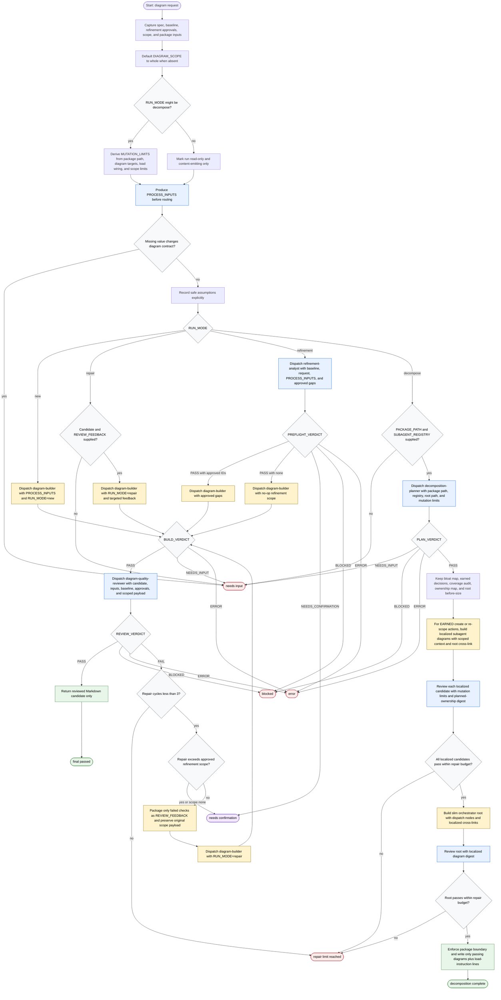

# Generate Flow Diagram Skill Workflow

The `generate-flow-diagram` skill is an orchestration workflow for turning normalized process inputs into a reviewed Markdown document with one Mermaid flowchart, or for decomposing a skill package into a slim root diagram plus localized subagent diagrams. The orchestrator may normalize inputs, ask for missing contract details, dispatch only the bundled subagents, route on their status lines, and write files only in `RUN_MODE=decompose` after planner, path-boundary, mutation-limit, builder, and reviewer gates pass.

Readiness rule: return a non-decompose candidate only after `BUILD: PASS` and `REVIEW: PASS`, plus `PREFLIGHT: PASS` when refinement applies. In decompose mode, write only after `PLAN: PASS`, package-boundary checks, `MUTATION_LIMITS` enforcement, and `REVIEW: PASS` for every generated localized diagram and the slim root.

Completion states: final passed, decomposition complete, needs confirmation, blocked, error, needs input, or repair limit reached.

Source grounding: this diagram is based on `skills/generate-flow-diagram/SKILL.md`, the existing package `flow-diagram.md`, `references/input-contract.md`, `references/flow-design-playbook.md`, `references/output-templates.md`, `references/quality-gate-checklist.md`, and the four subagent definitions under `skills/generate-flow-diagram/subagents/`.
