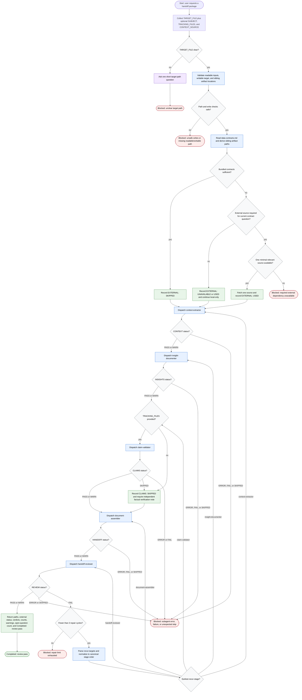

# Generate Handoff Document

The `generate-handoff-document` skill is a handoff-document orchestrator. Its authority is limited to path checks, routing decisions, status handling, optional external-source decisions, dispatching co-located subagents, bounded repair loops, and final reporting. It may write the requested handoff and sibling resumability artifacts after safety checks pass; it does not mutate product code. Detailed extraction, insight capture, claim validation, assembly, and review are owned by subagents.

Readiness rule: the workflow reaches success only after `handoff-reviewer` returns `REVIEW: PASS` or `REVIEW: WARN` and the orchestrator reports `Completed: review pass`. It stops instead at one of the named blockers when the target path is unclear, path/write checks are unsafe, a required external dependency is unavailable, a stage errors or returns an unexpected status, or three repair cycles fail to produce a passing review.

Source basis: `SKILL.md` defines the orchestrator role, inputs, status routing, subagent registry, execution steps, output contract, dispatch contract, and repair limit. `references/data-contracts.md` defines artifact naming, status vocabulary, final document sections, and final summary fields. The five files under `subagents/` define the dispatched stage contracts. The bundled `flow-diagram.md` provides an existing whole-workflow diagram consistent with these contracts.
