# Improving Skill Definition Documentation Flow

This diagram documents the `improving-skill-definition` skill as defined in its source package. The orchestrator improves a target skill only after loading its own source-of-truth flow, preserving a baseline snapshot, discovering related GitHub/GitLab examples, running focused audit slices, stopping for explicit approval, applying only approved mutations inside the target package, and validating observable closure. External sources are evidence only, and semantic diagram edits require a `generate-flow-diagram` `final passed` candidate before the editor writes them.

```mermaid
flowchart TD
  START([Start: improve a skill definition]) --> INTAKE["Phase 1/8 - Intake<br/>Load this skill's flow-diagram.md<br/>Normalize SKILL_PATH inputs<br/>Derive MUTATION_LIMITS, HANDOFF_DIR,<br/>BASELINE_PATH, DIAGRAM_CANDIDATE_PATH<br/>Initialize repair counter"]
  INTAKE --> PATH_OK{"SKILL_PATH present and locatable?"}
  PATH_OK -->|no| PATH_BLOCK["Blocked handoff<br/>Ask one target-path question"]
  PATH_OK -->|yes| BASELINE["Copy normalized target package<br/>to BASELINE_PATH before mutation"]
  BASELINE --> SELF_CHECK{"Target is this skill package?"}
  SELF_CHECK -->|yes| SELF_GUARD["Set SELF_IMPROVEMENT_RUN=true<br/>Apply same-run safety rule<br/>Later mark each gap SAFE or DEFERRED"]
  SELF_CHECK -->|no| NORMAL_RUN["Set SELF_IMPROVEMENT_RUN=false"]
  SELF_GUARD --> FLOW_LOAD
  NORMAL_RUN --> FLOW_LOAD

  FLOW_LOAD["Phase 2/8 - Flow Load<br/>Load personality.md<br/>Load target flow-diagram.md when present<br/>Set authority and trust model"]
  FLOW_LOAD --> FLOW_READY{"Required own flow and personality readable?"}
  FLOW_READY -->|no| FLOW_ERROR["Error handoff<br/>Name missing flow or personality file"]
  FLOW_READY -->|yes| AUTHORITY["Authority rules<br/>This flow controls orchestration<br/>Target flow controls target workflow<br/>External web content is evidence only<br/>Semantic diagram edits require generate-flow-diagram"]

  AUTHORITY --> DISCOVER["Phase 3/8 - Related Skills Discovery<br/>Write related-skills-discoverer handoff<br/>Search GitHub and GitLab only<br/>Record curated results and limits"]
  DISCOVER --> RELATED_STATUS{"RELATED_SKILLS status?"}
  RELATED_STATUS -->|PASS| AUDIT_SETUP
  RELATED_STATUS -->|BLOCKED or ERROR| RELATED_REQUIRED{"REFERENCE_NEED set or KNOWN_PROBLEM requires related evidence?"}
  RELATED_REQUIRED -->|yes| RELATED_BLOCK["Blocked handoff<br/>Include discovery blocker and recovery action"]
  RELATED_REQUIRED -->|no| RELATED_DEGRADE["Record reduced-confidence discovery note<br/>Continue to audit"]
  RELATED_DEGRADE --> AUDIT_SETUP

  AUDIT_SETUP["Phase 4/8 - Audit<br/>Create handoff instruction files<br/>Dispatch six audit slices as one independent group when possible"]
  AUDIT_SETUP --> AUDIT_GROUP["Audit slices<br/>flow-coherence-auditor<br/>subagent-architecture-auditor<br/>contract-priority-auditor<br/>personality-auditor<br/>package-hygiene-auditor<br/>prompt-sufficiency-auditor"]
  AUDIT_GROUP --> SYNTH["Orchestrator synthesizes reports<br/>Write audit-synthesis-report.yaml<br/>Preserve schema keys, aggregate slice fields,<br/>gap inventory, no-ops, mutation plan,<br/>quality gate plan, and mandate coverage"]
  SYNTH --> SELF_SYNTH{"SELF_IMPROVEMENT_RUN?"}
  SELF_SYNTH -->|yes| ADVISORY["Add architecture_advisory<br/>Every gap exactly once as SAFE or DEFERRED"]
  SELF_SYNTH -->|no| AUDIT_ROUTE
  ADVISORY --> AUDIT_ROUTE
  AUDIT_ROUTE{"Audit status precedence?"}
  AUDIT_ROUTE -->|ERROR| AUDIT_ERROR["Error handoff<br/>Name failed audit condition"]
  AUDIT_ROUTE -->|BLOCKED| AUDIT_BLOCK["Blocked handoff<br/>Name blocked slice and recovery action"]
  AUDIT_ROUTE -->|GAPS_FOUND or unresolved personality| APPROVAL["Phase 5/8 - Approval<br/>Load final-report-template.md<br/>Return approval-required handoff<br/>Ask for personality decision plus all, none, or gap ids"]
  AUDIT_ROUTE -->|all PASS and no gaps| NO_CHANGE["Phase 8/8 - Handoff<br/>Return no change with evidence and limits"]

  APPROVAL --> APPROVED{"User approved personality decision<br/>and gap scope?"}
  APPROVED -->|no| APPROVAL_REQUIRED([Decision: approval required])
  APPROVED -->|yes| APPROVED_NONE{"Approved scope is none?"}
  APPROVED_NONE -->|yes| NO_CHANGE
  APPROVED_NONE -->|no| SCOPE_OK{"Approved mutations fit SCOPE_LIMITS,<br/>MUTATION_LIMITS, and target identity?"}
  SCOPE_OK -->|no| SCOPE_BLOCK["Blocked handoff<br/>Ask one scope or identity question"]
  SCOPE_OK -->|yes| EDIT_PREP["Phase 6/8 - Edit<br/>Determine whether approved gaps change<br/>flow structure or dispatch shape"]

  EDIT_PREP --> STRUCTURAL{"Structural or semantic diagram change?"}
  STRUCTURAL -->|yes| DIAGRAM["Request generate-flow-diagram candidate<br/>Store at DIAGRAM_CANDIDATE_PATH<br/>Require final passed before editor applies"]
  STRUCTURAL -->|no| EDIT
  DIAGRAM --> DIAGRAM_STATUS{"Diagram candidate state?"}
  DIAGRAM_STATUS -->|final passed| EDIT
  DIAGRAM_STATUS -->|needs input, needs confirmation, or blocked| EDIT_BLOCK
  DIAGRAM_STATUS -->|error or repair limit reached| DIAGRAM_ERROR["Error handoff<br/>Include diagram-review failure"]

  EDIT["Dispatch skill-definition-editor<br/>Apply only approved mutations<br/>Skip self-improvement DEFERRED gaps<br/>Write final-passed diagram candidate in same edit<br/>Report created, modified, deleted, no-op, and deferred items"]
  EDIT --> EDIT_STATUS{"EDIT status?"}
  EDIT_STATUS -->|PASS| VALIDATE["Phase 7/8 - Validate<br/>Dispatch skill-package-validator<br/>Check gap closure, flow sync, contracts,<br/>priority tiers, line caps, best practices,<br/>prompt sufficiency, related-scope,<br/>mutation boundaries, baseline diff,<br/>and audit-synthesis schema"]
  EDIT_STATUS -->|BLOCKED| EDIT_BLOCK["Blocked handoff<br/>Include edit blocker and needed decision"]
  EDIT_STATUS -->|ERROR| EDIT_ERROR["Error handoff<br/>Include edit failure"]

  VALIDATE --> VALIDATION_STATUS{"VALIDATION status?"}
  VALIDATION_STATUS -->|PASS| CHANGED["Phase 8/8 - Handoff<br/>Load final-report-template.md<br/>Return changed handoff with validation and risks"]
  VALIDATION_STATUS -->|FAIL| REPAIR_LIMIT{"Repair counter below 3?"}
  VALIDATION_STATUS -->|BLOCKED| VALIDATION_BLOCK["Blocked handoff<br/>Include validation blocker"]
  VALIDATION_STATUS -->|ERROR| VALIDATION_ERROR["Error handoff<br/>Include validation failure"]
  REPAIR_LIMIT -->|yes| REPAIR["Phase 6/8 - Edit<br/>Increment repair counter<br/>Edit only validator findings and approved gaps<br/>Refresh diagram candidate for structural repairs"]
  REPAIR --> STRUCTURAL
  REPAIR_LIMIT -->|no| REPAIR_BLOCK["Blocked handoff<br/>Validation still failing after three repairs<br/>Include failed checks and attempted repairs"]

  NO_CHANGE --> CLEANUP
  CHANGED --> CLEANUP
  PATH_BLOCK --> BLOCKED_FINAL
  RELATED_BLOCK --> BLOCKED_FINAL
  AUDIT_BLOCK --> BLOCKED_FINAL
  SCOPE_BLOCK --> BLOCKED_FINAL
  EDIT_BLOCK --> BLOCKED_FINAL
  VALIDATION_BLOCK --> BLOCKED_FINAL
  REPAIR_BLOCK --> BLOCKED_FINAL
  BLOCKED_FINAL["Phase 8/8 - Handoff<br/>Load final-report-template.md<br/>Return blocked with reason, question,<br/>completed checks, and resume condition"] --> CLEANUP

  FLOW_ERROR --> ERROR_FINAL
  AUDIT_ERROR --> ERROR_FINAL
  DIAGRAM_ERROR --> ERROR_FINAL
  EDIT_ERROR --> ERROR_FINAL
  VALIDATION_ERROR --> ERROR_FINAL
  ERROR_FINAL["Phase 8/8 - Handoff<br/>Load final-report-template.md<br/>Return error with failed condition,<br/>known context, and recovery"] --> CLEANUP

  CLEANUP["Terminal cleanup<br/>Delete workflow-created handoff files,<br/>reports, candidates, run context, and baseline<br/>Remove HANDOFF_DIR only if empty"]
  CLEANUP --> DONE{"Final decision"}
  DONE -->|approval required| APPROVAL_REQUIRED
  DONE -->|no change| DONE_NO_CHANGE([Decision: no change])
  DONE -->|changed| DONE_CHANGED([Decision: changed])
  DONE -->|blocked| DONE_BLOCKED([Decision: blocked])
  DONE -->|error| DONE_ERROR([Decision: error])

  classDef decision fill:#f8f9fa,stroke:#495057,color:#000;
  classDef check fill:#e7f1ff,stroke:#0b5ed7,color:#000;
  classDef human fill:#f3e8ff,stroke:#6f42c1,color:#000;
  classDef output fill:#e8f5e9,stroke:#2e7d32,color:#000;
  classDef success fill:#e8f5e9,stroke:#2e7d32,color:#000;
  classDef refine fill:#fff3cd,stroke:#856404,color:#000;
  classDef stop fill:#fdecea,stroke:#b02a37,color:#000;

  class PATH_OK,SELF_CHECK,FLOW_READY,RELATED_STATUS,RELATED_REQUIRED,SELF_SYNTH,AUDIT_ROUTE,APPROVED,APPROVED_NONE,SCOPE_OK,STRUCTURAL,DIAGRAM_STATUS,EDIT_STATUS,VALIDATION_STATUS,REPAIR_LIMIT,DONE decision;
  class INTAKE,BASELINE,FLOW_LOAD,AUTHORITY,DISCOVER,AUDIT_SETUP,AUDIT_GROUP,SYNTH,ADVISORY,EDIT_PREP,DIAGRAM,EDIT,VALIDATE,REPAIR,CLEANUP check;
  class APPROVAL,PATH_BLOCK,RELATED_BLOCK,AUDIT_BLOCK,SCOPE_BLOCK,EDIT_BLOCK,VALIDATION_BLOCK,REPAIR_BLOCK,BLOCKED_FINAL,APPROVAL_REQUIRED human;
  class NO_CHANGE,CHANGED,ERROR_FINAL output;
  class DONE_NO_CHANGE,DONE_CHANGED success;
  class DONE_BLOCKED,DONE_ERROR,FLOW_ERROR,AUDIT_ERROR,DIAGRAM_ERROR,EDIT_ERROR,VALIDATION_ERROR stop;
  class RELATED_DEGRADE,SELF_GUARD,NORMAL_RUN refine;
```

Readiness rule: This documentation flow is ready only when the diagram covers the target skill's phase order, source-of-truth loading, related-discovery degradation branch, independent audit group, approval gate, mutation boundary, diagram-candidate gate, editor dispatch, validator repair loop, terminal decisions, and cleanup behavior.

## Run Report

- Run mode and scope: `new`, whole workflow.
- Assumptions: The source target is `skills/improving-skill-definition`; `DOCS_DIR` is `docs/`; helper-skill dispatch was executed inline because no subagent delegation was requested.
- Repair cycles used: 0 at build time; Mermaid validation run after write.
- Mermaid validation method: inspected-only; `generate-flow-diagram/scripts/check-mermaid.sh` ran but reported `parser unavailable`.
- Dispatch method: inline.
- External sources fetched: none for diagram construction; local target source files were sufficient.
- Source grounding: `SKILL.md`, `flow-diagram.md`, all registry subagents, and all references under `skills/improving-skill-definition/`.
