# Improving Test Suites

This diagram documents the `improving-test-suites` workflow as defined in its skill package. The orchestrator normalizes inputs, delegates raw inspection, source lookup, edits, and validation to co-located subagents, and keeps only compact reports, routing statuses, changed paths, fetched URLs, blockers, and final handoff decisions. Test and helper edits are allowed only after the minimal harness decision; production-code fixes require explicit scope and approval.

```mermaid
flowchart TD
  START(["Start: improve existing test suite"]) --> INTAKE["Normalize TARGET_TEST_FILES, USER_GOAL, TEST_COMMAND, SCOPE_LIMITS, REFERENCE_NEED"]
  INTAKE --> HAS_TARGET{"TARGET_TEST_FILES present or safely inferable?"}
  HAS_TARGET -->|no| ASK_TARGET["Ask one focused target question"]
  ASK_TARGET --> FINAL_BLOCKED
  HAS_TARGET -->|yes| LOAD_ORCH["Load references/orchestration-protocol.md"]

  LOAD_ORCH --> VALUE["Dispatch test-value-reviewer with heuristics and value-review template"]
  VALUE --> VALUE_STATUS{"VALUE_STATUS"}
  VALUE_STATUS -->|PASS| VALUE_REPORT["Record TEST_VALUE_REVIEW: diagnosis, low-value tests, high-value behaviors, gaps, routes, fetched URLs"]
  VALUE_STATUS -->|BLOCKED or NEEDS_CLARIFICATION| VALUE_BLOCK["Ask or report smallest value-review blocker"]
  VALUE_STATUS -->|ERROR| FINAL_ERROR
  VALUE_BLOCK --> FINAL_BLOCKED

  VALUE_REPORT --> API_ROUTE{"API_SECURITY_REVIEW route?"}
  API_ROUTE -->|required| API_REVIEW["Dispatch api-security-reviewer"]
  API_ROUTE -->|optional| API_REVIEW
  API_ROUTE -->|not needed| MAINT_ROUTE
  API_REVIEW --> API_STATUS{"API_STATUS"}
  API_STATUS -->|PASS| API_REPORT["Record API_SECURITY_REVIEW and fetched URLs"]
  API_STATUS -->|NOT_APPLICABLE| API_NA["Record API_SECURITY_REVIEW: NOT_APPLICABLE"]
  API_STATUS -->|BLOCKED or NEEDS_CLARIFICATION| API_GATE{"Required route or value evidence insufficient?"}
  API_STATUS -->|ERROR| API_ERROR_GATE{"Required route or value evidence insufficient?"}
  API_GATE -->|yes| API_BLOCK["Ask API/security decision, prerequisite, or unsupported-source approval"]
  API_GATE -->|no| API_RISK["Record skipped optional API/security review as remaining risk"]
  API_ERROR_GATE -->|yes| FINAL_ERROR
  API_ERROR_GATE -->|no| API_RISK
  API_BLOCK --> FINAL_BLOCKED
  API_REPORT --> MAINT_ROUTE
  API_NA --> MAINT_ROUTE
  API_RISK --> MAINT_ROUTE

  MAINT_ROUTE{"MAINTAINABILITY_REVIEW route?"}
  MAINT_ROUTE -->|required| MAINT_REVIEW["Dispatch test-maintainability-reviewer"]
  MAINT_ROUTE -->|optional| MAINT_REVIEW
  MAINT_ROUTE -->|not needed| SYNTH
  MAINT_REVIEW --> MAINT_STATUS{"MAINT_STATUS"}
  MAINT_STATUS -->|PASS| MAINT_REPORT["Record MAINTAINABILITY_REVIEW and fetched URLs"]
  MAINT_STATUS -->|BLOCKED or NEEDS_CLARIFICATION| MAINT_GATE{"Required route or value evidence insufficient?"}
  MAINT_STATUS -->|ERROR| MAINT_ERROR_GATE{"Required route or value evidence insufficient?"}
  MAINT_GATE -->|yes| MAINT_BLOCK["Ask maintainability decision, prerequisite, or unsupported-source approval"]
  MAINT_GATE -->|no| MAINT_RISK["Record skipped optional maintainability review as remaining risk"]
  MAINT_ERROR_GATE -->|yes| FINAL_ERROR
  MAINT_ERROR_GATE -->|no| MAINT_RISK
  MAINT_BLOCK --> FINAL_BLOCKED
  MAINT_REPORT --> SYNTH
  MAINT_RISK --> SYNTH

  SYNTH["Load test-quality-heuristics.md and synthesize MINIMAL_HARNESS_DECISION"]
  SYNTH --> SAFE_EDIT{"Safe test/helper edit justified?"}
  SAFE_EDIT -->|no| NO_OP["Record no-op rationale, scope limits, optional risks, fetched URLs"]
  NO_OP --> VALIDATE_NO_OP["Dispatch test-validator with CHANGED_FILES=none"]
  VALIDATE_NO_OP --> SET_NO_CHANGE["Set handoff context: no changed files"]
  SET_NO_CHANGE --> VALIDATION_STATUS

  SAFE_EDIT -->|yes| MUT_SCOPE{"Edit stays within tests or directly related helpers?"}
  MUT_SCOPE -->|yes| REFACTOR["Dispatch test-refactorer with MINIMAL_HARNESS_DECISION"]
  MUT_SCOPE -->|no| PROD_ASK["Ask for production-code approval: target, reason, risk, reversibility, safer alternative"]
  PROD_ASK --> PROD_APPROVAL{"User approves production-code fix?"}
  PROD_APPROVAL -->|approved| PROD_ALLOWED["Record approved production scope"]
  PROD_APPROVAL -->|declined| FINAL_BUG
  PROD_ALLOWED --> REFACTOR

  REFACTOR --> REFACTOR_STATUS{"REFACTOR_STATUS"}
  REFACTOR_STATUS -->|PASS| REFACTOR_REPORT["Record TEST_REFACTOR: changed files, actions, risks, suggested command"]
  REFACTOR_STATUS -->|BLOCKED or NEEDS_CLARIFICATION| REFACTOR_BLOCK["Ask or report smallest refactor blocker"]
  REFACTOR_STATUS -->|FAIL| REFACTOR_FAIL{"Production bug exposed outside approved scope?"}
  REFACTOR_STATUS -->|ERROR| FINAL_ERROR
  REFACTOR_BLOCK --> FINAL_BLOCKED
  REFACTOR_FAIL -->|yes| FINAL_BUG
  REFACTOR_FAIL -->|no| FINAL_BLOCKED

  REFACTOR_REPORT --> VALIDATE_CHANGED["Dispatch test-validator with changed files and narrow command"]
  VALIDATE_CHANGED --> SET_CHANGED["Set handoff context: changed files"]
  SET_CHANGED --> VALIDATION_STATUS

  VALIDATION_STATUS{"VALIDATION_STATUS"}
  VALIDATION_STATUS -->|PASS| HANDOFF_CONTEXT{"Changed files?"}
  VALIDATION_STATUS -->|BLOCKED| VALIDATION_BLOCK["Ask smallest command, dependency, template, or permission question"]
  VALIDATION_STATUS -->|ERROR| FINAL_ERROR
  VALIDATION_STATUS -->|FAIL| VALIDATION_FAIL_CONTEXT{"Changed files?"}
  VALIDATION_BLOCK --> FINAL_BLOCKED
  HANDOFF_CONTEXT -->|yes| FINAL_CHANGED
  HANDOFF_CONTEXT -->|no| FINAL_NO_CHANGE
  VALIDATION_FAIL_CONTEXT -->|no| FINAL_NO_CHANGE
  VALIDATION_FAIL_CONTEXT -->|yes| INIT_REPAIR["Initialize or preserve REPAIR_COUNT"]

  INIT_REPAIR --> LOAD_REPAIR["Load references/repair-protocol.md"]
  LOAD_REPAIR --> CAUSE{"Likely validation cause?"}
  CAUSE -->|test refactor regression| REPAIR_LIMIT{"REPAIR_COUNT under 3?"}
  CAUSE -->|production bug exposed| PROD_ASK
  CAUSE -->|pre-existing failure| FINAL_FAILED
  CAUSE -->|unknown| UNKNOWN_RETRY{"Command or environment retry plausible?"}
  UNKNOWN_RETRY -->|yes| REPAIR_LIMIT
  UNKNOWN_RETRY -->|no| FINAL_FAILED
  REPAIR_LIMIT -->|yes| REPAIR_DISPATCH["Increment REPAIR_COUNT and dispatch targeted repair or validation retry"]
  REPAIR_LIMIT -->|no| FINAL_FAILED
  REPAIR_DISPATCH --> REPAIR_KIND{"Repair action type?"}
  REPAIR_KIND -->|test edit| REFACTOR_STATUS
  REPAIR_KIND -->|validation retry| VALIDATION_STATUS

  FINAL_CHANGED["Load final-handoff-template.md with CHANGED_PASS"]
  FINAL_NO_CHANGE["Load final-handoff-template.md with COMPLETE_NO_SAFE_CHANGE"]
  FINAL_BUG["Load final-handoff-template.md with COMPLETE_PRODUCTION_BUG_EXPOSED"]
  FINAL_FAILED["Load final-handoff-template.md with VALIDATION_FAILED_AFTER_REPAIR"]
  FINAL_ERROR["Load final-handoff-template.md with COMPLETE_ERROR"]
  FINAL_BLOCKED["Load final-handoff-template.md with COMPLETE_BLOCKED"]

  FINAL_CHANGED --> DONE_CHANGED(["CHANGED_PASS"])
  FINAL_NO_CHANGE --> DONE_NO_CHANGE(["COMPLETE_NO_SAFE_CHANGE"])
  FINAL_BUG --> DONE_BUG(["COMPLETE_PRODUCTION_BUG_EXPOSED"])
  FINAL_FAILED --> DONE_FAILED(["VALIDATION_FAILED_AFTER_REPAIR"])
  FINAL_ERROR --> DONE_ERROR(["COMPLETE_ERROR"])
  FINAL_BLOCKED --> DONE_BLOCKED(["COMPLETE_BLOCKED"])

  classDef decision fill:#f8f9fa,stroke:#495057,color:#000;
  classDef check fill:#e7f1ff,stroke:#0b5ed7,color:#000;
  classDef human fill:#f3e8ff,stroke:#6f42c1,color:#000;
  classDef output fill:#e8f5e9,stroke:#2e7d32,color:#000;
  classDef success fill:#e8f5e9,stroke:#2e7d32,color:#000;
  classDef refine fill:#fff3cd,stroke:#856404,color:#000;
  classDef stop fill:#fdecea,stroke:#b02a37,color:#000;

  class HAS_TARGET,VALUE_STATUS,API_ROUTE,API_STATUS,API_GATE,API_ERROR_GATE,MAINT_ROUTE,MAINT_STATUS,MAINT_GATE,MAINT_ERROR_GATE,SAFE_EDIT,MUT_SCOPE,PROD_APPROVAL,REFACTOR_STATUS,REFACTOR_FAIL,VALIDATION_STATUS,HANDOFF_CONTEXT,VALIDATION_FAIL_CONTEXT,CAUSE,UNKNOWN_RETRY,REPAIR_LIMIT,REPAIR_KIND decision;
  class INTAKE,LOAD_ORCH,VALUE,API_REVIEW,MAINT_REVIEW,SYNTH,NO_OP,VALIDATE_NO_OP,SET_NO_CHANGE,REFACTOR,VALIDATE_CHANGED,SET_CHANGED,INIT_REPAIR,LOAD_REPAIR,REPAIR_DISPATCH check;
  class ASK_TARGET,VALUE_BLOCK,API_BLOCK,MAINT_BLOCK,PROD_ASK,REFACTOR_BLOCK,VALIDATION_BLOCK human;
  class VALUE_REPORT,API_REPORT,API_NA,API_RISK,MAINT_REPORT,MAINT_RISK,PROD_ALLOWED,REFACTOR_REPORT,FINAL_CHANGED,FINAL_NO_CHANGE,FINAL_BUG,FINAL_FAILED output;
  class DONE_CHANGED,DONE_NO_CHANGE success;
  class FINAL_ERROR,FINAL_BLOCKED,DONE_BUG,DONE_FAILED,DONE_ERROR,DONE_BLOCKED stop;
```

Readiness rule: return a final handoff only after exactly one handoff status is selected and the handoff records changed files or no-op rationale, validation command and result, fetched URLs that materially influenced decisions, remaining risks or scope limits, and approvals or blockers.

## Run Report

- Run mode and scope: new whole-workflow diagram for `skills/improving-test-suites`.
- Assumptions: `DOCS_DIR=docs/`; diagram reflects the skill as written rather than decomposing or revising the skill package.
- Repair cycles used: 0.
- Mermaid validation method: inspected-only; the parser script was attempted, but no Mermaid parser was available in this environment.
- Dispatch method: inline, using the `generate-flow-diagram` builder and reviewer instructions.
- External sources fetched: none for diagram construction.
- Decompose approval path: n/a.
- Mirror/lockfile follow-up disclosed: n/a.
