# Planning Codebase Restructuring Workflow

This workflow describes the `planning-codebase-restructuring` skill as a read-only orchestration process. The orchestrator normalizes inputs, enforces the planning boundary, conditionally assesses an external reference, dispatches focused subagents, validates every consumed summary, applies local-evidence precedence, synthesizes a candidate restructuring report, routes review repairs, and returns a final `READY`, `NEEDS_INPUT`, `BLOCKED`, or `ERROR` report. Repository mutation remains outside the run unless a later human explicitly approves the exact action, target, risk, validation, and rollback path.

```mermaid
flowchart TD
  START([Start]) --> PREFLIGHT["Preflight: normalize inputs, infer only safe values, set mutation boundary"]
  PREFLIGHT --> REQ{"Required input missing and not safely inferable?"}
  REQ -->|yes| ASK["Ask one concise question"]
  ASK --> NEEDS_INPUT([Status: NEEDS_INPUT])
  REQ -->|no| MUTATION["Default absent or ambiguous mutation authorization to planning-only"]

  MUTATION --> REF_PRESENT{"REFERENCE_URL present?"}
  REF_PRESENT -->|no| REF_SKIPPED["Record REFERENCE_ASSESSMENT: SKIPPED"]
  REF_PRESENT -->|yes| REF_DISPATCH["Dispatch reference-assessor"]
  REF_DISPATCH --> REF_STATUS{"Reference status"}
  REF_STATUS -->|PASS| REF_VALIDATE["Validate reference summary contract"]
  REF_VALIDATE --> REF_OK{"Summary usable?"}
  REF_OK -->|yes| REF_SUMMARY["Keep validated reference summary"]
  REF_OK -->|no, repair unused| REF_REPAIR["Re-dispatch reference-assessor for targeted summary repair"]
  REF_REPAIR --> REF_STATUS
  REF_OK -->|no, repair used and optional| REF_DEGRADE["Record optional reference limitation"]
  REF_OK -->|no, repair used and required| BLOCKED_FINAL
  REF_STATUS -->|SKIPPED| REF_SKIPPED
  REF_STATUS -->|NEEDS_INPUT| ASK
  REF_STATUS -->|BLOCKED or ERROR and optional| REF_DEGRADE
  REF_STATUS -->|BLOCKED and required| BLOCKED_FINAL
  REF_STATUS -->|ERROR and required| ERROR_FINAL

  REF_SKIPPED --> CARTOGRAPHY
  REF_SUMMARY --> CARTOGRAPHY
  REF_DEGRADE --> CARTOGRAPHY
  CARTOGRAPHY["Dispatch architecture-cartographer for read-only structure, workflow, dependency, integration, and safety-net map"] --> MAP_STATUS{"ARCHITECTURE_MAP status"}
  MAP_STATUS -->|PASS| MAP_VALIDATE["Validate architecture map summary contract"]
  MAP_VALIDATE --> MAP_OK{"Summary usable?"}
  MAP_OK -->|yes| MAP_SUMMARY["Keep validated architecture map"]
  MAP_OK -->|no, repair unused| MAP_REPAIR["Re-dispatch architecture-cartographer for targeted summary repair"]
  MAP_REPAIR --> MAP_STATUS
  MAP_OK -->|no, repair used| BLOCKED_FINAL
  MAP_STATUS -->|NEEDS_INPUT| ASK
  MAP_STATUS -->|BLOCKED| BLOCKED_FINAL
  MAP_STATUS -->|ERROR| ERROR_FINAL

  MAP_SUMMARY --> DOMAIN["Dispatch domain-analyst for domain language, context candidates, DDD gaps, Screaming Architecture gaps, and complexity signals"]
  DOMAIN --> DOMAIN_STATUS{"DOMAIN_ANALYSIS status"}
  DOMAIN_STATUS -->|PASS| DOMAIN_VALIDATE["Validate domain analysis summary contract"]
  DOMAIN_VALIDATE --> DOMAIN_OK{"Summary usable?"}
  DOMAIN_OK -->|yes| DOMAIN_SUMMARY["Keep validated domain analysis"]
  DOMAIN_OK -->|no, repair unused| DOMAIN_REPAIR["Re-dispatch domain-analyst for targeted summary repair"]
  DOMAIN_REPAIR --> DOMAIN_STATUS
  DOMAIN_OK -->|no, repair used| BLOCKED_FINAL
  DOMAIN_STATUS -->|NEEDS_INPUT| ASK
  DOMAIN_STATUS -->|BLOCKED| BLOCKED_FINAL
  DOMAIN_STATUS -->|ERROR| ERROR_FINAL

  DOMAIN_SUMMARY --> PRECEDENCE["Evidence precedence gate: local repo evidence, goals, constraints, success criteria, and mutation boundary outrank references"]
  PRECEDENCE --> REF_FIT{"Reference pattern fit confirmed against local map and domain analysis?"}
  REF_FIT -->|yes| REF_AUTH["Set EVIDENCE_PRECEDENCE_DECISION: reference authorized"]
  REF_FIT -->|no| REF_LIMIT["Set EVIDENCE_PRECEDENCE_DECISION: limitations only"]
  REF_FIT -->|not applicable| REF_NA["Set EVIDENCE_PRECEDENCE_DECISION: not applicable"]

  REF_AUTH --> STRATEGY
  REF_LIMIT --> STRATEGY
  REF_NA --> STRATEGY
  STRATEGY["Dispatch restructuring-strategist for target model, folder sketch, guardrails, impact, migration, validation, and approval gates"] --> PLAN_STATUS{"RESTRUCTURING_PLAN status"}
  PLAN_STATUS -->|PASS| PLAN_VALIDATE["Validate restructuring plan summary contract"]
  PLAN_VALIDATE --> PLAN_OK{"Summary usable?"}
  PLAN_OK -->|yes| PLAN_SUMMARY["Keep validated restructuring plan"]
  PLAN_OK -->|no, repair unused| PLAN_REPAIR["Re-dispatch restructuring-strategist for targeted summary repair"]
  PLAN_REPAIR --> PLAN_STATUS
  PLAN_OK -->|no, repair used| BLOCKED_FINAL
  PLAN_STATUS -->|NEEDS_INPUT| ASK
  PLAN_STATUS -->|BLOCKED| BLOCKED_FINAL
  PLAN_STATUS -->|ERROR| ERROR_FINAL

  PLAN_SUMMARY --> CANDIDATE["Synthesize candidate final report from validated summaries only"]
  CANDIDATE --> REVIEW["Dispatch plan-reviewer"]
  REVIEW --> REVIEW_STATUS{"PLAN_REVIEW status"}
  REVIEW_STATUS -->|PASS| READY_REPORT["Deliver reviewed final report with Status: READY"]
  READY_REPORT --> READY([Status: READY])
  REVIEW_STATUS -->|FAIL| REVIEW_COUNT["Increment review_repair_count once"]
  REVIEW_COUNT --> REVIEW_LIMIT{"review_repair_count <= 2?"}
  REVIEW_LIMIT -->|no| BLOCKED_FINAL
  REVIEW_LIMIT -->|yes| REPAIR_OWNER{"Smallest responsible owner?"}
  REPAIR_OWNER -->|subagent summary| TARGET_REPAIR["Re-dispatch smallest responsible subagent with REPAIR_FINDINGS"]
  TARGET_REPAIR --> REPAIR_STATUS{"Repair status"}
  REPAIR_STATUS -->|PASS| REPAIR_VALIDATE["Validate repaired summary contract"]
  REPAIR_VALIDATE --> REPAIR_OK{"Repaired summary usable?"}
  REPAIR_OK -->|yes| CANDIDATE
  REPAIR_OK -->|no| BLOCKED_FINAL
  REPAIR_STATUS -->|NEEDS_INPUT| ASK
  REPAIR_STATUS -->|BLOCKED| BLOCKED_FINAL
  REPAIR_STATUS -->|ERROR| ERROR_FINAL
  REPAIR_OWNER -->|candidate report section| REPORT_REPAIR["Revise only targeted report section from existing validated summaries"]
  REPORT_REPAIR --> REVIEW
  REVIEW_STATUS -->|BLOCKED| BLOCKED_FINAL
  REVIEW_STATUS -->|ERROR| ERROR_FINAL

  BLOCKED_FINAL["Return blocked handoff with stopping reason, completed phases, next decision, repair counts, and safe partial findings"] --> BLOCKED([Status: BLOCKED])
  ERROR_FINAL["Return error handoff with failed condition, completed phases, known context, and recovery action"] --> ERROR([Status: ERROR])

  classDef decision fill:#f8f9fa,stroke:#495057,color:#000;
  classDef check fill:#e7f1ff,stroke:#0b5ed7,color:#000;
  classDef human fill:#f3e8ff,stroke:#6f42c1,color:#000;
  classDef output fill:#e8f5e9,stroke:#2e7d32,color:#000;
  classDef success fill:#e8f5e9,stroke:#2e7d32,color:#000;
  classDef refine fill:#fff3cd,stroke:#856404,color:#000;
  classDef stop fill:#fdecea,stroke:#b02a37,color:#000;

  class REQ,REF_PRESENT,REF_STATUS,REF_OK,MAP_STATUS,MAP_OK,DOMAIN_STATUS,DOMAIN_OK,REF_FIT,PLAN_STATUS,PLAN_OK,REVIEW_STATUS,REVIEW_LIMIT,REPAIR_OWNER,REPAIR_STATUS,REPAIR_OK decision;
  class REF_VALIDATE,MAP_VALIDATE,DOMAIN_VALIDATE,PRECEDENCE,PLAN_VALIDATE,REVIEW,REPAIR_VALIDATE check;
  class ASK human;
  class CANDIDATE,READY_REPORT,BLOCKED_FINAL,ERROR_FINAL output;
  class REF_REPAIR,MAP_REPAIR,DOMAIN_REPAIR,PLAN_REPAIR,TARGET_REPAIR,REPORT_REPAIR refine;
  class READY success;
  class NEEDS_INPUT,BLOCKED,ERROR stop;
```

Readiness rule: return `Status: READY` only after preflight is complete, required phases have routeable `PASS` statuses, every consumed summary has passed its summary contract, reference use has been skipped, validated, or degraded according to `REFERENCE_REQUIRED`, evidence precedence has been decided, the candidate report is built from validated summaries only, and `plan-reviewer` returns `PLAN_REVIEW: PASS`.

Mutation rule: the skill defaults to `planning-only`. Any broad restructuring, file move, public contract change, data migration, dependency addition, or architecture rewrite requires a separate human approval gate that names the exact proposed action, affected files or modules, reason, benefit, risks, reversibility, validation plan, and safer alternative.

## Run Report

- Run mode and scope: `new`, `whole` diagram for `planning-codebase-restructuring`.
- Assumptions: The target skill's existing `flow-diagram.md` is source evidence, not the output artifact.
- Repair cycles used: 0.
- Mermaid validation method: inspected-only; the bundled parser script returned `parser unavailable`.
- Dispatch method: inline execution of `generate-flow-diagram` subagent instructions.
- External sources fetched: none for diagram construction.
- Decompose approval path: n/a.
- Mirror/lockfile follow-up disclosed: n/a.

## Source Grounding

- `SKILL.md`: inputs, pipeline overview, status routing, summary contract gate, evidence precedence, execution, human approval gate, and output contract.
- `flow-diagram.md`: existing workflow routes, terminal states, optional reference degradation, evidence precedence, and review repair loop.
- `subagents/reference-assessor.md`: reference assessment scope, output status, summary contract, and escalation behavior.
- `subagents/architecture-cartographer.md`: read-only current-architecture mapping scope, output status, and escalation behavior.
- `subagents/domain-analyst.md`: domain and complexity analysis scope, output status, and escalation behavior.
- `subagents/restructuring-strategist.md`: target model, folder proposal, guardrails, migration, validation, and approval-gate scope.
- `subagents/plan-reviewer.md`: review checks and targeted repair ownership.
