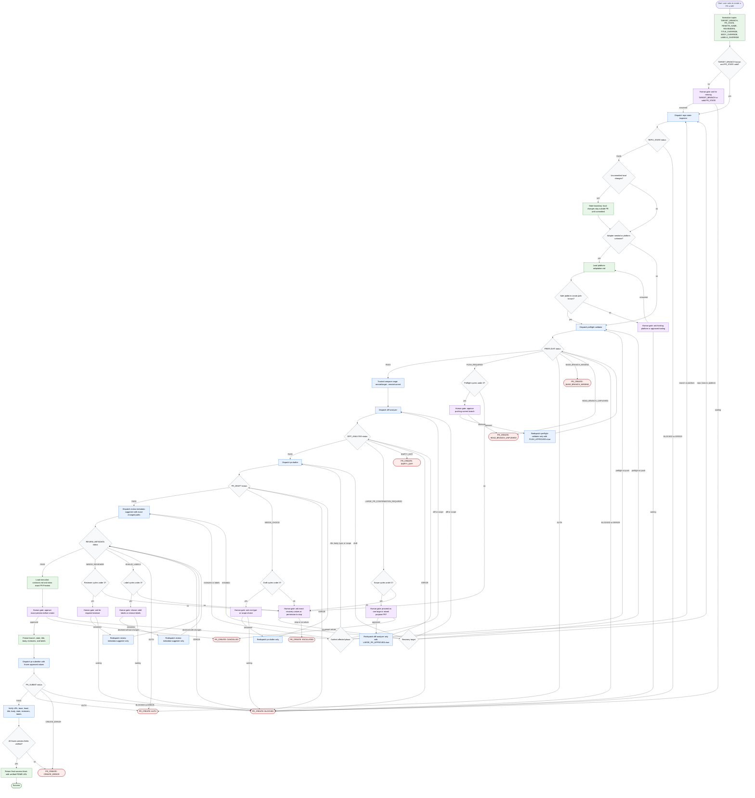

# PR Creator Workflow

The `pr-creator` skill is a pull request creation orchestrator. It may inspect repository state, validate remote comparability, analyze a trusted remote diff, draft a title and body, resolve reviewers and labels, show an exact preview, and create a PR or MR only after explicit approval. Its trust model is compact subagent status blocks, recorded remote facts, comparable remote refs, exact changed-file paths, platform-valid metadata, and frozen preview fields.



```text
PR Preview
----------
Title:      <title>
Target:     <target_branch>
Source:     <current_branch>
Reviewers:  <reviewer list>
Labels:     <label list or "none">
Status:     <draft or ready>

Description:
<description>
```

Readiness rule: dispatch `pr-submitter` only after `REPO_STATE: PASS`, a safe platform path, `PREFLIGHT: PASS`, `DIFF_ANALYSIS: PASS`, `PR_DRAFT: PASS`, `REVIEW_METADATA: PASS`, exact preview approval, and frozen approved preview fields. Return success only after verifying URL, base, head, title, body, state, reviewers, and labels against the frozen preview.

## Run Report

- Run mode and scope: new, whole skill workflow.
- Assumptions: `DOCS_DIR` defaulted to `docs/`; target slug resolved to `pr-creator`.
- Repair cycles used: 0.
- Mermaid validation method: inspected-only. `generate-flow-diagram/scripts/check-mermaid.sh` was run, but no `mmdc` or `npx` parser was available in this environment.
- Dispatch method: inline, because delegated agent work was not explicitly requested by the user.
- External sources fetched: none for diagram construction; local `pr-creator` files were sufficient.

## Source Grounding

- `skills/pr-creator/SKILL.md`: inputs, progressive loading map, subagent registry, workflow, status routing, core rules, and output contract.
- `skills/pr-creator/flow-diagram.md`: existing whole-workflow node coverage, human gates, failure envelope rule, and readiness rule.
- `skills/pr-creator/references/execution-contracts.md`: preview template, failure envelope, final success output, cycle recovery rule, and body template.
- `skills/pr-creator/references/platform-adaptation.md`: GitLab, Bitbucket, GitHub Enterprise, unknown platform handling, field mapping, and failure mapping.
- `skills/pr-creator/subagents/*.md` and `skills/pr-creator/references/contracts/*.md`: routeable subagent statuses, required inputs, outputs, and escalation behavior.
