# Prompt Structurer Workflow

Prompt Structurer is a portable orchestration skill that converts prose prompts into compact XML prompt contracts. It may read the target prompt, optional run style, suite context, terminology, and revision request; it may load bundled subagents and references just in time; it may fetch at most one targeted URL only when source-backed current rationale is needed and permitted. It returns final XML plus assembly notes, or a routeable terminal status when missing input, contradictions, pass failures, runtime errors, or repair exhaustion prevent completion.

```mermaid
flowchart TD
  START([Start: prompt structuring request]) --> INTAKE["Capture PROMPT_TEXT, RUN_STYLE, SUITE_CONTEXT, TERMINOLOGY, and CHANGE_REQUEST"]
  INTAKE --> PROMPT_READY{"PROMPT_TEXT present?"}
  PROMPT_READY -->|no| BLOCKED_PROMPT([BLOCKED: missing required PROMPT_TEXT])
  PROMPT_READY -->|yes| SOURCE_TRUTH["Treat supplied prompt inputs as source of truth"]
  SOURCE_TRUTH --> CONTRADICTION{"Contradictions change task meaning?"}
  CONTRADICTION -->|yes| FAIL_CLARIFY([FAIL: ask smallest targeted clarification])
  CONTRADICTION -->|no| LOCAL_FIRST["Use bundled references first and preserve progressive loading"]

  LOCAL_FIRST --> SOURCE_NEED{"Current or source-backed external rationale needed?"}
  SOURCE_NEED -->|no| LOCAL_ONLY["Record LOCAL_ONLY"]
  SOURCE_NEED -->|yes| LOCAL_SUFFICIENT{"Local references sufficient?"}
  LOCAL_SUFFICIENT -->|yes| LOCAL_ONLY
  LOCAL_SUFFICIENT -->|no| NETWORK_OK{"Network available and permitted?"}
  NETWORK_OK -->|yes| FETCH_ONE["Fetch one targeted URL and record it"]
  NETWORK_OK -->|no| RATIONALE_OMITTED["Record RATIONALE_OMITTED"]
  LOCAL_ONLY --> SELECT_REV
  FETCH_ONE --> SELECT_REV
  RATIONALE_OMITTED --> SELECT_REV

  SELECT_REV{"CHANGE_REQUEST targets existing XML prompt?"}
  SELECT_REV -->|yes| REVISION["Flow: revision"]
  SELECT_REV -->|no| SELECT_SUITE{"SUITE_CONTEXT governs conventions?"}
  SELECT_SUITE -->|yes| SUITE["Flow: suite"]
  SELECT_SUITE -->|no| SELECT_FULL{"Multi-phase, autonomous, safety-sensitive, or repeatedly failing?"}
  SELECT_FULL -->|yes| FULL["Flow: full"]
  SELECT_FULL -->|no| LIGHT["Flow: light"]

  LIGHT --> P1L["Dispatch pass 1: semantic-decomposer"]
  P1L --> P6L["Dispatch pass 6: xml-prompt-assembler with omission reasons"]

  SUITE --> SUITE_CONTEXT["Pass suite terminology, tags, constraints, tone, and output conventions into every pass"]
  SUITE_CONTEXT --> P1F
  FULL --> P1F["Dispatch pass 1: semantic-decomposer"]
  P1F --> P2F["Dispatch pass 2: philosophy-constraints-classifier"]
  P2F --> P3F["Dispatch pass 3: implicit-behavior-surfacer"]
  P3F --> P4F["Dispatch pass 4: anti-pattern-synthesizer"]
  P4F --> P5F["Dispatch pass 5: success-criteria-builder"]
  P5F --> P6F["Dispatch pass 6: xml-prompt-assembler"]

  REVISION --> BASELINE_READY{"Existing XML prompt and baseline content sufficient?"}
  BASELINE_READY -->|no| BLOCKED_BASE([BLOCKED: missing revision baseline])
  BASELINE_READY -->|yes| CHANGE_SCOPE{"CHANGE_REQUEST in scope and meaning-preserving?"}
  CHANGE_SCOPE -->|no| BLOCKED_SCOPE([BLOCKED or FAIL: revision changes task meaning])
  CHANGE_SCOPE -->|yes| AFFECTED_RANGE["Identify affected pass range and upstream prerequisites"]
  AFFECTED_RANGE --> PREREQS_READY{"Required upstream outputs available?"}
  PREREQS_READY -->|no| RERUN_PREREQS["Rerun missing prerequisites and downstream affected passes"]
  PREREQS_READY -->|yes| RERUN_AFFECTED["Rerun affected passes and preserve unaffected sections"]
  RERUN_PREREQS --> RERUN_AFFECTED
  RERUN_AFFECTED --> P6R["Dispatch pass 6: xml-prompt-assembler for revision"]

  P6L --> ROUTE_STATUS
  P6F --> ROUTE_STATUS
  P6R --> ROUTE_STATUS
  ROUTE_STATUS{"Any dispatched pass returned BLOCKED, FAIL, or ERROR?"}
  ROUTE_STATUS -->|BLOCKED| BLOCKED_PASS([BLOCKED: ask smallest useful question])
  ROUTE_STATUS -->|FAIL| FAIL_PASS([FAIL: source conflict prevents assembly])
  ROUTE_STATUS -->|ERROR| ERROR_PASS([ERROR: unexpected tool or runtime failure])
  ROUTE_STATUS -->|none| VALIDATE["Check run-level success criteria and removal test"]

  VALIDATE --> CRITERIA_PASS{"Criteria pass?"}
  CRITERIA_PASS -->|yes| FINAL_OUTPUT["Return final XML prompt first, then assembly notes"]
  FINAL_OUTPUT --> PASS_DONE([PASS])
  CRITERIA_PASS -->|no| REPAIR_LEFT{"Repair cycle available?"}
  REPAIR_LEFT -->|no| REPAIR_NEEDED([REPAIR_NEEDED after three fix cycles])
  REPAIR_LEFT -->|yes| MAP_FAILURE["Map failed criterion to earliest affected pass"]
  MAP_FAILURE --> REPAIR_SCOPE["Rerun that pass and downstream dependencies; preserve unaffected sections"]
  REPAIR_SCOPE --> ROUTE_STATUS

  classDef decision fill:#f8f9fa,stroke:#495057,color:#000;
  classDef check fill:#e7f1ff,stroke:#0b5ed7,color:#000;
  classDef output fill:#e8f5e9,stroke:#2e7d32,color:#000;
  classDef success fill:#e8f5e9,stroke:#2e7d32,color:#000;
  classDef refine fill:#fff3cd,stroke:#856404,color:#000;
  classDef stop fill:#fdecea,stroke:#b02a37,color:#000;
  classDef source fill:#f1f3f5,stroke:#495057,color:#000;

  class PROMPT_READY,CONTRADICTION,SOURCE_NEED,LOCAL_SUFFICIENT,NETWORK_OK,SELECT_REV,SELECT_SUITE,SELECT_FULL,BASELINE_READY,CHANGE_SCOPE,PREREQS_READY,ROUTE_STATUS,CRITERIA_PASS,REPAIR_LEFT decision;
  class INTAKE,SOURCE_TRUTH,LOCAL_FIRST,LIGHT,SUITE,FULL,SUITE_CONTEXT,P1L,P6L,P1F,P2F,P3F,P4F,P5F,P6F,REVISION,AFFECTED_RANGE,RERUN_PREREQS,RERUN_AFFECTED,P6R,VALIDATE,MAP_FAILURE,REPAIR_SCOPE check;
  class LOCAL_ONLY,FETCH_ONE,RATIONALE_OMITTED source;
  class FINAL_OUTPUT output;
  class PASS_DONE success;
  class BLOCKED_PROMPT,FAIL_CLARIFY,BLOCKED_BASE,BLOCKED_SCOPE,BLOCKED_PASS,FAIL_PASS,ERROR_PASS stop;
  class REPAIR_NEEDED refine;
```

Readiness rule: return `PASS` only after the XML prompt is assembled, internal `RESULT: PASS` has been stripped from the user-facing response, and run-level criteria pass. Return `BLOCKED`, `FAIL`, `ERROR`, or `REPAIR_NEEDED` when the corresponding source-defined terminal condition prevents a final contract.

## Run Report

- Run mode and scope: new, whole workflow diagram for `skills/prompt-structurer`.
- Assumptions: `DOCS_DIR` is `docs/`; the target slug is `prompt-structurer`; no suite context or revision request applies to this documentation run.
- Repair cycles used: 0.
- Mermaid validation method: inspected-only; `skills/generate-flow-diagram/scripts/check-mermaid.sh` was run and returned `parser unavailable` because neither `mmdc` nor `npx` was available.
- Dispatch method: inline execution of the `generate-flow-diagram` builder and reviewer instructions.
- External sources fetched: none for diagram construction.
- Decompose approval path: n/a.
- Mirror/lockfile follow-up disclosed: n/a.
