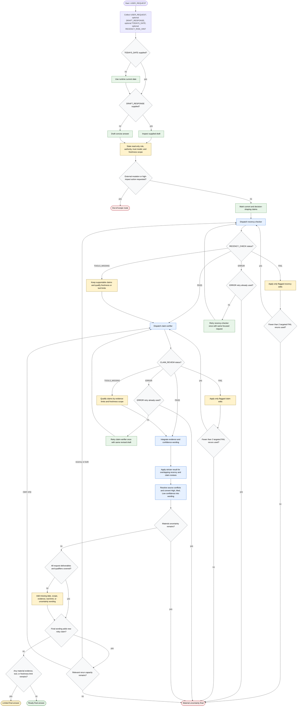

# Recency Guard Workflow

Recency Guard is a read-only response-validation workflow for answers that depend on current external facts. The orchestrator may inspect or draft an answer, route focused verification to `recency-checker` and `claim-verifier`, apply only flagged edits within repair limits, and return a user-visible final answer rather than a default audit report.

Readiness rule: Return the user-visible final answer, not a verification report, unless the user asks for verification details. The final answer must carry date, scope, evidence, tool-limit, or uncertainty wording whenever those limits materially affect action.

Repair rule: Each subagent gets one initial review plus at most two targeted FAIL reruns. Each subagent also gets one separate ERROR retry. Exhausted repair capacity or a repeated ERROR yields a material uncertainty final.

## Run Report

- Run mode and scope: new, whole workflow.
- Assumptions: `TODAYS_DATE` defaults to the runtime current date when omitted; helper-skill pass dispatch was executed inline because no user-requested subagent delegation was authorized in this session.
- Repair cycles used: 0.
- Mermaid validation method: inspected-only (parser unavailable in this environment).
- Dispatch method: inline.
- External sources fetched: none for diagram construction; local target and helper-skill files were sufficient.
- Source grounding: `skills/recency-guard/SKILL.md`, `skills/recency-guard/flow-diagram.md`, both target subagents, and all target references.
