# Refactoring Code Workflow

This diagram documents the `refactoring-code` skill as a behavior-preserving refactoring orchestrator for one required `TARGET_PATH`. The orchestrator may inspect code, route subagents, select reference and validation gates, apply approved refactor edits through the implementer, and run review-controlled fix cycles. It must stop rather than change observable behavior, public API, test intent, state assumptions, unrelated worktree changes, destructive validation, public web use, or file-size waivers outside the approved boundary.

```mermaid
flowchart TD
  START([Start: user asks for refactor]) --> INPUTS["Collect TARGET_PATH, USER_GOAL, TEST_COMMAND, SCOPE_LIMITS, MAX_LINES, REFERENCE_NEED"]
  INPUTS --> TARGET{TARGET_PATH specific and inspectable?}
  TARGET -->|no| ASK_TARGET["Ask one focused target-path question"]
  ASK_TARGET --> NEEDS_TARGET([Status: NEEDS_CLARIFICATION])
  TARGET -->|yes| BOUNDARY["Set one-target behavior-preserving boundary"]

  BOUNDARY --> MAP["Dispatch behavior-mapper"]
  MAP --> MAP_STATUS{BEHAVIOR_MAP status}
  MAP_STATUS -->|NEEDS_CLARIFICATION| MAP_ASK["Return mapper question"]
  MAP_ASK --> NEEDS_MAP([Status: NEEDS_CLARIFICATION])
  MAP_STATUS -->|ERROR| ERROR_MAP([Status: ERROR])
  MAP_STATUS -->|PASS or NO_CHANGE_CANDIDATE| MAP_REPORT["Receive behavior facts, risks, validation option, file sizes"]

  MAP_REPORT --> REF_DECIDE["Resolve REFERENCE_NEED and reference status"]
  REF_DECIDE --> PUBLIC_REF{Concrete public reference needed?}
  PUBLIC_REF -->|no| REF_READY["Reference status: not needed or bundled-local-only"]
  PUBLIC_REF -->|yes| WEB_OK{Public web allowed?}
  WEB_OK -->|yes| FETCH["Fetch smallest matching URL set"]
  WEB_OK -->|no| WEB_GATE["Ask before public web fetch"]
  WEB_GATE --> WEB_APPROVAL{User approves?}
  WEB_APPROVAL -->|approved| FETCH
  WEB_APPROVAL -->|declined| REF_DECLINED["Reference declined"]
  FETCH --> FETCH_OK{Useful source available?}
  FETCH_OK -->|yes| REF_FETCHED["Reference status: fetched"]
  FETCH_OK -->|no| REF_UNAVAILABLE["Reference unavailable"]
  REF_DECLINED --> SAFE_DECLINED{Safe from local evidence?}
  REF_UNAVAILABLE --> SAFE_UNAVAILABLE{Safe from local evidence?}
  SAFE_DECLINED -->|yes| REF_DECLINED_SAFE["Reference status: declined-but-safe"]
  SAFE_DECLINED -->|no| BLOCK_REF([Status: BLOCKED])
  SAFE_UNAVAILABLE -->|yes| REF_UNAVAILABLE_SAFE["Reference status: unavailable-but-safe"]
  SAFE_UNAVAILABLE -->|no| BLOCK_REF

  REF_READY --> STRATEGY
  REF_FETCHED --> STRATEGY
  REF_DECLINED_SAFE --> STRATEGY
  REF_UNAVAILABLE_SAFE --> STRATEGY
  STRATEGY["Dispatch refactor-strategist"]
  STRATEGY --> STRATEGY_STATUS{STRATEGY status}
  STRATEGY_STATUS -->|NO_CHANGE| NO_CHANGE([Status: NO_CHANGE])
  STRATEGY_STATUS -->|NEEDS_CLARIFICATION| STRATEGY_ASK["Return smallest strategy decision"]
  STRATEGY_ASK --> NEEDS_STRATEGY([Status: NEEDS_CLARIFICATION])
  STRATEGY_STATUS -->|ERROR| ERROR_STRATEGY([Status: ERROR])
  STRATEGY_STATUS -->|PASS| PLAN_REPORT["Receive diagnosis, minimal plan, size plan, non-goals, validation expectations"]

  PLAN_REPORT --> DRIFT{Plan needs behavior, API, test-intent, scope, state, or unrelated worktree change?}
  DRIFT -->|yes| BLOCK_SCOPE([Status: BLOCKED])
  DRIFT -->|no| WAIVER{File-size waiver recorded?}
  WAIVER -->|yes| WAIVER_GATE["Ask approval for waiver"]
  WAIVER_GATE --> WAIVER_APPROVED{User approves?}
  WAIVER_APPROVED -->|declined| BLOCK_SIZE([Status: BLOCKED])
  WAIVER_APPROVED -->|approved| VALIDATE_SELECT
  WAIVER -->|no| VALIDATE_SELECT["Choose validation contract"]

  VALIDATE_SELECT --> VALIDATION_SAFE{Safe validation command available?}
  VALIDATION_SAFE -->|no| VALIDATION_WARN["Record validation warning"]
  VALIDATION_WARN --> IMPLEMENT
  VALIDATION_SAFE -->|yes| VALIDATION_MUTATES{Command destructive or state-mutating?}
  VALIDATION_MUTATES -->|yes| VALIDATION_GATE["Ask approval for validation command"]
  VALIDATION_GATE --> VALIDATION_APPROVED{User approves?}
  VALIDATION_APPROVED -->|declined| BLOCK_VALIDATION([Status: BLOCKED])
  VALIDATION_APPROVED -->|approved| IMPLEMENT
  VALIDATION_MUTATES -->|no| IMPLEMENT

  IMPLEMENT["Dispatch refactor-implementer"]
  IMPLEMENT --> IMPLEMENT_STATUS{IMPLEMENTATION status}
  IMPLEMENT_STATUS -->|BLOCKED| BLOCK_IMPLEMENT([Status: BLOCKED])
  IMPLEMENT_STATUS -->|ERROR| ERROR_IMPLEMENT([Status: ERROR])
  IMPLEMENT_STATUS -->|PASS or PASS_WITH_WARNINGS| IMPLEMENT_REPORT["Receive changes, behavior preservation, sizes, validation summary, deviations"]

  IMPLEMENT_REPORT --> REVIEW["Dispatch refactor-reviewer"]
  REVIEW --> REVIEW_STATUS{REFACTOR_REVIEW status}
  REVIEW_STATUS -->|ERROR| ERROR_REVIEW([Status: ERROR])
  REVIEW_STATUS -->|PASS| HANDOFF["Build PASS handoff with behavior, diagnosis, changes, validation, review, size, improvements"]
  HANDOFF --> PASS([Status: PASS])
  REVIEW_STATUS -->|FAIL| FIX_COUNT{Fewer than two fix cycles used?}
  FIX_COUNT -->|no| BLOCK_FIX_LIMIT([Status: BLOCKED])
  FIX_COUNT -->|yes| FIX_SCOPE{Required fix stays behavior-preserving and inside approved strategy?}
  FIX_SCOPE -->|no| BLOCK_FIX_SCOPE([Status: BLOCKED])
  FIX_SCOPE -->|yes| FIX_WAIVER{Fix needs new file-size waiver?}
  FIX_WAIVER -->|yes| FIX_WAIVER_GATE["Ask approval for fix waiver"]
  FIX_WAIVER_GATE --> FIX_WAIVER_APPROVED{User approves?}
  FIX_WAIVER_APPROVED -->|declined| BLOCK_FIX_SIZE([Status: BLOCKED])
  FIX_WAIVER_APPROVED -->|approved| FIX_CONTRACT["Update validation contract for targeted fixes"]
  FIX_WAIVER -->|no| FIX_CONTRACT
  FIX_CONTRACT --> IMPLEMENT

  class TARGET,MAP_STATUS,PUBLIC_REF,WEB_OK,WEB_APPROVAL,FETCH_OK,SAFE_DECLINED,SAFE_UNAVAILABLE,STRATEGY_STATUS,DRIFT,WAIVER,WAIVER_APPROVED,VALIDATION_SAFE,VALIDATION_MUTATES,VALIDATION_APPROVED,IMPLEMENT_STATUS,REVIEW_STATUS,FIX_COUNT,FIX_SCOPE,FIX_WAIVER,FIX_WAIVER_APPROVED decision;
  class MAP,MAP_REPORT,REF_DECIDE,FETCH,STRATEGY,PLAN_REPORT,VALIDATE_SELECT,VALIDATION_WARN,IMPLEMENT,IMPLEMENT_REPORT,REVIEW,FIX_CONTRACT check;
  class WEB_GATE,WAIVER_GATE,VALIDATION_GATE,FIX_WAIVER_GATE human;
  class HANDOFF output;
  class PASS success;
  class ASK_TARGET,MAP_ASK,STRATEGY_ASK refine;
  class NEEDS_TARGET,NEEDS_MAP,ERROR_MAP,BLOCK_REF,NO_CHANGE,NEEDS_STRATEGY,ERROR_STRATEGY,BLOCK_SCOPE,BLOCK_SIZE,BLOCK_VALIDATION,BLOCK_IMPLEMENT,ERROR_IMPLEMENT,ERROR_REVIEW,BLOCK_FIX_LIMIT,BLOCK_FIX_SCOPE,BLOCK_FIX_SIZE stop;

  classDef decision fill:#f8f9fa,stroke:#495057,color:#000;
  classDef check fill:#e7f1ff,stroke:#0b5ed7,color:#000;
  classDef human fill:#f3e8ff,stroke:#6f42c1,color:#000;
  classDef output fill:#e8f5e9,stroke:#2e7d32,color:#000;
  classDef success fill:#e8f5e9,stroke:#2e7d32,color:#000;
  classDef refine fill:#fff3cd,stroke:#856404,color:#000;
  classDef stop fill:#fdecea,stroke:#b02a37,color:#000;
```



```text
Final handoff shape:
Status: PASS | NO_CHANGE | NEEDS_CLARIFICATION | BLOCKED | ERROR

PASS sections:
1. Current behavior summary
2. Design diagnosis focused on current problems only
3. Code changes made, including file splits and new file locations
4. Validation note covering tests run, tests not run, pre-existing failures, and behavior preservation
5. Review outcome and remaining risks
6. File-size compliance summary against MAX_LINES
7. Brief improvement summary

Non-PASS sections:
- Smallest stopping reason
- Next decision needed
- Validation already completed
- Remaining risks
```

Readiness rule: return `Status: PASS` only after implementation has completed or recorded validation according to the selected validation contract and `refactor-reviewer` has returned `REFACTOR_REVIEW: PASS`.

## Run Report

- Run mode and scope: `new`, whole workflow, documenting `skills/refactoring-code`.
- Assumptions: none beyond the skill's own default `MAX_LINES=250` and one-target-cycle rule.
- Repair cycles used: 0.
- Mermaid validation method: inspected-only; the bundled checker was invoked, but no Mermaid parser (`mmdc` or `npx`) was available in this environment.
- Dispatch method: inline, using `generate-flow-diagram` builder and reviewer instructions.
- External sources fetched: none for diagram construction; local helper references were sufficient.
- Decompose approval path: n/a.
- Mirror/lockfile follow-up disclosed: n/a.
