# refine-task documentation workflow

This diagram documents the actual `refine-task` workflow as defined in `skills/refine-task`. The coordinator is reviewer-only: it normalizes Jira or GitHub item inputs, applies tracker mutation and posting gates, dispatches exactly one `refinement-reviewer`, and returns or posts only the reviewer-provided refinement comment when every posting prerequisite passes. The detailed reviewer inspects evidence, applies readiness checks, gates sensitive recommendations, validates the comment, and returns compact routeable fields.

```mermaid
flowchart TD
  START([Start: user asks to refine or review a Jira or GitHub work item]) --> INPUTS["Capture ITEM_URL, ITEM_CONTEXT, WRITE_MODE, and HUMAN_APPROVALS"]
  INPUTS --> SOURCE{"Source item or usable context exists?"}
  SOURCE -->|no| ASK_SOURCE["Ask one concise question for ITEM_URL or usable context"]
  ASK_SOURCE --> BLOCKED_SOURCE([Mode: Blocked; Status: Blocked])
  SOURCE -->|yes| INTENT["Normalize write intent as draft, post-comment, or unknown"]

  INTENT --> MUTATION_ONLY{"Mutation-only request?"}
  MUTATION_ONLY -->|yes| DEFERRED([Mode: Deferred; Status: Not actionable])
  MUTATION_ONLY -->|no| POST_INTENT{"WRITE_MODE is post-comment?"}
  POST_INTENT -->|no| SAFE_DRAFT["Use safe draft path for draft or unknown intent"]
  POST_INTENT -->|yes| POST_READY{"Posting authorization and tooling clear?"}
  POST_READY -->|no| ASK_POST["Ask one concise posting authorization or tooling question"]
  ASK_POST --> BLOCKED_POST([Mode: Blocked; Status: Blocked])
  POST_READY -->|yes| EVIDENCE
  SAFE_DRAFT --> EVIDENCE["Collect compact source and evidence pointers"]

  EVIDENCE --> MEANINGFUL{"Enough evidence for meaningful review?"}
  MEANINGFUL -->|no| BLOCKED_EVIDENCE([Mode: Blocked; Status: Blocked])
  MEANINGFUL -->|yes| OPTIONAL{"Optional linked evidence accessible?"}
  OPTIONAL -->|yes| PASS_POINTERS["Pass available issue, comment, child-item, linked-doc, and code pointers"]
  OPTIONAL -->|no| MISSING_EVIDENCE["Record missing optional evidence as readiness gap"]
  PASS_POINTERS --> DISPATCH["Dispatch exactly one refinement-reviewer"]
  MISSING_EVIDENCE --> DISPATCH

  subgraph REVIEWER["refinement-reviewer"]
    RV_ENTRY["Receive compact source pointers, intent, approvals, and reference paths"] --> RV_POLICY["Load reviewer-policy.md for boundaries, gates, and phase order"]
    RV_POLICY --> RV_SNAPSHOT["Build compact source snapshot and missing-evidence list"]
    RV_SNAPSHOT --> RV_CHECKS["Load refinement-checks.md and run readiness checks"]
    RV_CHECKS --> RV_CAN_CONTINUE{"Can review continue safely?"}
    RV_CAN_CONTINUE -->|blocked| RV_BLOCKED["Return REVIEW=BLOCKED with reason and recovery action"]
    RV_CAN_CONTINUE -->|error| RV_ERROR["Return REVIEW=ERROR with no-post recovery action"]
    RV_CAN_CONTINUE -->|yes| RV_TECH{"Technical claim requires verification?"}
    RV_TECH -->|yes| RV_VERIFY["Verify against trusted docs or codebase evidence"]
    RV_TECH -->|no| RV_SYNTHESIS["Synthesize facts, assumptions, gaps, risks, contradictions, split or spike signals"]
    RV_VERIFY --> RV_SYNTHESIS
    RV_SYNTHESIS --> RV_STATUS["Select REVIEW_STATUS: Ready, Needs refinement, Needs split, Needs spike, Blocked, or Not actionable"]
    RV_STATUS --> RV_GATE{"Sensitive recommendation needs approval?"}
    RV_GATE -->|approved| RV_INCLUDE["Include approved recommendation as advisory"]
    RV_GATE -->|missing or declined| RV_NEUTRAL["Use neutral question or defer recommendation"]
    RV_GATE -->|no| RV_TEMPLATE
    RV_INCLUDE --> RV_TEMPLATE["Load comment-template.md and assemble one comment or draft"]
    RV_NEUTRAL --> RV_TEMPLATE
    RV_TEMPLATE --> RV_QUALITY["Load review-quality-checklist.md"]
    RV_QUALITY --> RV_PASS{"Quality checklist passes?"}
    RV_PASS -->|yes| RV_DONE["Return REVIEW=PASS, REVIEW_STATUS, POST_ALLOWED, Comment mode, summary, comment, validation"]
    RV_PASS -->|no| RV_FIX{"Fix cycles used under 3?"}
    RV_FIX -->|yes| RV_TARGET_FIX["Revise only failed checklist area"]
    RV_TARGET_FIX --> RV_QUALITY
    RV_FIX -->|no| RV_FAIL["Return REVIEW=FAIL with failed criteria, safest draft, POST_ALLOWED=no"]
  end

  DISPATCH --> RV_ENTRY
  RV_DONE --> RETAIN["Coordinator retains compact reviewer fields and final comment only"]
  RV_BLOCKED --> RETAIN
  RV_ERROR --> RETAIN
  RV_FAIL --> RETAIN

  RETAIN --> REVIEW_STATE{"Reviewer state?"}
  REVIEW_STATE -->|REVIEW=BLOCKED| OUT_BLOCKED([Mode: Blocked; Status: Blocked])
  REVIEW_STATE -->|REVIEW=ERROR| OUT_ERROR([Mode: Blocked; Status: Blocked])
  REVIEW_STATE -->|REVIEW=FAIL| OUT_FAIL([Mode: Draft; Status: Needs refinement])
  REVIEW_STATE -->|REVIEW=PASS| OUTPUT_PATH{"Output path"}

  OUTPUT_PATH -->|draft or unknown| COMMENT_MODE{"Comment mode is Ready to post?"}
  COMMENT_MODE -->|yes| OUT_READY([Mode: Ready to post])
  COMMENT_MODE -->|no| OUT_DRAFT([Mode: Draft])
  OUTPUT_PATH -->|post-comment| POST_GATE{"May attempt post?"}
  POST_GATE -->|POST_ALLOWED=yes and tooling authorized| POST_ONCE["Attempt one post of exact reviewer comment"]
  POST_GATE -->|posting unavailable| OUT_READY
  POST_GATE -->|not authorized or not allowed| OUT_REVIEWER_MODE([Return reviewer Mode, Status, and Comment])
  POST_ONCE --> POST_RESULT{"Post result?"}
  POST_RESULT -->|success| OUT_POSTED([Mode: Posted])
  POST_RESULT -->|failure but comment safe| OUT_READY
  POST_RESULT -->|failure blocks safe posting| OUT_POST_FAIL([Mode: Blocked; Status: Blocked])

  classDef decision fill:#f8f9fa,stroke:#495057,color:#000;
  classDef check fill:#e7f1ff,stroke:#0b5ed7,color:#000;
  classDef human fill:#f3e8ff,stroke:#6f42c1,color:#000;
  classDef output fill:#e8f5e9,stroke:#2e7d32,color:#000;
  classDef stop fill:#fdecea,stroke:#b02a37,color:#000;
  classDef refine fill:#fff3cd,stroke:#856404,color:#000;

  class SOURCE,MUTATION_ONLY,POST_INTENT,POST_READY,MEANINGFUL,OPTIONAL,RV_CAN_CONTINUE,RV_TECH,RV_GATE,RV_PASS,RV_FIX,REVIEW_STATE,OUTPUT_PATH,COMMENT_MODE,POST_GATE,POST_RESULT decision;
  class RV_POLICY,RV_CHECKS,RV_VERIFY,RV_QUALITY,RV_TARGET_FIX check;
  class ASK_SOURCE,ASK_POST human;
  class OUT_READY,OUT_DRAFT,OUT_POSTED,OUT_REVIEWER_MODE output;
  class BLOCKED_SOURCE,BLOCKED_POST,BLOCKED_EVIDENCE,RV_BLOCKED,RV_ERROR,RV_FAIL,OUT_BLOCKED,OUT_ERROR,OUT_FAIL,OUT_POST_FAIL stop;
  class DEFERRED,MISSING_EVIDENCE refine;
```



Readiness rule: `REVIEW=PASS` means the reviewer workflow produced a checklist-valid output. It does not mean the item is ready to implement. The item readiness lives in `REVIEW_STATUS`, which may be `Ready`, `Needs refinement`, `Needs split`, `Needs spike`, `Blocked`, or `Not actionable`.

Posting rule: posting requires explicit `WRITE_MODE=post-comment`, clear authorization, available tooling, reviewer `REVIEW=PASS`, `POST_ALLOWED=yes`, and a successful one-time post of the exact returned comment. A failed post is not retried and does not authorize any other tracker mutation.

Output contract:

```text
Refinement review complete.
Mode: Draft | Ready to post | Posted | Blocked | Deferred
Status: Ready | Needs refinement | Needs split | Needs spike | Blocked | Not actionable
Comment: <final comment or draft>
```

## Run Report

- Run mode and scope: new diagram, whole `refine-task` workflow.
- Assumptions: no runtime-specific posting connector is named by the skill; posting availability is checked at run time.
- Repair cycles used: 0.
- Mermaid validation method: inspected-only; `skills/generate-flow-diagram/scripts/check-mermaid.sh` was run, but its parser dependency was unavailable in this workspace.
- Dispatch method: inline.
- External sources fetched: none for diagram construction; target local sources were used.
- Decompose approval path: n/a.
- Mirror/lockfile follow-up disclosed: n/a.

## Source Grounding

| Diagram area | Target source |
| --- | --- |
| Coordinator role, inputs, write-mode routing, output contract, and coordinator validation | `skills/refine-task/SKILL.md` |
| Reviewer input contract, review states, detailed phase order, output format, escalation, and example output | `skills/refine-task/subagents/refinement-reviewer.md` |
| Reviewer-only boundary, posting boundary, human gates, phase order, readiness rule, and autonomy rule | `skills/refine-task/references/reviewer-policy.md` |
| Readiness checks, technical claim verification, split and spike signals, and evidence discipline | `skills/refine-task/references/refinement-checks.md` |
| Required comment sections and status definitions | `skills/refine-task/references/comment-template.md` |
| Checklist validation and targeted fix loop | `skills/refine-task/references/review-quality-checklist.md` |
| Existing detailed package workflow used as a comparison source | `skills/refine-task/flow-diagram.md` |
