# Responding to PR Review Comments

This diagram describes the `responding-to-pr-review-comments` skill as defined in its package. The orchestrator may normalize inputs, dispatch focused subagents, ask bounded user questions, write or sync the verified local Markdown report, and optionally post exact approved replies. It does not edit code or invent unsupported posting targets. GitHub posting is a sensitive side effect and occurs only after an exact final preview is explicitly approved.

```mermaid
flowchart TD
  START([Start]) --> INTAKE["Normalize PR_URL, defaults, comment scope, language style, responder login, and OUTPUT_FILE"]
  INTAKE --> PR_OK{"PR_URL present and unambiguous?"}
  PR_OK -->|no| ASK_PR["Ask focused PR_URL question, max 3 cycles"]
  ASK_PR --> INTAKE
  PR_OK -->|yes| PATH_OK{"OUTPUT_FILE safe and resolved before report write?"}
  PATH_OK -->|no| ASK_PATH["Ask focused safe-path question, max 3 cycles"]
  ASK_PATH --> INTAKE
  PATH_OK -->|yes| COLLECT["Dispatch review-comment-collector"]

  COLLECT --> COLLECT_STATUS{"COLLECT status"}
  COLLECT_STATUS -->|AUTH| AUTH([PR_COMMENT_RESPONSE: AUTH])
  COLLECT_STATUS -->|NOT_FOUND| NOT_FOUND([PR_COMMENT_RESPONSE: NOT_FOUND])
  COLLECT_STATUS -->|NO_COMMENTS| NO_COMMENTS([PR_COMMENT_RESPONSE: NO_COMMENTS])
  COLLECT_STATUS -->|ERROR| RESPONSE_ERROR([PR_COMMENT_RESPONSE: RESPONSE_ERROR])
  COLLECT_STATUS -->|PASS| COMPLETE{"Collection complete or explicit limitation recorded?"}
  COMPLETE -->|no, repair unused| COLLECT_REPAIR["Redispatch collector once for pagination or metadata repair"]
  COLLECT_REPAIR --> COLLECT
  COMPLETE -->|no, repair used| RESPONSE_ERROR
  COMPLETE -->|yes| TAXONOMY["Normalize target taxonomy and reply disposition"]

  TAXONOMY --> TARGET_SUPPORTED{"Supported top-level review-comment root?"}
  TARGET_SUPPORTED -->|yes| THREAD_STATE{"Thread state and responder history"}
  TARGET_SUPPORTED -->|review summary| UNSUPPORTED["Preserve requires-user-choice:review-summary"]
  TARGET_SUPPORTED -->|issue or PR comment| UNSUPPORTED_ISSUE["Preserve requires-user-choice:issue-comment"]
  TARGET_SUPPORTED -->|reply target unsupported| UNSUPPORTED_REPLY["Preserve requires-user-choice:unsupported-review-reply"]
  TARGET_SUPPORTED -->|unresolved metadata unavailable| UNSUPPORTED_META["Preserve requires-user-choice:unresolved-metadata"]
  THREAD_STATE -->|resolved| SKIP_RESOLVED["Disposition skipped-resolved"]
  THREAD_STATE -->|already replied, no warranted follow-up| SKIP_REPLIED["Disposition skipped-already-replied"]
  THREAD_STATE -->|already replied, follow-up warranted| FOLLOWUP_READY["Disposition follow-up-ready"]
  THREAD_STATE -->|unresolved and no responder reply| REPLY_READY["Disposition reply-ready"]
  UNSUPPORTED --> ASSESS
  UNSUPPORTED_ISSUE --> ASSESS
  UNSUPPORTED_REPLY --> ASSESS
  UNSUPPORTED_META --> ASSESS
  SKIP_RESOLVED --> ASSESS
  SKIP_REPLIED --> ASSESS
  FOLLOWUP_READY --> ASSESS
  REPLY_READY --> ASSESS

  ASSESS["Dispatch review-comment-assessor for reply-ready and follow-up-ready items; preserve report-only items"] --> ASSESS_STATUS{"ASSESS status"}
  ASSESS_STATUS -->|NEEDS_CONTEXT| ASSESS_CONTEXT{"Narrow context redispatch already used?"}
  ASSESS_CONTEXT -->|no| NARROW_LOOKUP["Run one focused lookup and reassess affected items"]
  NARROW_LOOKUP --> ASSESS
  ASSESS_CONTEXT -->|yes| RESPONSE_ERROR
  ASSESS_STATUS -->|NEEDS_USER_DECISION| ASK_DECISION["Ask one focused product, team, target, or source-conflict question, max 3 cycles"]
  ASK_DECISION --> ASSESS
  ASSESS_STATUS -->|ERROR| RESPONSE_ERROR
  ASSESS_STATUS -->|PASS| SOURCE_NEEDED{"Recency-sensitive official source needed?"}

  SOURCE_NEEDED -->|yes| FETCH_SOURCE["Fetch smallest current official source; record claim, URL, date, limitation or conflict"]
  SOURCE_NEEDED -->|no| DRAFT
  FETCH_SOURCE --> SOURCE_OK{"Source supports safe claim?"}
  SOURCE_OK -->|yes| DRAFT
  SOURCE_OK -->|unavailable but claim can be removed or qualified| QUALIFY["Remove or qualify claim"]
  QUALIFY --> DRAFT
  SOURCE_OK -->|conflict needs product or policy decision| NEEDS_DECISION([PR_COMMENT_RESPONSE: NEEDS_USER_DECISION])

  DRAFT["Dispatch reply-drafter"] --> DRAFT_STATUS{"DRAFT status"}
  DRAFT_STATUS -->|NEEDS_USER_DECISION| ASK_WORDING["Ask focused wording or response-choice question, max 3 cycles"]
  ASK_WORDING --> DRAFT
  DRAFT_STATUS -->|ERROR| RESPONSE_ERROR
  DRAFT_STATUS -->|PASS| VERIFY

  VERIFY["Dispatch response-verifier"] --> VERIFY_STATUS{"VERIFY status"}
  VERIFY_STATUS -->|NEEDS_CONTEXT| VERIFY_CONTEXT{"Verification context cycles fewer than 2?"}
  VERIFY_CONTEXT -->|yes| VERIFY_LOOKUP["Repair only named context gap"]
  VERIFY_LOOKUP --> VERIFY
  VERIFY_CONTEXT -->|no| VERIFY_FAIL([PR_COMMENT_RESPONSE: VERIFY_FAIL])
  VERIFY_STATUS -->|FAIL| VERIFY_FIX{"Verification fix cycles fewer than 2?"}
  VERIFY_FIX -->|yes| REPAIR_TARGET["Repair only named collector, assessor, or drafter fix target"]
  REPAIR_TARGET --> VERIFY
  VERIFY_FIX -->|no| VERIFY_FAIL
  VERIFY_STATUS -->|ERROR| RESPONSE_ERROR
  VERIFY_STATUS -->|PASS| PATH_STILL_OK{"OUTPUT_FILE still safe and known?"}

  PATH_STILL_OK -->|no| ASK_PATH
  PATH_STILL_OK -->|yes| WRITE["Dispatch response-report-writer with verified package and posting status"]
  WRITE --> WRITE_STATUS{"WRITE status and read-back"}
  WRITE_STATUS -->|ERROR or read-back fail| WRITE_ERROR([PR_COMMENT_RESPONSE: WRITE_ERROR])
  WRITE_STATUS -->|PASS| POST_MODE{"POSTING_MODE"}
  POST_MODE -->|draft-only| PASS_DRAFT([PR_COMMENT_RESPONSE: PASS, Posting: not-posted])
  POST_MODE -->|post-after-confirmation| PREVIEW["Build exact final preview for supported reply-ready or follow-up-ready targets"]

  PREVIEW --> PREVIEW_OK{"Preview outcome"}
  PREVIEW_OK -->|no supported targets remain| SYNC_NOT_POSTED["Sync report as not-posted with report-only or unsupported reason"]
  PREVIEW_OK -->|auth unavailable or preview error| SYNC_POST_ERROR["Sync report with failed posting outcome"]
  PREVIEW_OK -->|unsupported target detected| CONTRACT_REPAIR{"Unsupported-target repair cycles fewer than 2?"}
  CONTRACT_REPAIR -->|yes| CONTRACT_FIX["Remove unsupported target from poster package, preserve requires-user-choice disposition, redispatch verifier"]
  CONTRACT_FIX --> VERIFY
  CONTRACT_REPAIR -->|no| SYNC_POST_ERROR
  PREVIEW_OK -->|ready| SHOW_PREVIEW["Show exact reply text, target thread, root ID, risks, skipped targets, and draft-only alternative"]

  SHOW_PREVIEW --> APPROVAL{"User approves exact final preview?"}
  APPROVAL -->|declined| SYNC_CANCELLED["Sync report with cancelled posting outcome"]
  APPROVAL -->|needs wording change| DRAFT
  APPROVAL -->|approved| POST["Dispatch thread-reply-poster with exact approved replies"]
  POST --> POST_STATUS{"POST status"}
  POST_STATUS -->|PASS| SYNC_POSTED["Sync report with posted reply IDs and URLs"]
  POST_STATUS -->|AUTH| SYNC_AUTH["Sync report with auth failure"]
  POST_STATUS -->|TARGET_UNSUPPORTED| CONTRACT_REPAIR
  POST_STATUS -->|PREVIEW_REQUIRED| PREVIEW
  POST_STATUS -->|ERROR| SYNC_POST_ERROR

  SYNC_NOT_POSTED --> SYNC_WRITE{"Sync write and read-back pass?"}
  SYNC_POST_ERROR --> SYNC_WRITE
  SYNC_CANCELLED --> SYNC_WRITE
  SYNC_POSTED --> SYNC_WRITE
  SYNC_AUTH --> SYNC_WRITE
  SYNC_WRITE -->|no| WRITE_ERROR
  SYNC_WRITE -->|yes, not posted| PASS_DRAFT
  SYNC_WRITE -->|yes, posted| PASS_POSTED([PR_COMMENT_RESPONSE: PASS, Posting: posted])
  SYNC_WRITE -->|yes, auth| AUTH
  SYNC_WRITE -->|yes, cancelled| CANCELLED([PR_COMMENT_RESPONSE: CANCELLED, Posting: cancelled])
  SYNC_WRITE -->|yes, post error| POST_ERROR([PR_COMMENT_RESPONSE: POST_ERROR])

  classDef decision fill:#f8f9fa,stroke:#495057,color:#000;
  classDef check fill:#e7f1ff,stroke:#0b5ed7,color:#000;
  classDef human fill:#f3e8ff,stroke:#6f42c1,color:#000;
  classDef output fill:#e8f5e9,stroke:#2e7d32,color:#000;
  classDef stop fill:#fdecea,stroke:#b02a37,color:#000;

  class PR_OK,PATH_OK,COLLECT_STATUS,COMPLETE,TARGET_SUPPORTED,THREAD_STATE,ASSESS_STATUS,ASSESS_CONTEXT,SOURCE_NEEDED,SOURCE_OK,DRAFT_STATUS,VERIFY_STATUS,VERIFY_CONTEXT,VERIFY_FIX,PATH_STILL_OK,WRITE_STATUS,POST_MODE,PREVIEW_OK,CONTRACT_REPAIR,APPROVAL,POST_STATUS,SYNC_WRITE decision;
  class INTAKE,COLLECT,COLLECT_REPAIR,TAXONOMY,UNSUPPORTED,UNSUPPORTED_ISSUE,UNSUPPORTED_REPLY,UNSUPPORTED_META,SKIP_RESOLVED,SKIP_REPLIED,FOLLOWUP_READY,REPLY_READY,ASSESS,NARROW_LOOKUP,FETCH_SOURCE,QUALIFY,DRAFT,VERIFY,VERIFY_LOOKUP,REPAIR_TARGET,WRITE,PREVIEW,CONTRACT_FIX,POST,SYNC_NOT_POSTED,SYNC_POST_ERROR,SYNC_CANCELLED,SYNC_POSTED,SYNC_AUTH check;
  class ASK_PR,ASK_PATH,ASK_DECISION,ASK_WORDING,SHOW_PREVIEW human;
  class PASS_DRAFT,PASS_POSTED output;
  class AUTH,NOT_FOUND,NO_COMMENTS,RESPONSE_ERROR,NEEDS_DECISION,VERIFY_FAIL,WRITE_ERROR,CANCELLED,POST_ERROR stop;
```

Readiness rule: the run is complete only after it emits a documented terminal `PR_COMMENT_RESPONSE` envelope. A success envelope requires a verified report path and either `Posting: not-posted` or `Posting: posted`. Any posting, cancellation, auth failure, preview failure, or post failure after report writing must be synced back into the report before the final terminal response.

## Run Report

- Run mode and scope: `new`, whole-skill workflow diagram.
- Assumptions: none beyond the target skill source files.
- Repair cycles used: 0.
- Mermaid validation method: inspected-only; `skills/generate-flow-diagram/scripts/check-mermaid.sh` returned `parser unavailable`.
- Dispatch method: inline fallback using `diagram-builder` and `diagram-quality-reviewer` contracts.
- External sources fetched: none for diagram generation; target source files were authoritative.
- Source grounding: `skills/responding-to-pr-review-comments/SKILL.md`, `flow-diagram.md`, `references/status-contracts.md`, `references/report-template.md`, `references/external-sources.md`, `references/status-examples.md`, and all six target subagent files.
