# Workflow Skill Architect

Workflow Skill Architect converts user-described workflows, existing prompts, or existing skill packages into portable agent-skill artifacts or review reports. Its authority is to clarify, inspect, route, dispatch, synthesize, and validate; package mutation is gated on explicit approval. Local package files are authoritative for behavior, and external sources are optional, just-in-time evidence for current platform syntax or conceptual background.

```mermaid
flowchart TD
  START([Start: workflow skill architecture request]) --> INTAKE["Capture WORKFLOW_OR_STEP, TARGET_RUNTIME, EXISTING_PROMPT, OUTPUT_SCOPE, CONSTRAINTS, and any existing skill directory"]
  INTAKE --> REQUIRED{"Required workflow, step, or existing skill directory available?"}
  REQUIRED -->|no| NEEDS_INPUT([needs_input: ask one concise question])
  REQUIRED -->|yes| DEFAULT_RUNTIME["Default TARGET_RUNTIME to portable Agent Skills when absent"]
  DEFAULT_RUNTIME --> CLASSIFY{"Classify request"}

  CLASSIFY -->|review| REVIEW_PACKET["Build FILES_UNDER_REVIEW, review scope, runtime constraints, and report target"]
  CLASSIFY -->|create| EXISTING_CHECK{"Existing skill directory supplied?"}
  CLASSIFY -->|extend| EXISTING_CHECK
  CLASSIFY -->|refactor| EXISTING_CHECK

  EXISTING_CHECK -->|yes| INSPECT["Inspect local skill files before editing, reviewing, or generating replacements"]
  EXISTING_CHECK -->|no| BOUNDARIES
  INSPECT --> BOUNDARIES["Identify output scope, artifact boundaries, authority, trust model, and mutation limits"]
  REVIEW_PACKET --> REFERENCE_PHASE
  BOUNDARIES --> REFERENCE_PHASE["Load only references justified by the current phase"]

  REFERENCE_PHASE --> STRUCTURE_NEED{"Need structure, template, quality, or external-source policy?"}
  STRUCTURE_NEED -->|structure/contracts| LOAD_STRUCTURE["Load references/skill-structure.md"]
  STRUCTURE_NEED -->|copy-ready output| LOAD_TEMPLATES["Load references/output-templates.md"]
  STRUCTURE_NEED -->|final validation or repair| LOAD_QUALITY["Load references/quality-checklist.md"]
  STRUCTURE_NEED -->|current runtime syntax or platform behavior| LOAD_EXTERNAL_POLICY["Load references/external-sources.md"]
  STRUCTURE_NEED -->|no| PLAN
  LOAD_STRUCTURE --> MORE_REFS{"More current-phase reference need?"}
  LOAD_TEMPLATES --> MORE_REFS
  LOAD_QUALITY --> MORE_REFS
  LOAD_EXTERNAL_POLICY --> EXTERNAL_GATE{"Fetch external source?"}
  MORE_REFS -->|yes| REFERENCE_PHASE
  MORE_REFS -->|no| PLAN

  EXTERNAL_GATE -->|no| PLAN
  EXTERNAL_GATE -->|yes| FETCH["Fetch smallest relevant URL as isolated evidence"]
  FETCH --> FETCH_STATUS{"Source status"}
  FETCH_STATUS -->|available and consistent| PLAN
  FETCH_STATUS -->|unavailable but nonessential| LOCAL_ONLY["Record local-only fallback, assumption, and remaining risk"]
  FETCH_STATUS -->|unsafe or conflicting| SOURCE_BLOCKED([blocked: source risk or user decision required])
  LOCAL_ONLY --> PLAN

  PLAN["Plan smallest correct artifact set or review report"] --> REVIEW_ONLY{"Review-only request?"}
  REVIEW_ONLY -->|yes| REVIEW_DISPATCH["Dispatch definition-reviewer with FILES_UNDER_REVIEW"]
  REVIEW_ONLY -->|no| QUEUE["Derive WORK_ITEM_QUEUE from OUTPUT_SCOPE with item, artifact type, constraints, status, and step-architect context"]
  QUEUE --> QUEUE_EMPTY{"WORK_ITEM_QUEUE empty?"}
  QUEUE_EMPTY -->|yes| EMPTY_MANIFEST["Create empty COLLECTION_MANIFEST and continue to synthesis"]
  QUEUE_EMPTY -->|no| NEXT_ITEM["Select next queued item"]

  NEXT_ITEM --> STEP_DISPATCH["Dispatch step-architect with explicit inputs and artifact boundary"]
  STEP_DISPATCH --> ARCH_STATUS{"ARCHITECTURE status"}
  ARCH_STATUS -->|PASS| MANIFEST["Append files, registry rows, contracts, validation notes, and handoff summary to COLLECTION_MANIFEST"]
  ARCH_STATUS -->|NEEDS_INPUT| STEP_NEEDS_INPUT([needs_input: ask one precise artifact question])
  ARCH_STATUS -->|BLOCKED| STEP_BLOCKED([blocked: runtime detail, source, or boundary unverifiable])
  ARCH_STATUS -->|ERROR| STEP_ERROR([error: unexpected architecture failure])
  MANIFEST --> ITEMS_LEFT{"Queued items remain?"}
  ITEMS_LEFT -->|yes| NEXT_ITEM
  ITEMS_LEFT -->|no| SYNTHESIZE
  EMPTY_MANIFEST --> SYNTHESIZE

  SYNTHESIZE["Synthesize coherent candidate package, integration notes, fetched-source notes, validation summary, and risks"] --> REVIEW_DISPATCH
  REVIEW_DISPATCH --> REVIEW_STATUS{"REVIEW status"}
  REVIEW_STATUS -->|PASS| OUTPUT_KIND{"Request type"}
  REVIEW_STATUS -->|FAIL| REPAIR_LIMIT{"Fewer than three repair cycles used?"}
  REVIEW_STATUS -->|BLOCKED| REVIEW_BLOCKED([blocked: missing file, scope, package fact, or runtime fact])
  REVIEW_STATUS -->|ERROR| REVIEW_ERROR([error: unexpected review failure])

  REPAIR_LIMIT -->|yes| TARGETED_REPAIR["Apply only reviewer-required fixes in approved scope and update COLLECTION_MANIFEST"]
  REPAIR_LIMIT -->|no| REPAIR_BLOCKED([blocked: repair limit reached])
  TARGETED_REPAIR --> REVIEW_DISPATCH

  OUTPUT_KIND -->|review| REVIEW_REPORT["Return review report with verdict, findings, checks, summary, and remaining risks"]
  OUTPUT_KIND -->|create, extend, refactor| MUTATION_REQUEST{"Package mutation requested now?"}
  MUTATION_REQUEST -->|no| FINAL_FILES["Return copy-ready files, integration notes, fetched sources, validation summary, and remaining risks"]
  MUTATION_REQUEST -->|yes| APPROVAL_GATE{"Explicit parent-orchestrator or user approval?"}
  APPROVAL_GATE -->|approved| APPLY_MUTATION["Apply only approved package mutation or hand off approved mutation plan"]
  APPROVAL_GATE -->|declined| FINAL_FILES
  APPROVAL_GATE -->|missing| MUTATION_BLOCKED([blocked: package mutation approval missing])
  APPLY_MUTATION --> FINAL_FILES

  REVIEW_REPORT --> READY([ready])
  FINAL_FILES --> READY

  classDef guard fill:#fff3cd,stroke:#856404,color:#000;
  classDef check fill:#e7f1ff,stroke:#0b5ed7,color:#000;
  classDef decision fill:#f8f9fa,stroke:#495057,color:#000;
  classDef human fill:#f3e8ff,stroke:#6f42c1,color:#000;
  classDef output fill:#e8f5e9,stroke:#2e7d32,color:#000;
  classDef success fill:#e8f5e9,stroke:#2e7d32,color:#000;
  classDef refine fill:#fff3cd,stroke:#856404,color:#000;
  classDef stop fill:#fdecea,stroke:#b02a37,color:#000;

  class DEFAULT_RUNTIME,BOUNDARIES,REFERENCE_PHASE,LOAD_STRUCTURE,LOAD_TEMPLATES,LOAD_QUALITY,LOAD_EXTERNAL_POLICY,LOCAL_ONLY,QUEUE guard;
  class INTAKE,INSPECT,REVIEW_PACKET,PLAN,EMPTY_MANIFEST,NEXT_ITEM,STEP_DISPATCH,MANIFEST,SYNTHESIZE,REVIEW_DISPATCH,TARGETED_REPAIR,APPLY_MUTATION check;
  class REQUIRED,CLASSIFY,EXISTING_CHECK,STRUCTURE_NEED,MORE_REFS,EXTERNAL_GATE,FETCH_STATUS,REVIEW_ONLY,QUEUE_EMPTY,ARCH_STATUS,ITEMS_LEFT,REVIEW_STATUS,REPAIR_LIMIT,OUTPUT_KIND,MUTATION_REQUEST,APPROVAL_GATE decision;
  class NEEDS_INPUT,STEP_NEEDS_INPUT human;
  class TARGETED_REPAIR refine;
  class REVIEW_REPORT,FINAL_FILES output;
  class READY success;
  class SOURCE_BLOCKED,STEP_BLOCKED,STEP_ERROR,REVIEW_BLOCKED,REVIEW_ERROR,REPAIR_BLOCKED,MUTATION_BLOCKED stop;
```

Readiness rule: return final files or a review report only after `definition-reviewer` returns `REVIEW: PASS`. If review fails, repair only the failed checks within approved scope and rerun review for at most three cycles. Package mutation remains blocked until explicit approval is present.

Source basis: this diagram is grounded in `skills/workflow-skill-architect/SKILL.md`, `skills/workflow-skill-architect/flow-diagram.md`, `subagents/step-architect.md`, `subagents/definition-reviewer.md`, and the target skill's bundled references.

Diagram review: checked against the generate-flow-diagram quality gate for one Mermaid block, branch destinations, named decision outcomes, required intake/boundary/validation/output coverage, mutation approval, terminal states, and grounded assumptions.
