# Flow Diagram: Revised analyzing-recent-project-state

Control flow for the improved read-only recent-project-state skill. The
orchestrator normalizes inputs, resolves the base branch exactly once via an
explicit ladder, dispatches a bounded evidence pass, drafting, and
verification to three subagents, and supports ask-and-resume on interactive
channels instead of terminating after a question. Repairs carry the prior
draft plus targeted fixes and are capped at two cycles. Terminal states are
exactly two: a verified report body, or a `RECENT_STATE` envelope
(`NOT_GIT | PATH_ERROR | NEEDS_CONTEXT | ERROR`). The full authoring contract
is in `revised-analyzing-recent-project-state.prompt.md`; the audit rationale
is in `revised-analyzing-recent-project-state.plan.md`.

```mermaid
flowchart TD
  START([Start: analyze recent project state]) --> P1[Phase 1/5: Intake banner; load posture]
  P1 --> NORM[Normalize inputs; out-of-set REVIEW_FOCUS or OUTPUT_DEPTH falls back to defaults with labeled assumption]
  NORM --> PATH{PROJECT_PATH resolvable?}
  PATH -->|provided| LADDER
  PATH -->|missing, workspace is a Git worktree and no other path named| ASSUME[Use workspace; record assumption]
  PATH -->|missing or unclear| QPATH[Ask one targeted path question]
  ASSUME --> LADDER[Resolve BASE_BRANCH once: input -> upstream -> origin/HEAD -> main/master -> none]

  QPATH --> CHANNEL1{Interactive channel and user answers?}
  CHANNEL1 -->|yes| NORM
  CHANNEL1 -->|no| ENV_NEEDS1([RECENT_STATE: NEEDS_CONTEXT])

  LADDER --> AMBIG{Material base ambiguity: two ladder candidates with different merge-bases?}
  AMBIG -->|yes| QBASE[Ask one targeted base question]
  AMBIG -->|no| MUT
  QBASE --> CHANNEL2{Interactive channel and user answers?}
  CHANNEL2 -->|yes| LADDER
  CHANNEL2 -->|no| ENV_NEEDS2([RECENT_STATE: NEEDS_CONTEXT])

  MUT{User also asked for mutation?} -->|yes| CARRY[Stay read-only; carry ask into risks or next actions]
  MUT -->|no| P2
  CARRY --> P2[Phase 2/5: Git evidence banner]

  P2 --> COLLECT[Dispatch git-evidence-collector with resolved base; injection guard active]
  COLLECT --> WINDOW[Bounded evidence window: tree state + BASE..HEAD or last 15 first-parent commits, cap 30; detect repo state; full sanitized command lines; handoff ceiling ~80 lines]
  WINDOW --> GSTAT{GIT_EVIDENCE status}
  GSTAT -->|PASS incl. quiet or abnormal repo state as facts| EVID[Retain compact handoff only]
  GSTAT -->|NOT_GIT| ENV_NOTGIT([RECENT_STATE: NOT_GIT])
  GSTAT -->|PATH_ERROR| ENV_PATH([RECENT_STATE: PATH_ERROR])
  GSTAT -->|NEEDS_CONTEXT, one user decision named| QSUB[Ask-and-resume: ask, then redispatch collector with answer]
  GSTAT -->|ERROR| ENV_ERR1([RECENT_STATE: ERROR])
  GSTAT -->|unroutable output| RETRY1[Redispatch once with format reminder]
  RETRY1 --> GSTAT2{Routable now?}
  GSTAT2 -->|yes| GSTAT
  GSTAT2 -->|no| ENV_ERR2([RECENT_STATE: ERROR])
  QSUB --> CHANNEL3{Interactive channel and user answers?}
  CHANNEL3 -->|yes| COLLECT
  CHANNEL3 -->|no| ENV_NEEDS3([RECENT_STATE: NEEDS_CONTEXT])

  EVID --> P3[Phase 3/5: Snapshot writing banner]
  P3 --> WRITE[Dispatch state-snapshot-writer: evidence + inputs; on repair also TARGETED_FIXES + PRIOR_DRAFT]
  WRITE --> DRAFT[Draft within inspection budget; log Inspected paths; apply focus profile; quiet state uses short-form report]
  DRAFT --> WSTAT{SNAPSHOT_WRITE status}
  WSTAT -->|PASS| KEEP[Retain latest draft + Inspected log; discard superseded draft]
  WSTAT -->|NEEDS_CONTEXT or ERROR| ROUTE_W{One user decision named and channel interactive?}
  ROUTE_W -->|yes| WRITE
  ROUTE_W -->|no| ENV_W([RECENT_STATE: NEEDS_CONTEXT or ERROR])
  WSTAT -->|unroutable output| RETRY2[Redispatch once with format reminder]
  RETRY2 --> WSTAT2{Routable now?}
  WSTAT2 -->|yes| WSTAT
  WSTAT2 -->|no| ENV_ERR3([RECENT_STATE: ERROR])

  KEEP --> P4[Phase 4/5: Verification banner]
  P4 --> VERIFY[Dispatch snapshot-verifier with draft + Inspected log + evidence; spot-check up to 3 claims]
  VERIFY --> COHERE{Verdict coherent? FAIL needs fixes >= 1; PASS needs fixes = 0; blocked-on-user is NEEDS_CONTEXT}
  COHERE -->|no, or unroutable| RETRY3[Redispatch once with format reminder]
  RETRY3 --> COHERE2{Coherent now?}
  COHERE2 -->|yes| VSTAT
  COHERE2 -->|no| ENV_ERR4([RECENT_STATE: ERROR])
  COHERE -->|yes| VSTAT{SNAPSHOT_VERIFY status}
  VSTAT -->|PASS| P5[Phase 5/5: Final response banner]
  VSTAT -->|FAIL, cycles used < 2| FIXES[Retain targeted fixes; reprint Phase 3/5 banner]
  VSTAT -->|FAIL after second cycle| ENV_ERR5([RECENT_STATE: ERROR with remaining fixes])
  VSTAT -->|NEEDS_CONTEXT| ROUTE_V{One user decision named and channel interactive?}
  ROUTE_V -->|yes| VERIFY
  ROUTE_V -->|no| ENV_NEEDS4([RECENT_STATE: NEEDS_CONTEXT])
  VSTAT -->|ERROR| ENV_ERR6([RECENT_STATE: ERROR])
  FIXES --> WRITE

  P5 --> STRIP[Strip status wrappers and Inspected log]
  STRIP --> REPORT[Return verified report body only]
  REPORT --> DONE([Complete: verified report returned])

  classDef decision fill:#f8f9fa,stroke:#495057,color:#000;
  classDef check fill:#e7f1ff,stroke:#0b5ed7,color:#000;
  classDef guard fill:#fff3cd,stroke:#856404,color:#000;
  classDef output fill:#e8f5e9,stroke:#2e7d32,color:#000;
  classDef success fill:#e8f5e9,stroke:#2e7d32,color:#000;
  classDef refine fill:#fff3cd,stroke:#856404,color:#000;
  classDef stop fill:#fdecea,stroke:#b02a37,color:#000;

  class PATH,AMBIG,MUT,GSTAT,GSTAT2,WSTAT,WSTAT2,COHERE,COHERE2,VSTAT,CHANNEL1,CHANNEL2,CHANNEL3,ROUTE_W,ROUTE_V decision;
  class WINDOW,DRAFT,VERIFY,STRIP check;
  class QPATH,QBASE,QSUB,CARRY,ASSUME guard;
  class EVID,KEEP,REPORT output;
  class FIXES,RETRY1,RETRY2,RETRY3 refine;
  class DONE success;
  class ENV_NEEDS1,ENV_NEEDS2,ENV_NEEDS3,ENV_NEEDS4,ENV_NOTGIT,ENV_PATH,ENV_ERR1,ENV_ERR2,ENV_ERR3,ENV_ERR4,ENV_ERR5,ENV_ERR6,ENV_W stop;
```

## Gate and branch summary

| Gate | Question | Pass path | Stop/alternate path |
| ---- | -------- | --------- | ------------------- |
| Path gate | `PROJECT_PATH` resolvable, or workspace safely assumable? | Continue to base ladder | One question (interactive) or `NEEDS_CONTEXT` |
| Base ambiguity gate | Two ladder candidates with different merge-bases? | Use ladder result | One question (interactive) or `NEEDS_CONTEXT` |
| Mutation gate | User asked for mutation? | Carry into report as risk/next action; never execute | — |
| Evidence gate | `GIT_EVIDENCE: PASS` (quiet/abnormal repo states are PASS facts)? | Snapshot writing | `NOT_GIT` / `PATH_ERROR` / ask-and-resume / `ERROR` |
| Write gate | `SNAPSHOT_WRITE: PASS`? | Verification; retain only latest draft | Ask-and-resume or envelope |
| Coherence gate | Verdict matches its own fix list? | Route on status | One format-reminder retry, then `ERROR` |
| Verify gate | `SNAPSHOT_VERIFY: PASS`? | Final response | Repair (≤2 cycles, with `PRIOR_DRAFT`), `NEEDS_CONTEXT`, or `ERROR` |
| Malformed-status rule | Exactly one routable status line present? | Route normally | One redispatch with reminder, then `ERROR`; never guess a status |

## Terminal states

- **Success:** verified `# Project State Snapshot` body, wrappers and
  inspection log stripped.
- **Escalation:** `RECENT_STATE: <NOT_GIT | PATH_ERROR | NEEDS_CONTEXT |
  ERROR>` + `Reason: <one line>` + `Next step: <one clear action>`.

Readiness rule: every material claim in the success output traces to the
evidence handoff, the inspection log, a cited source, or an explicit
inference label; the run was read-only throughout; at most one user question
and two repair cycles were used.
