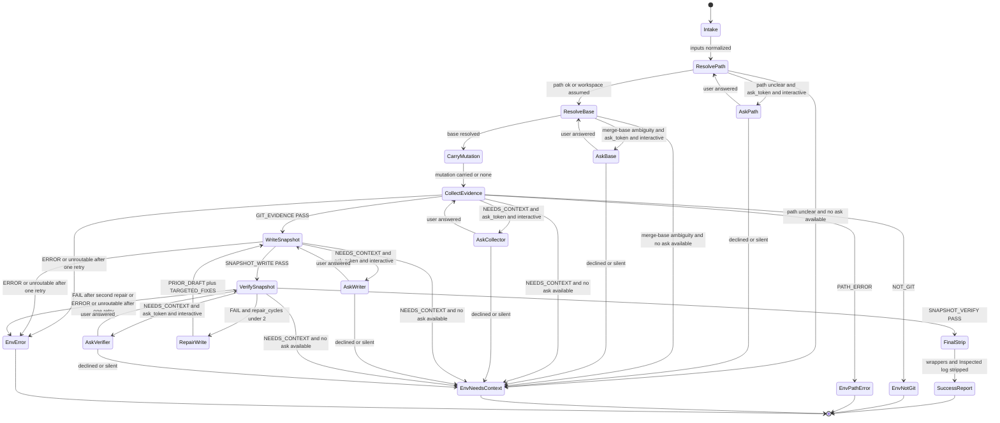

# Flow Diagram

Canonical execution model: finite state machine. Guards and terminals are
tabulated in [`state-machine.md`](./state-machine.md).

## Gate And Branch Summary

| Gate | Guard | Pass path | Stop / alternate |
| ---- | ----- | --------- | ---------------- |
| Path gate | Path resolvable or workspace assumable | `ResolveBase` | `AskPath` if ask token left; else `EnvNeedsContext` |
| Base ambiguity gate | Two ladder candidates, different merge-bases | `CarryMutation` | `AskBase` if ask token left; else `EnvNeedsContext` |
| Ask-budget gate | `ask_token` unused | First interactive ask consumes token | Later `NEEDS_CONTEXT` → envelope |
| Mutation gate | User asked for mutation | Stay read-only; carry into risks / next actions | None |
| Evidence gate | `GIT_EVIDENCE: PASS` | `WriteSnapshot` | `EnvNotGit`, `EnvPathError`, ask, or `EnvError` |
| Write gate | `SNAPSHOT_WRITE: PASS` | `VerifySnapshot` | `NEEDS_CONTEXT` → ask or envelope; `ERROR` → envelope only |
| Verify gate | `SNAPSHOT_VERIFY: PASS` | `FinalStrip` | Repair (cap 2), ask, or `EnvError` |
| Malformed-status rule | Exactly one routable status line | Route on status | One format-reminder redispatch inside the same phase state, then `EnvError` |

## Terminal States

- Success: verified `# Project State Snapshot` body (`SuccessReport`).
- Escalation: `RECENT_STATE: <NOT_GIT | PATH_ERROR | NEEDS_CONTEXT | ERROR>` plus
  `Reason:` and `Next step:` (`EnvNotGit`, `EnvPathError`, `EnvNeedsContext`,
  `EnvError`).
