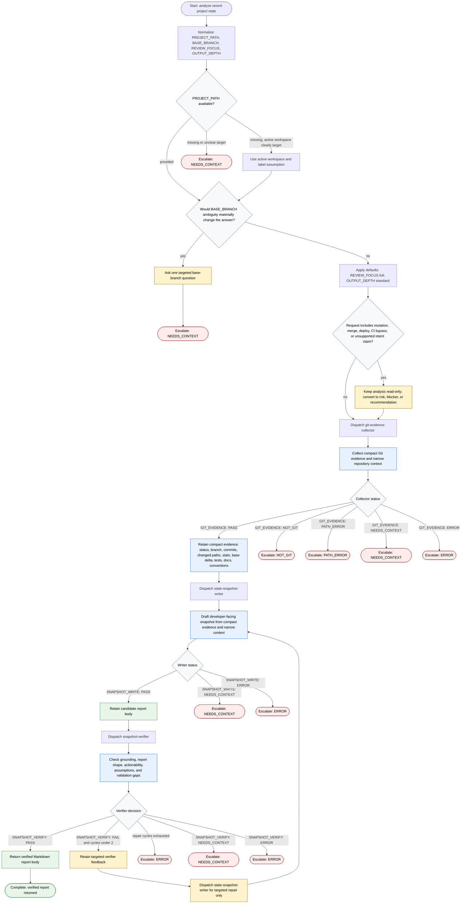

# Analyzing Recent Project State

This read-only orchestration workflow helps a developer continue safely by normalizing the requested scope, collecting compact local Git evidence, drafting a grounded project-state snapshot, and verifying the report before return. The orchestrator controls phase transitions and routes only on explicit `GIT_EVIDENCE`, `SNAPSHOT_WRITE`, and `SNAPSHOT_VERIFY` statuses, while `git-evidence-collector`, `state-snapshot-writer`, and `snapshot-verifier` handle focused evidence collection, drafting, and validation. Local Git state, repository docs, tests, scripts, CI files, and project conventions are primary evidence; external sources are optional, narrow, and only used for concrete local questions. The flow does not merge, deploy, mutate repository contents, bypass CI, or return raw diffs or full command dumps.

Completion rule: return only a verified Markdown report body or a labeled `RECENT_STATE` escalation state: `NOT_GIT`, `PATH_ERROR`, `NEEDS_CONTEXT`, or `ERROR`.

Readiness rule: claims in the final report must be tied to compact Git evidence, narrow repository context, or clearly labeled inference; validation gaps and next actions must stay separate from facts.
