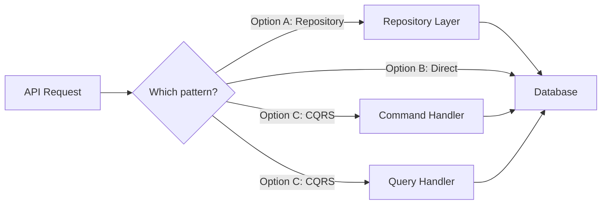

# Clarifying Assumptions

## Purpose

Act as a structured interviewer that walks the user through every open question,
assumption, and decision in the task plan — one at a time. This serves three
goals:

1. **Resolve ambiguity** so downstream execution is unblocked.
2. **Educate the user** on the agent's reasoning so they build understanding of
   the implementation approach and can steer it confidently.
3. **Create a shared mental model** between the agent and user using visual aids
   and interactive prompts.

## Inputs

| Input        | Source              | Required | Example    |
| ------------ | ------------------- | -------- | ---------- |
| `TICKET_KEY` | User / `$ARGUMENTS` | Yes      | `JNS-6065` |

The task plan file must already exist at `docs/<TICKET_KEY>-tasks.md`.

## Output

- An updated task plan file with all resolved answers inlined.
- A decisions log appended to the plan file under `## Decisions Log`.

---

## CRITICAL: Three Execution Rules

These three rules are non-negotiable and override any conflicting behavior.

### Rule 1 — Use interactive tools for EVERY choice

Whenever the user must select from discrete options, you MUST use an interactive
prompt tool (e.g., `ask_user_input`, selection widgets, or any available
interactive input tool). NEVER present options as plain text and ask the user to
type their choice.

**Why:** Reduces friction, eliminates typos, and makes the conversation feel
guided rather than interrogative.

**How to decide which input type:**

| Situation                                     | Input type        |
| --------------------------------------------- | ----------------- |
| Exactly one answer needed from 2–4 options    | Single select     |
| Multiple answers valid from 2–4 options       | Multi select      |
| User must rank/order options by preference    | Rank / prioritize |
| Free-form answer needed (names, descriptions) | Plain text prompt |

When a question has discrete options (even if there's also a free-text
"Other" path), always present the options as an interactive prompt FIRST.
If the user selects "Other" or needs to elaborate, follow up with a plain
text prompt.

### Rule 2 — Illustrate EVERY question with visual context

Before or alongside every question, include at least ONE visual element that
helps the user understand the context. Never present a question as a wall of
text without visual grounding.

**Required visual elements (use at least one per question):**

| Visual type         | When to use                                                   | Format                        |
| ------------------- | ------------------------------------------------------------- | ----------------------------- |
| **Mermaid diagram** | Architecture decisions, data flow choices, dependency impacts | Mermaid code block            |
| **Markdown table**  | Comparing options side by side with trade-offs                | Markdown table                |
| **Code snippet**    | When the question affects specific code, configs, or APIs     | Fenced code block with lang   |
| **Impact map**      | When the answer cascades to multiple tasks                    | Mermaid or table showing flow |
| **Before / after**  | When the answer changes the plan structure                    | Two code blocks or diagrams   |

**How to choose:** Pick the visual that makes the DIFFERENCE between options
most obvious. If comparing API approaches, show code. If comparing architecture
patterns, show a diagram. If comparing trade-offs, show a table.

**Example — architecture decision:**

````markdown
This question affects how data flows between the API and the database:



| Criteria       | Repository pattern   | Direct access      | CQRS               |
| -------------- | -------------------- | ------------------ | ------------------- |
| Complexity     | Medium               | Low                | High               |
| Testability    | High (mockable)      | Low                | High               |
| Fits codebase? | Yes — existing repos | Breaks conventions | Overkill for scope |
````

**Example — code-level decision:**

````markdown
This question affects the error response format in Task 4:

```typescript
// Option A: Flat error response
{ "error": "validation_failed", "message": "Email is required" }

// Option B: Structured error response (matches existing patterns in src/errors/)
{ "error": { "code": "VALIDATION_FAILED", "field": "email", "message": "Email is required" } }
```
````

### Rule 3 — Generate the COMPLETE question manifest UPFRONT

Before asking the first question, you MUST:

1. Read the entire task plan.
2. Extract every item that needs user input.
3. Build the **complete, numbered question manifest** (see Phase 1 below).
4. Present the manifest to the user for review.
5. Get their confirmation before proceeding.

**NEVER generate questions on the fly.** Every question the user will see must
be listed in the manifest BEFORE the first question is asked. This is
non-negotiable.

**Why:** Ad hoc question generation leads to drift, irrelevant questions, and
an unpredictable experience. The manifest creates a contract between the agent
and the user — both sides know exactly what to expect.

**If a user's answer reveals a NEW question:**

- Do NOT ask it immediately.
- Note it explicitly: "Your answer raised a new consideration. I'll add it as
  Question N+1 at the end of our manifest."
- Update the manifest and present the updated version before asking the new
  question.

---

## Execution Steps

### 1. Read and inventory all items to clarify

Read `docs/<TICKET_KEY>-tasks.md` and build an internal list of every item that
needs user input. Categorize them:

| Category                    | Where to find them                                   |
| --------------------------- | ---------------------------------------------------- |
| **Cross-cutting questions** | `## Cross-Cutting Open Questions` section            |
| **Assumptions**             | `## Assumptions and Constraints` section             |
| **Per-task questions**      | `Questions to answer before starting` in each task   |
| **Per-task assumptions**    | Implicit assumptions in `Implementation notes`       |
| **Dependency risks**        | `Dependencies / prerequisites` that seem uncertain   |
| **Validation warnings**     | `## Validation Report` — any WARN or unresolved FAIL |

### 2. Prioritize the list

Order items so that:

1. Unresolved FAILs from the validation report come first (they block execution).
2. Cross-cutting questions come next (they unblock the most tasks).
3. Assumptions that affect architectural decisions come next.
4. Per-task questions follow, ordered by task number.
5. Validation warnings and low-impact confirmations come last.

### 3. Present a brief overview

Before starting questions, give the user a short summary:

```
I've reviewed the task plan for <TICKET_KEY> and found:

- <N> cross-cutting open questions
- <N> assumptions to confirm
- <N> per-task questions
- <N> validation warnings to review

I'll walk through these one at a time, starting with the ones that have the
biggest impact on the overall plan. For each item, I'll explain why it matters
and what the trade-offs are.

Ready? Let's start.
```

### 4. Ask one question at a time

For each item, present it in this format:

```
---

**[<category>]** Question <current>/<total>

**Context:** <1–2 sentences explaining WHERE this came from — which part of the
ticket or plan raised this question.>

**Question:** <The actual question, clearly stated.>

**Why this matters:** <1–2 sentences on the downstream impact. What breaks or
changes depending on the answer?>

**Considerations:**
- **Option A:** <description> — <trade-off>
- **Option B:** <description> — <trade-off>
- **Option C (if applicable):** <description> — <trade-off>

**Current assumption (if any):** <What the plan currently assumes if this
question is left unanswered.>

---

What's your take?
```

### 5. Record each answer

After the user responds:

1. **Acknowledge** their answer briefly (1 sentence).
2. **Note any follow-up implications** — e.g., "Got it — that means Task 3 will
   need to use the REST API instead of GraphQL. I'll update the plan."
3. **Move to the next question.**

If the user says "skip" or "I don't know":

- Record it as unresolved.
- Note the fallback assumption that will be used.
- Move on.

If the user's answer raises a NEW question:

- Add it to the list and note it will be covered.
- Stay on the current flow — don't get sidetracked.

### 6. Update the plan file

After all questions are addressed, update `docs/<TICKET_KEY>-tasks.md`:

#### a. Append a Decisions Log

```markdown
## Decisions Log

> Recorded on: <YYYY-MM-DD HH:MM UTC>

| #   | Category        | Question (short)         | Decision / Answer       | Impact on plan     |
| --- | --------------- | ------------------------ | ----------------------- | ------------------ |
| 1   | Cross-cutting   | Which API version?       | Use v3 REST API         | Tasks 3, 5 updated |
| 2   | Assumption      | Auth method?             | Confirmed: OAuth2       | No change          |
| 3   | Task 4 question | Error handling strategy? | Return 422 with details | Task 4 updated     |
```

#### b. Inline updates

- In the `Assumptions and Constraints` section, mark each assumption as
  `✅ Confirmed` or `❌ Revised: <new assumption>`.
- In each task's `Questions to answer before starting`, replace the question
  with the answer: `~~<question>~~ → <answer>`.
- Update `Implementation notes` if the answer changes the approach.

### 7. Final summary

After all questions are done, present:

```
All done! Here's what we covered:

- <N> questions resolved
- <N> assumptions confirmed
- <N> assumptions revised
- <N> items left unresolved (using fallback assumptions)

The task plan at docs/<TICKET_KEY>-tasks.md has been updated with all decisions.

Key changes to the plan:
- <bullet list of material changes, if any>

You're ready to start execution whenever you like.
```

## Behavioral Rules

- **ONE question at a time.** Never ask two questions in a single message.
- **Be a teacher, not an interrogator.** Explain context and trade-offs so the
  user learns the problem space.
- **Respect "skip".** Don't pressure the user to answer everything.
- **Stay neutral.** Present options fairly. If you have a recommendation, state
  it as "I'd lean toward X because..." not "You should do X."
- **Keep it concise.** Each question block should be readable in under 30
  seconds.
- **Track progress.** Always show `Question <current>/<total>` so the user knows
  how far along they are.
