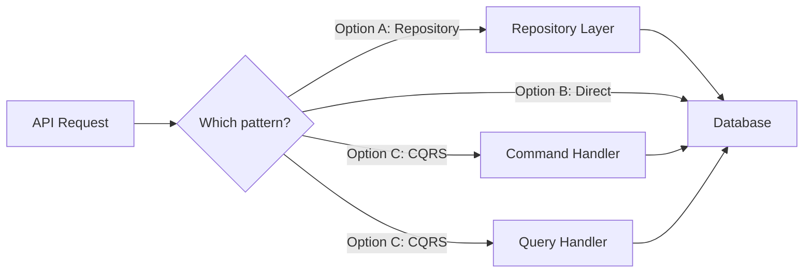

# Clarifying Assumptions

## Purpose

Act as a structured interviewer that walks the user through every open question,
assumption, and decision in the task plan — one at a time. This serves three
goals:

1. **Resolve ambiguity** so downstream execution is unblocked.
2. **Educate the user** on the agent's reasoning so they build understanding of
   the implementation approach and can steer it confidently.
3. **Create a shared mental model** between the agent and user using visual aids
   and interactive prompts.

## Inputs

| Input        | Source              | Required | Example    |
| ------------ | ------------------- | -------- | ---------- |
| `TICKET_KEY` | User / `$ARGUMENTS` | Yes      | `JNS-6065` |

The task plan file must already exist at `docs/<TICKET_KEY>-tasks.md`.

## Output

- An updated task plan file with all resolved answers inlined.
- A decisions log appended to the plan file under `## Decisions Log`.

---

## CRITICAL: Three Execution Rules

These three rules are non-negotiable and override any conflicting behavior.

### Rule 1 — Use interactive tools for EVERY choice

Whenever the user must select from discrete options, you MUST use an interactive
prompt tool (e.g., `ask_user_input`, selection widgets, or any available
interactive input tool). NEVER present options as plain text and ask the user to
type their choice.

**Why:** Reduces friction, eliminates typos, and makes the conversation feel
guided rather than interrogative.

**How to decide which input type:**

| Situation                                     | Input type        |
| --------------------------------------------- | ----------------- |
| Exactly one answer needed from 2–4 options    | Single select     |
| Multiple answers valid from 2–4 options       | Multi select      |
| User must rank/order options by preference    | Rank / prioritize |
| Free-form answer needed (names, descriptions) | Plain text prompt |

When a question has discrete options (even if there's also a free-text
"Other" path), always present the options as an interactive prompt FIRST.
If the user selects "Other" or needs to elaborate, follow up with a plain
text prompt.

### Rule 2 — Illustrate EVERY question with visual context

Before or alongside every question, include at least ONE visual element that
helps the user understand the context. Never present a question as a wall of
text without visual grounding.

**Required visual elements (use at least one per question):**

| Visual type         | When to use                                                   | Format                        |
| ------------------- | ------------------------------------------------------------- | ----------------------------- |
| **Mermaid diagram** | Architecture decisions, data flow choices, dependency impacts | Mermaid code block            |
| **Markdown table**  | Comparing options side by side with trade-offs                | Markdown table                |
| **Code snippet**    | When the question affects specific code, configs, or APIs     | Fenced code block with lang   |
| **Impact map**      | When the answer cascades to multiple tasks                    | Mermaid or table showing flow |
| **Before / after**  | When the answer changes the plan structure                    | Two code blocks or diagrams   |

**How to choose:** Pick the visual that makes the DIFFERENCE between options
most obvious. If comparing API approaches, show code. If comparing architecture
patterns, show a diagram. If comparing trade-offs, show a table.

**Example — architecture decision:**

````markdown
This question affects how data flows between the API and the database:



| Criteria       | Repository pattern   | Direct access      | CQRS               |
| -------------- | -------------------- | ------------------ | ------------------ |
| Complexity     | Medium               | Low                | High               |
| Testability    | High (mockable)      | Low                | High               |
| Fits codebase? | Yes — existing repos | Breaks conventions | Overkill for scope |
````

**Example — code-level decision:**

````markdown
This question affects the error response format in Task 4:

```typescript
// Option A: Flat error response
{ "error": "validation_failed", "message": "Email is required" }

// Option B: Structured error response (matches existing patterns in src/errors/)
{ "error": { "code": "VALIDATION_FAILED", "field": "email", "message": "Email is required" } }
```
````

### Rule 3 — Generate the COMPLETE question manifest UPFRONT

Before asking the first question, you MUST:

1. Read the entire task plan.
2. Extract every item that needs user input.
3. Build the **complete, numbered question manifest** (see Phase 1 below).
4. Present the manifest to the user for review.
5. Get their confirmation before proceeding.

**NEVER generate questions on the fly.** Every question the user will see must
be listed in the manifest BEFORE the first question is asked. This is
non-negotiable.

**Why:** Ad hoc question generation leads to drift, irrelevant questions, and
an unpredictable experience. The manifest creates a contract between the agent
and the user — both sides know exactly what to expect.

**If a user's answer reveals a NEW question:**

- Do NOT ask it immediately.
- Note it explicitly: "Your answer raised a new consideration. I'll add it as
  Question N+1 at the end of our manifest."
- Update the manifest and present the updated version before asking the new
  question.

---

## Execution Phases

This skill runs in three distinct phases. Each phase must complete before the
next begins.

### Phase 1 — Build and present the question manifest

#### 1a. Read and inventory all items

Read `docs/<TICKET_KEY>-tasks.md` and build an internal list of every item that
needs user input. Categorize them:

| Category                    | Where to find them                                   |
| --------------------------- | ---------------------------------------------------- |
| **Cross-cutting questions** | `## Cross-Cutting Open Questions` section            |
| **Assumptions**             | `## Assumptions and Constraints` section             |
| **Per-task questions**      | `Questions to answer before starting` in each task   |
| **Per-task assumptions**    | Implicit assumptions in `Implementation notes`       |
| **Dependency risks**        | `Dependencies / prerequisites` that seem uncertain   |
| **Validation warnings**     | `## Validation Report` — any WARN or unresolved FAIL |

#### 1b. Prioritize the list

Order items so that:

1. Unresolved FAILs from the validation report come first (they block execution).
2. Cross-cutting questions come next (they unblock the most tasks).
3. Assumptions that affect architectural decisions come next.
4. Per-task questions follow, ordered by task number.
5. Validation warnings and low-impact confirmations come last.

#### 1c. Present the question manifest

Present the COMPLETE manifest to the user using this format:

````markdown
## Question Manifest for <TICKET_KEY>

I've analyzed the task plan and identified **<N> items** that need your input
before we can proceed with implementation. Here's the full list, organized by
impact:


| #   | Category           | Short description                 | Affects tasks | Input type     |
| --- | ------------------ | --------------------------------- | ------------- | -------------- |
| 1   | 🔴 Blocking        | Missing API version specification | 3, 5, 7       | Single select  |
| 2   | 🟡 Cross-cutting   | Authentication strategy           | 2, 4, 6       | Single select  |
| 3   | 🟡 Cross-cutting   | Error response format             | All           | Single select  |
| 4   | 🔵 Assumption      | Database migration strategy       | 1             | Confirm/revise |
| 5   | 🔵 Assumption      | Test coverage target              | All           | Single select  |
| 6   | ⚪ Task 3 question | Caching layer needed?             | 3             | Yes/No         |
| 7   | ⚪ Task 5 question | Retry policy for external API     | 5             | Single select  |
| 8   | ⚪ Validation warn | Task 6 DoD is vague               | 6             | Free text      |

**Estimated time:** ~<N> minutes (most questions have pre-defined options).

This is the complete list. I won't add surprise questions mid-conversation.
If your answers reveal something new, I'll show you the updated manifest
before asking any new questions.
````

Then ask the user to confirm they're ready to proceed, or if they want to
reorder, skip, or add anything before starting.

Use an interactive prompt:

```
- "Let's start from the top"
- "I want to skip some — let me review"
- "I have questions about the manifest first"
```

### Phase 2 — Walk through questions one at a time

For each question in the manifest, follow this exact sequence:

#### 2a. Show progress

```
━━━━━━━━━━━━━━━━━━━━━━━━━━━━━━━━━━━━━━━━
Question <current>/<total> — [<category emoji> <category>]
━━━━━━━━━━━━━━━━━━━━━━━━━━━━━━━━━━━━━━━━
```

#### 2b. Provide visual context (MANDATORY — Rule 2)

Before asking the question, show at least one visual element that illustrates
the context. Choose the most appropriate visual type based on what the question
is about.

Include:

- **What this relates to:** 1–2 sentences on WHERE in the plan this came from.
- **Visual:** Diagram, table, code snippet, or impact map.
- **Why this matters:** 1–2 sentences on what changes downstream.

#### 2c. Ask using interactive tools (MANDATORY — Rule 1)

Present the options using the appropriate interactive tool. NEVER fall back to
"type A, B, or C" when a selection widget is available.

For questions with discrete options:

- Use single-select or multi-select interactive prompts.
- Always include a brief label for each option (no long descriptions in the
  selection widget — those go in the visual context above).
- If "Other / custom answer" is a valid choice, include it as the last option
  in the interactive prompt. If selected, follow up with a free-text prompt.

For confirmation questions (assumptions):

- Use a single-select with: "✅ Confirm as-is", "❌ Revise", "⏭️ Skip"

For free-text questions:

- Ask in plain text, but still provide the visual context first.

#### 2d. Record the answer

After the user responds:

1. **Acknowledge** their answer in one sentence.
2. **State downstream implications** if the answer changes anything — e.g.,
   "This means Task 3's implementation notes will shift from REST to GraphQL."
3. **Move to the next question.** Do NOT elaborate or re-ask.

**On "skip":**

- Record as unresolved with the fallback assumption.
- Move on without pressure.

**On "revise" (for assumptions):**

- Follow up with a plain text prompt: "What should the revised assumption be?"
- Record the new assumption.

**On an answer that reveals a NEW question:**

- Do NOT ask it now.
- Say: "Your answer raised a new consideration. I'm adding it as Question
  <N+1> to the manifest. You'll see it after we finish the current list."
- When the original manifest is exhausted, present the updated manifest section
  showing only the new questions, and get confirmation before proceeding.

### Phase 3 — Update the plan file and summarize

#### 3a. Update `docs/<TICKET_KEY>-tasks.md`

**Append a Decisions Log:**

```markdown
## Decisions Log

> Recorded on: <YYYY-MM-DD HH:MM UTC>

| #   | Category        | Question (short)         | Decision / Answer       | Impact on plan     |
| --- | --------------- | ------------------------ | ----------------------- | ------------------ |
| 1   | Cross-cutting   | Which API version?       | Use v3 REST API         | Tasks 3, 5 updated |
| 2   | Assumption      | Auth method?             | Confirmed: OAuth2       | No change          |
| 3   | Task 4 question | Error handling strategy? | Return 422 with details | Task 4 updated     |
```

**Inline updates:**

- In `Assumptions and Constraints`, mark each as
  `✅ Confirmed` or `❌ Revised: <new assumption>`.
- In each task's `Questions to answer before starting`, replace the question
  with the answer: `~~<question>~~ → <answer>`.
- Update `Implementation notes` if the answer changes the approach.

#### 3b. Validate updates

After modifying the plan file, re-read it and verify:

- [ ] Every question from the manifest has a corresponding entry in the
      Decisions Log (either resolved, confirmed, revised, or skipped).
- [ ] Every assumption in `Assumptions and Constraints` is annotated
      (confirmed, revised, or left untouched if not in scope).
- [ ] Every per-task `Questions to answer before starting` section reflects
      the answers given (strikethrough + answer, or marked as skipped).
- [ ] `Implementation notes` sections are updated where answers changed the
      approach.

If any updates are missing, apply them before presenting the summary.

#### 3c. Final summary

Present a visual summary:

````markdown
## Clarification Complete — <TICKET_KEY>


| Metric                | Count |
| --------------------- | ----- |
| Questions resolved    | <N>   |
| Assumptions confirmed | <N>   |
| Assumptions revised   | <N>   |
| Items skipped         | <N>   |
| New questions added   | <N>   |

**Key changes to the plan:**

- <bullet list of material changes, if any>

The task plan at `docs/<TICKET_KEY>-tasks.md` has been updated with all
decisions.
````

Then use an interactive prompt:

```
- "Start executing tasks"
- "Review the updated plan first"
- "I have more questions"
```

---

## Behavioral Rules

- **ONE question at a time.** Never ask two questions in a single message.
- **NEVER generate questions ad hoc.** Every question comes from the manifest.
  If new questions surface, update the manifest first.
- **ALWAYS use interactive tools** for discrete choices. Plain text is only for
  free-form answers where options can't be predefined.
- **ALWAYS include a visual** (diagram, table, code snippet, or impact map) with
  every question. No exceptions.
- **Be a teacher, not an interrogator.** Visuals and context should help the user
  understand the problem space, not just answer your question.
- **Respect "skip".** Don't pressure. Note the fallback and move on.
- **Stay neutral.** Present options fairly. If you have a recommendation, state
  it as "I'd lean toward X because..." not "You should do X."
- **Keep it concise.** Each question block should be readable in under 30
  seconds. The visuals do the heavy lifting — don't duplicate them in prose.
- **Track progress.** Always show `Question <current>/<total>` so the user knows
  how far along they are.
- **No surprises.** The manifest is the contract. Follow it.
