# Clarifying Assumptions Flow

This workflow is the conversation layer for clarifying plan-wide assumptions before execution or critiquing one task before execution. It may load only active-stage guidance, dispatch bundled subagents, ask developer-facing questions one manifest item at a time, keep limited inline state, and present a stable summary. Artifact analysis, manifest assembly, file writes, durable decision logs, re-plan signaling, and blocker recording stay inside bundled subagents.

```mermaid
flowchart TD
  START([Start]) --> INTAKE["Receive TICKET_KEY, MODE, optional TASK_NUMBER, optional ITERATION"]
  INTAKE --> VALIDATE{Required inputs valid?}
  VALIDATE -->|no| INPUT_BLOCKED([Blocked: surface blocking verdict, reason, Critique artifact, Files updated, RE_PLAN_NEEDED, BLOCKERS_PRESENT])
  VALIDATE -->|yes| BOUNDARY["Apply authority, trust model, and mutation limits"]

  BOUNDARY --> MODE_CHECK{MODE?}

  MODE_CHECK -->|upfront| LOAD_UPFRONT["Load design-thinking-mindset and upfront playbook"]
  MODE_CHECK -->|critique| TASK_CHECK{TASK_NUMBER present?}
  MODE_CHECK -->|other| INPUT_BLOCKED

  TASK_CHECK -->|no| INPUT_BLOCKED
  TASK_CHECK -->|yes| LOAD_CRITIQUE["Load design-thinking-mindset and critique playbook"]

  LOAD_UPFRONT --> DISPATCH_ANALYZER["Dispatch critique-analyzer for upfront artifacts"]
  LOAD_CRITIQUE --> DISPATCH_ANALYZER_TASK["Dispatch critique-analyzer for task artifacts"]
  DISPATCH_ANALYZER_TASK --> ANALYZER_VERDICT{Parseable analyzer verdict?}
  DISPATCH_ANALYZER --> ANALYZER_VERDICT

  ANALYZER_VERDICT -->|fail or error| FAIL_SUMMARY([Stop: surface blocking verdict, reason, Critique artifact, Files updated, RE_PLAN_NEEDED, BLOCKERS_PRESENT])
  ANALYZER_VERDICT -->|pass| BUILD_MANIFEST["Dispatch question-manifest-builder"]

  BUILD_MANIFEST --> MANIFEST_READY{Manifest valid?}
  MANIFEST_READY -->|no| FAIL_SUMMARY
  MANIFEST_READY -->|yes| HAS_ITEMS{Current-scope items exist?}

  HAS_ITEMS -->|no| RECORD_ZERO["Dispatch decision-recorder for zero-item completion"]
  HAS_ITEMS -->|yes| LOAD_PROTOCOL["Read conversation-protocol for Stage 4"]

  LOAD_PROTOCOL --> ASK_ONE["Ask one manifest item"]
  ASK_ONE --> HUMAN_GATE{Developer answered or chose allowed option?}

  HUMAN_GATE -->|no| WAIT([Wait: human confirmation required])
  HUMAN_GATE -->|skipped but Tier 3 or non-skippable| ASK_ONE
  HUMAN_GATE -->|blocked answer| RECORD_BLOCKER["Dispatch decision-recorder with blocker"]
  HUMAN_GATE -->|answered| RECORD_DECISION["Dispatch decision-recorder with decision"]

  RECORD_DECISION --> NEW_SCOPE{New current-scope item found?}
  NEW_SCOPE -->|yes| TRACK_LIVE_ITEM["Track live manifest item only under SKILL.md guardrail; subagents own assembly and writes"]
  TRACK_LIVE_ITEM --> ASK_ONE
  NEW_SCOPE -->|no| MORE_ITEMS{More manifest items?}
  MORE_ITEMS -->|yes| ASK_ONE
  MORE_ITEMS -->|no| RECORD_COMPLETE["Dispatch decision-recorder for stable summary"]

  RECORD_ZERO --> SUMMARY_READY["Present required summary fields"]
  RECORD_COMPLETE --> SUMMARY_READY
  RECORD_BLOCKER --> BLOCKED_SUMMARY([Blocked: surface blocking verdict, reason, Critique artifact, Files updated, RE_PLAN_NEEDED, BLOCKERS_PRESENT])

  SUMMARY_READY --> REPLAN{RE_PLAN_NEEDED?}
  REPLAN -->|yes| REPLAN_SUMMARY([Complete: surface Critique artifact, Files updated, RE_PLAN_NEEDED, BLOCKERS_PRESENT])
  REPLAN -->|no| DONE([Complete: surface Critique artifact, Files updated, RE_PLAN_NEEDED, BLOCKERS_PRESENT])

  class VALIDATE,MODE_CHECK,TASK_CHECK,ANALYZER_VERDICT,MANIFEST_READY,HAS_ITEMS,HUMAN_GATE,NEW_SCOPE,MORE_ITEMS,REPLAN decision;
  class BOUNDARY,LOAD_UPFRONT,LOAD_CRITIQUE,LOAD_PROTOCOL check;
  class ASK_ONE,HUMAN_GATE human;
  class DISPATCH_ANALYZER,DISPATCH_ANALYZER_TASK,BUILD_MANIFEST,RECORD_ZERO,RECORD_BLOCKER,RECORD_DECISION,RECORD_COMPLETE output;
  class SUMMARY_READY,DONE,REPLAN_SUMMARY success;
  class INPUT_BLOCKED,FAIL_SUMMARY,BLOCKED_SUMMARY stop;
  class WAIT refine;

  classDef guard fill:#fff3cd,stroke:#856404,color:#000;
  classDef check fill:#e7f1ff,stroke:#0b5ed7,color:#000;
  classDef decision fill:#f8f9fa,stroke:#495057,color:#000;
  classDef human fill:#f3e8ff,stroke:#6f42c1,color:#000;
  classDef output fill:#e8f5e9,stroke:#2e7d32,color:#000;
  classDef success fill:#e8f5e9,stroke:#2e7d32,color:#000;
  classDef refine fill:#fff3cd,stroke:#856404,color:#000;
  classDef stop fill:#fdecea,stroke:#b02a37,color:#000;
```

Readiness rule: the workflow is complete only after decision-recorder returns a parseable result and the conversation layer surfaces `Critique artifact`, `Files updated`, `RE_PLAN_NEEDED`, and `BLOCKERS_PRESENT`. Blocked, fail, and error terminals must also surface the blocking verdict and reason.
