# Committing Scoped Changes

This workflow commits only user-approved scoped changes. The orchestrator normalizes commit authority and path scope, dispatches specialists for state inspection, boundary planning, and commit execution, and asks one targeted user question when required. `CHANGE_PATHS` is the commit allow-list; existing staged changes are evidence to plan around, not permission to commit. The workflow must preserve unrelated work, refresh state after each commit, and never expand scope or leave meaningful in-scope changes uncommitted without user approval.

```mermaid
flowchart TD
  START([Start: user invokes committing-scoped-changes]) --> INTAKE[Normalize inputs: CHANGE_PATHS, context, style, verification hint]
  INTAKE --> HAS_PATHS{CHANGE_PATHS present and unambiguous?}
  HAS_PATHS -->|no| ASK_PATHS[Ask one targeted question for allowed paths]
  ASK_PATHS --> WAIT_PATHS([Needs input: path scope])
  HAS_PATHS -->|yes| AUTH{User asked to create commits?}

  AUTH -->|no| STOP_NO_AUTH([Blocked: no commit request authority])
  AUTH -->|yes| SET_SCOPE[Set COMMIT_REQUEST_CONFIRMED=true and treat CHANGE_PATHS as allow-list]
  SET_SCOPE --> DISPATCH_STATE[Dispatch scoped-state-summarizer for scoped git state and local context]
  DISPATCH_STATE --> STATE_RESULT{SCOPED_STATE result}

  STATE_RESULT -->|NO_SCOPED_CHANGES| NO_CHANGES([NO_SCOPED_CHANGES: report no commit-worthy scoped work])
  STATE_RESULT -->|NEEDS_CONTEXT| ASK_CONTEXT[Ask one targeted context question]
  ASK_CONTEXT --> WAIT_CONTEXT([Needs input: context])
  STATE_RESULT -->|BLOCKED or ERROR| STATE_BLOCKED([Blocked: report state failure contract])
  STATE_RESULT -->|PASS| REF_NEED{Reference need named?}

  REF_NEED -->|yes| LOOKUP_REF[Load external-sources and select only relevant public URL]
  REF_NEED -->|no| PLAN[Dispatch commit-boundary-planner with state facts]
  LOOKUP_REF --> PLAN[Dispatch commit-boundary-planner with selected URL conclusion]

  PLAN --> PLAN_RESULT{COMMIT_PLAN result}
  PLAN_RESULT -->|NEEDS_DECISION| ASK_DECISION[Ask smallest user decision question]
  ASK_DECISION --> WAIT_DECISION([Needs input: decision])
  PLAN_RESULT -->|BLOCKED or ERROR| PLAN_BLOCKED([Blocked: report planning failure contract])
  PLAN_RESULT -->|PASS| APPROVE_GROUPS[Use approved commit groups, messages, and verification checks]

  APPROVE_GROUPS --> SENSITIVE_SCOPE{Plan expands scope or leaves meaningful in-scope changes uncommitted?}
  SENSITIVE_SCOPE -->|yes| HUMAN_SCOPE[Human gate: explain target, reason, risk, safer alternative, approve or decline]
  HUMAN_SCOPE -->|approved| COMMIT_NEXT[Dispatch scoped-commit-executor for next approved group]
  HUMAN_SCOPE -->|declined| SCOPE_DECLINED([Blocked: scope decision declined])
  SENSITIVE_SCOPE -->|no| COMMIT_NEXT[Dispatch scoped-commit-executor for next approved group]

  COMMIT_NEXT --> EXEC_ACTIONS[Executor stages only group paths, reviews staged diff, runs verification, creates commit]
  EXEC_ACTIONS --> EXEC_RESULT{COMMIT_EXECUTE result}
  EXEC_RESULT -->|VERIFY_FAILED| RECOVER{Safe in-scope recovery available and attempts remain?}
  RECOVER -->|yes| COMMIT_NEXT
  RECOVER -->|no| VERIFY_BLOCKED([Blocked: verification failure contract])
  EXEC_RESULT -->|COMMIT_ERROR or ERROR| EXEC_BLOCKED([Blocked: commit execution failure contract])
  EXEC_RESULT -->|PASS| RECORD_SHA[Record commit SHA and verification evidence]

  RECORD_SHA --> REFRESH[Refresh scoped state because hooks, generated files, or concurrent edits may change safety]
  REFRESH --> REMAINING{Remaining scoped changes differ from approved plan?}
  REMAINING -->|yes| PLAN
  REMAINING -->|no| MORE_GROUPS{More approved groups?}
  MORE_GROUPS -->|yes| COMMIT_NEXT
  MORE_GROUPS -->|no| FINAL_REPORT[Load orchestrator report contract and synthesize final report]
  FINAL_REPORT --> DONE([Success: report SHAs, verification, remaining scoped changes, untouched unrelated work])

  classDef guard fill:#fff3cd,stroke:#856404,color:#000;
  classDef check fill:#e7f1ff,stroke:#0b5ed7,color:#000;
  classDef decision fill:#f8f9fa,stroke:#495057,color:#000;
  classDef human fill:#f3e8ff,stroke:#6f42c1,color:#000;
  classDef output fill:#e8f5e9,stroke:#2e7d32,color:#000;
  classDef success fill:#e8f5e9,stroke:#2e7d32,color:#000;
  classDef stop fill:#fdecea,stroke:#b02a37,color:#000;

  class HAS_PATHS,AUTH,STATE_RESULT,REF_NEED,PLAN_RESULT,SENSITIVE_SCOPE,EXEC_RESULT,RECOVER,REMAINING,MORE_GROUPS decision;
  class INTAKE,SET_SCOPE,DISPATCH_STATE,LOOKUP_REF,PLAN,APPROVE_GROUPS,EXEC_ACTIONS,RECORD_SHA,REFRESH check;
  class ASK_PATHS,ASK_CONTEXT,ASK_DECISION,HUMAN_SCOPE human;
  class FINAL_REPORT output;
  class DONE success;
  class WAIT_PATHS,STOP_NO_AUTH,NO_CHANGES,WAIT_CONTEXT,STATE_BLOCKED,WAIT_DECISION,PLAN_BLOCKED,SCOPE_DECLINED,VERIFY_BLOCKED,EXEC_BLOCKED stop;
```

Readiness rule: commit execution is allowed only when `COMMIT_REQUEST_CONFIRMED=true`, `CHANGE_PATHS` is explicit, the planner has approved scoped commit groups, and any required human scope decision has an approve branch.

Final report contract:

| Field | Required Content |
| --- | --- |
| Status | success, `NO_SCOPED_CHANGES`, blocked, error, or failure |
| Commits | SHA and message for each created commit |
| Verification | Checks run and pass/fail outcome |
| Remaining scoped changes | Any in-scope changes not committed and why |
| Untouched unrelated work | Confirmation that unrelated work was preserved |
| Questions or blockers | Only unresolved decisions needed for safe continuation |

Facts:

| Item | Detail |
| --- | --- |
| Authority | The orchestrator normalizes authority and delegates git inspection, staging, verification, and commit creation to specialists. |
| Scope | User-provided `CHANGE_PATHS` is the commit allow-list. |
| Existing staged changes | Treated as facts for planning, not as permission to commit. |
| External sources | Optional and used only when they can change a commit decision. |
