# Committing Scoped Changes

This workflow creates reviewable atomic git commits only after the user explicitly asks to commit. The orchestrator treats `CHANGE_PATHS` as the commit allow-list, preserves unrelated work and index entries, and uses specialist subagents for scoped state inspection, commit boundary planning, execution, and post-commit refresh. Existing staged changes are planning facts, not permission to commit. Scope expansion, intentional in-scope omission, ambiguous inputs, and unsafe recovery require one targeted user decision before mutation continues.

```mermaid
flowchart TD
  START([Start: user invokes committing-scoped-changes]) --> INTAKE[Normalize inputs: CHANGE_PATHS, context, style, verification hint]
  INTAKE --> HAS_PATHS{CHANGE_PATHS present and unambiguous?}
  HAS_PATHS -->|no| ASK_PATHS[Ask one targeted question for allowed paths]
  ASK_PATHS --> WAIT_PATHS([COMMIT_SCOPED_CHANGES: NEEDS_CONTEXT])
  HAS_PATHS -->|yes| AUTH{User explicitly asked to create commits?}

  AUTH -->|no| NO_AUTH([COMMIT_SCOPED_CHANGES: BLOCKED])
  AUTH -->|yes| SET_SCOPE[Set COMMIT_REQUEST_CONFIRMED=true and treat CHANGE_PATHS as allow-list]
  SET_SCOPE --> DISPATCH_STATE[Dispatch scoped-state-summarizer for scoped git state and local context]
  DISPATCH_STATE --> STATE_RESULT{SCOPED_STATE status}

  STATE_RESULT -->|NO_SCOPED_CHANGES| NO_CHANGES([COMMIT_SCOPED_CHANGES: NO_SCOPED_CHANGES])
  STATE_RESULT -->|NEEDS_CONTEXT| ASK_CONTEXT[Ask one targeted context question]
  ASK_CONTEXT --> WAIT_CONTEXT([COMMIT_SCOPED_CHANGES: NEEDS_CONTEXT])
  STATE_RESULT -->|BLOCKED| STATE_BLOCKED([COMMIT_SCOPED_CHANGES: BLOCKED])
  STATE_RESULT -->|ERROR| STATE_ERROR([COMMIT_SCOPED_CHANGES: ERROR])
  STATE_RESULT -->|PASS| REF_NEED{Reference need named?}

  REF_NEED -->|yes| LOOKUP_REF[Load external-sources and select only relevant public URL]
  REF_NEED -->|no| PLAN[Dispatch commit-boundary-planner]
  LOOKUP_REF --> PLAN

  PLAN --> PLAN_RESULT{COMMIT_PLAN status}
  PLAN_RESULT -->|NEEDS_DECISION| ASK_DECISION[Ask smallest user decision question]
  ASK_DECISION --> WAIT_DECISION([COMMIT_SCOPED_CHANGES: NEEDS_CONTEXT])
  PLAN_RESULT -->|BLOCKED| PLAN_BLOCKED([COMMIT_SCOPED_CHANGES: BLOCKED])
  PLAN_RESULT -->|ERROR| PLAN_ERROR([COMMIT_SCOPED_CHANGES: ERROR])
  PLAN_RESULT -->|PASS| APPROVE_GROUPS[Use approved commit groups, messages, and verification checks]

  APPROVE_GROUPS --> G_SCOPE_EXPANSION{G_SCOPE_EXPANSION: plan includes paths outside CHANGE_PATHS?}
  G_SCOPE_EXPANSION -->|yes| HUMAN_EXPAND[Human gate: target extra paths, reason, risk, reversibility, safer alternative]
  HUMAN_EXPAND -->|approved| G_IN_SCOPE_OMISSION
  HUMAN_EXPAND -->|declined| SCOPE_DECLINED([COMMIT_SCOPED_CHANGES: BLOCKED])
  G_SCOPE_EXPANSION -->|no| G_IN_SCOPE_OMISSION{G_IN_SCOPE_OMISSION: meaningful in-scope changes omitted?}

  G_IN_SCOPE_OMISSION -->|yes| HUMAN_OMIT[Human gate: target omitted changes, reason, risk, reversibility, safer alternative]
  HUMAN_OMIT -->|approved| COMMIT_NEXT
  HUMAN_OMIT -->|declined| OMISSION_DECLINED([COMMIT_SCOPED_CHANGES: BLOCKED])
  G_IN_SCOPE_OMISSION -->|no| COMMIT_NEXT[Dispatch scoped-commit-executor for next approved group]

  COMMIT_NEXT --> EXEC_ACTIONS[Executor stages only group paths, reviews staged diff, runs verification, creates commit]
  EXEC_ACTIONS --> EXEC_RESULT{COMMIT_EXECUTE status}
  EXEC_RESULT -->|VERIFY_FAILED| VERIFY_CLASSIFY{Recovery safe, same-scope, same-group, and under 3 attempts?}
  VERIFY_CLASSIFY -->|yes| RETRY_SAME_GROUP[Retry same approved group without expanding scope]
  RETRY_SAME_GROUP --> COMMIT_NEXT
  VERIFY_CLASSIFY -->|no: decision needed| ASK_VERIFY[Ask one targeted recovery decision question]
  ASK_VERIFY --> WAIT_VERIFY([COMMIT_SCOPED_CHANGES: NEEDS_CONTEXT])
  VERIFY_CLASSIFY -->|no: terminal| VERIFY_FAILED([COMMIT_SCOPED_CHANGES: VERIFY_FAILED])
  EXEC_RESULT -->|BLOCKED| EXEC_BLOCKED([COMMIT_SCOPED_CHANGES: BLOCKED])
  EXEC_RESULT -->|COMMIT_ERROR| COMMIT_ERROR([COMMIT_SCOPED_CHANGES: COMMIT_ERROR])
  EXEC_RESULT -->|ERROR| EXEC_ERROR([COMMIT_SCOPED_CHANGES: ERROR])
  EXEC_RESULT -->|PASS| RECORD_SHA[Record commit SHA and verification evidence]

  RECORD_SHA --> REFRESH_STATE[Dispatch scoped-state-summarizer for post-commit refresh]
  REFRESH_STATE --> REFRESH_RESULT{SCOPED_STATE refresh status}
  REFRESH_RESULT -->|NO_SCOPED_CHANGES| FINAL_REPORT
  REFRESH_RESULT -->|NEEDS_CONTEXT| ASK_REFRESH_CONTEXT[Ask one targeted refresh context question]
  ASK_REFRESH_CONTEXT --> WAIT_REFRESH([COMMIT_SCOPED_CHANGES: NEEDS_CONTEXT])
  REFRESH_RESULT -->|BLOCKED| REFRESH_BLOCKED([COMMIT_SCOPED_CHANGES: BLOCKED])
  REFRESH_RESULT -->|ERROR| REFRESH_ERROR([COMMIT_SCOPED_CHANGES: ERROR])
  REFRESH_RESULT -->|PASS| REMAINING{Remaining scoped changes differ from approved plan?}

  REMAINING -->|yes| REF_NEED
  REMAINING -->|no| MORE_GROUPS{More approved groups?}
  MORE_GROUPS -->|yes| COMMIT_NEXT
  MORE_GROUPS -->|no| FINAL_REPORT[Load orchestrator report contract and synthesize final report]
  FINAL_REPORT --> DONE([Success report: SHAs, verification, remaining scoped changes, untouched unrelated work])

  classDef guard fill:#fff3cd,stroke:#856404,color:#000;
  classDef check fill:#e7f1ff,stroke:#0b5ed7,color:#000;
  classDef decision fill:#f8f9fa,stroke:#495057,color:#000;
  classDef human fill:#f3e8ff,stroke:#6f42c1,color:#000;
  classDef output fill:#e8f5e9,stroke:#2e7d32,color:#000;
  classDef stop fill:#fdecea,stroke:#b02a37,color:#000;

  class HAS_PATHS,AUTH,STATE_RESULT,REF_NEED,PLAN_RESULT,EXEC_RESULT,VERIFY_CLASSIFY,REFRESH_RESULT,REMAINING,MORE_GROUPS decision;
  class G_SCOPE_EXPANSION,G_IN_SCOPE_OMISSION guard;
  class INTAKE,SET_SCOPE,DISPATCH_STATE,LOOKUP_REF,PLAN,APPROVE_GROUPS,COMMIT_NEXT,EXEC_ACTIONS,RECORD_SHA,REFRESH_STATE check;
  class ASK_PATHS,ASK_CONTEXT,ASK_DECISION,HUMAN_EXPAND,HUMAN_OMIT,ASK_VERIFY,ASK_REFRESH_CONTEXT human;
  class FINAL_REPORT,DONE output;
  class WAIT_PATHS,NO_AUTH,NO_CHANGES,WAIT_CONTEXT,STATE_BLOCKED,STATE_ERROR,WAIT_DECISION,PLAN_BLOCKED,PLAN_ERROR,SCOPE_DECLINED,OMISSION_DECLINED,WAIT_VERIFY,VERIFY_FAILED,EXEC_BLOCKED,COMMIT_ERROR,EXEC_ERROR,WAIT_REFRESH,REFRESH_BLOCKED,REFRESH_ERROR stop;
```

Readiness rule: proceed only when commit authority is explicit, `CHANGE_PATHS` is unambiguous, planned groups stay within the allow-list or receive explicit approval, and every post-commit refresh confirms the next safe action.

Final report contract: load
[`./references/report-contract-orchestrator.md`](./references/report-contract-orchestrator.md)
after commit execution, post-commit refresh, or terminal failure and use its success or failure
structure as the source of truth.

Facts:

| Item | Detail |
| --- | --- |
| Authority | The orchestrator normalizes authority and delegates git inspection, staging, verification, commit creation, and post-commit refresh to specialists. |
| Scope | User-provided `CHANGE_PATHS` is the commit allow-list. |
| Existing staged changes | Treated as facts for planning, not as permission to commit. |
| External sources | Optional and used only when they can change a commit decision. |

Assumptions:

| Item | Detail |
| --- | --- |
| Commit request | `COMMIT_REQUEST_CONFIRMED=true` is set only after the user asks for commits. |
| Report synthesis | The orchestrator loads the final report contract after commit execution, post-commit refresh, or terminal failure. |

Risks:

| Risk | Mitigation |
| --- | --- |
| Unrelated work could be staged or committed accidentally | Executor stages only approved scoped groups and reviews staged diff before commit. |
| Hooks or generated files can change the worktree | Orchestrator dispatches `scoped-state-summarizer` for post-commit refresh and replans only after `SCOPED_STATE: PASS`. |
| Verification recovery can repeat unsafe actions | Workflow retries only same-scope, same-group recovery under three attempts; otherwise it asks one targeted question or returns `COMMIT_SCOPED_CHANGES: VERIFY_FAILED`. |
| Scope ambiguity can cause unsafe commits | Workflow separates `G_SCOPE_EXPANSION` from `G_IN_SCOPE_OMISSION` and stops for one targeted user question. |

Blockers:

| Blocker | Terminal State |
| --- | --- |
| Missing or ambiguous `CHANGE_PATHS` | `COMMIT_SCOPED_CHANGES: NEEDS_CONTEXT` |
| No user commit request | `COMMIT_SCOPED_CHANGES: BLOCKED` |
| State, planning, verification, commit, or post-commit refresh failure without safe recovery | Exact `COMMIT_SCOPED_CHANGES` status from the terminal node |

Unresolved questions:

| Question | Handling |
| --- | --- |
| Should scope expand beyond `CHANGE_PATHS`? | Use `G_SCOPE_EXPANSION` and ask before expanding. |
| Should meaningful in-scope changes be left uncommitted? | Use `G_IN_SCOPE_OMISSION` and ask before leaving them behind. |
