# Creating GitHub Child Issues

This Phase 4 workflow coordinates `task-issue-creator` for an approved GitHub
task plan. It may create or reconcile GitHub child task issues and update only
`docs/<ISSUE_SLUG>-tasks.md` after caller/user approval; upstream orchestration
normally supplies approval evidence, while standalone direct invocation asks
once and blocks if approval is absent or declined.

```mermaid
flowchart TD
  START([Start: ISSUE_URL received]) --> INPUT{ISSUE_URL present?}
  INPUT -->|no| ORCH_BLOCK_INPUT([TASK_ISSUES: BLOCKED<br/>Validation: NOT_RUN<br/>Parent: UNKNOWN<br/>ISSUE_SLUG: UNKNOWN<br/>Plan file: not updated])
  INPUT -->|yes| DERIVE[Derive OWNER, REPO, PARENT_NUMBER, ISSUE_SLUG, and docs/&lt;ISSUE_SLUG&gt;-tasks.md]

  DERIVE --> APPROVAL_EVIDENCE{Upstream approval evidence supplied?}
  APPROVAL_EVIDENCE -->|yes| DISPATCH[Dispatch task-issue-creator with ISSUE_URL, approved mutation scope, and plan path]
  APPROVAL_EVIDENCE -->|no| STANDALONE{Standalone direct invocation?}
  STANDALONE -->|no| ORCH_BLOCK_APPROVAL
  STANDALONE -->|yes| ASK_APPROVAL[Ask once for explicit GitHub writes and scoped plan-file update approval]
  ASK_APPROVAL --> APPROVAL{Approval granted?}
  APPROVAL -->|declined or absent| ORCH_BLOCK_APPROVAL([TASK_ISSUES: BLOCKED<br/>Validation: NOT_RUN<br/>Derived parent and ISSUE_SLUG when URL is valid<br/>Plan file: not updated])
  APPROVAL -->|approved| DISPATCH

  DISPATCH --> W_START[Worker receives approved GitHub write scope and single plan-file boundary]
  W_START --> PLAN{Plan exists with Tasks and Task headings?}
  PLAN -->|no| W_BLOCK_PLAN[Return TASK_ISSUES: BLOCKED<br/>Validation: NOT_RUN]
  PLAN -->|yes| PARENT{Parent issue verified?}
  PARENT -->|no| W_FAIL_PARENT[Return TASK_ISSUES: FAIL<br/>Validation: NOT_RUN]
  PARENT -->|yes| PARSE[Parse tasks, Decisions Log, existing GitHub Task Issue refs, dependencies, and priorities]

  PARSE --> REFS{Existing refs unsafe or conflicting?}
  REFS -->|yes| W_BLOCK_REFS[Return TASK_ISSUES: BLOCKED<br/>Validation: NOT_RUN]
  REFS -->|no, safe refs or none| MISSING{Any task missing concrete child issue traceability?}
  MISSING -->|no| VALIDATE[Validate existing plan against Phase 4 contract]
  MISSING -->|yes| MODEL{GitHub write model and capability determined?}
  MODEL -->|no| W_FAIL_MODEL[Return TASK_ISSUES: FAIL<br/>Validation: NOT_RUN]
  MODEL -->|yes| NATIVE{Native sub-issues supported?}

  NATIVE -->|yes| CREATE_NATIVE[Create, link, or reuse native sub-issues; retry rate limits once]
  NATIVE -->|no| LINKED{Linked issue fallback supported?}
  LINKED -->|yes| CREATE_LINKED[Create, link, or reuse child task issues; retry rate limits once]
  LINKED -->|no| TASKLIST[Record task-list fallback as intentional degraded traceability]

  CREATE_NATIVE --> WRITE_RESULT{Any create or link failed after retry?}
  CREATE_LINKED --> WRITE_RESULT
  WRITE_RESULT -->|yes| NOT_CREATED[Record Not Created rows and warnings]
  WRITE_RESULT -->|no| UPDATE[Update only docs/&lt;ISSUE_SLUG&gt;-tasks.md idempotently]
  TASKLIST --> UPDATE
  NOT_CREATED --> UPDATE

  UPDATE --> BOUNDARY{Write ledger shows only approved plan file changed?}
  BOUNDARY -->|no| W_FAIL_BOUNDARY[Return TASK_ISSUES: FAIL<br/>Validation: FAIL]
  BOUNDARY -->|yes| VALIDATE
  VALIDATE --> VALID{Validation passes?}
  VALID -->|no| REPAIR[Repair local markdown once without more GitHub writes]
  VALID -->|yes| WARNINGS{Warnings or degraded traceability?}
  REPAIR --> REVALIDATE{Validation passes after repair?}
  REVALIDATE -->|no| W_FAIL_VALIDATE[Return TASK_ISSUES: FAIL<br/>Validation: FAIL]
  REVALIDATE -->|yes| WARNINGS

  WARNINGS -->|no| W_SUMMARY_PASS[Return TASK_ISSUES: PASS<br/>Validation: PASS]
  WARNINGS -->|yes| WARN_KIND{Any Not Created rows?}
  WARN_KIND -->|no, nonfatal warnings or task-list fallback only| W_SUMMARY_WARN_NONFATAL[Return TASK_ISSUES: WARN<br/>Validation: PASS<br/>Nonfatal warnings or degraded task-list traceability]
  WARN_KIND -->|yes| W_SUMMARY_WARN_NOT_CREATED[Return TASK_ISSUES: WARN<br/>Validation: PASS<br/>Not Created rows need manual resolution or rerun before execution selection]
  W_START -->|unexpected tool, filesystem, or environment failure| W_ERROR[Return TASK_ISSUES: ERROR<br/>Validation: NOT_RUN]

  W_BLOCK_PLAN --> RECEIVE[Orchestrator receives structured worker summary]
  W_FAIL_PARENT --> RECEIVE
  W_FAIL_MODEL --> RECEIVE
  W_BLOCK_REFS --> RECEIVE
  W_FAIL_BOUNDARY --> RECEIVE
  W_FAIL_VALIDATE --> RECEIVE
  W_SUMMARY_PASS --> RECEIVE
  W_SUMMARY_WARN_NONFATAL --> RECEIVE
  W_SUMMARY_WARN_NOT_CREATED --> RECEIVE
  W_ERROR --> RECEIVE

  RECEIVE --> ROUTE{Route on TASK_ISSUES and Validation}
  ROUTE -->|PASS + PASS| PASS([TASK_ISSUES: PASS<br/>Validation: PASS<br/>Concrete child issues ready])
  ROUTE -->|WARN + PASS, no Not Created| WARN_NONFATAL([TASK_ISSUES: WARN<br/>Validation: PASS<br/>Linked child issues usable; show nonfatal warnings or degraded task-list traceability])
  ROUTE -->|WARN + PASS, includes Not Created| WARN_NOT_CREATED([TASK_ISSUES: WARN<br/>Validation: PASS<br/>Usable linked child issues remain where present; resolve Not Created before selecting those tasks])
  ROUTE -->|BLOCKED + NOT_RUN| BLOCKED([TASK_ISSUES: BLOCKED<br/>Validation: NOT_RUN<br/>Unsafe to continue])
  ROUTE -->|FAIL + FAIL or NOT_RUN| FAIL([TASK_ISSUES: FAIL<br/>Validation: FAIL or NOT_RUN<br/>Operation failed])
  ROUTE -->|ERROR + NOT_RUN| ERROR([TASK_ISSUES: ERROR<br/>Validation: NOT_RUN<br/>Unexpected failure])

  classDef guard fill:#fff3cd,stroke:#856404,color:#000;
  classDef check fill:#e7f1ff,stroke:#0b5ed7,color:#000;
  classDef decision fill:#f8f9fa,stroke:#495057,color:#000;
  classDef human fill:#f3e8ff,stroke:#6f42c1,color:#000;
  classDef output fill:#e8f5e9,stroke:#2e7d32,color:#000;
  classDef success fill:#e8f5e9,stroke:#2e7d32,color:#000;
  classDef stop fill:#fdecea,stroke:#b02a37,color:#000;

  class INPUT,APPROVAL_EVIDENCE,STANDALONE,APPROVAL,PLAN,PARENT,REFS,MISSING,MODEL,NATIVE,LINKED,WRITE_RESULT,BOUNDARY,VALID,REVALIDATE,WARNINGS,WARN_KIND,ROUTE decision;
  class DERIVE,PARSE,VALIDATE,REPAIR check;
  class ASK_APPROVAL,DISPATCH,CREATE_NATIVE,CREATE_LINKED,TASKLIST,NOT_CREATED,UPDATE guard;
  class APPROVAL_EVIDENCE,STANDALONE,ASK_APPROVAL,APPROVAL human;
  class RECEIVE,W_SUMMARY_PASS,W_SUMMARY_WARN_NONFATAL,W_SUMMARY_WARN_NOT_CREATED output;
  class PASS success;
  class WARN_NONFATAL,WARN_NOT_CREATED output;
  class ORCH_BLOCK_INPUT,ORCH_BLOCK_APPROVAL,W_BLOCK_PLAN,W_FAIL_PARENT,W_FAIL_MODEL,W_BLOCK_REFS,W_FAIL_BOUNDARY,W_FAIL_VALIDATE,W_ERROR,BLOCKED,FAIL,ERROR stop;
```

Readiness rule: report `TASK_ISSUES: PASS` when parent verification,
existing-ref safety, and validation pass, and every task has verified concrete
GitHub issue traceability. Write-model detection, child issue creation, and
scoped plan updates are required only for tasks missing verified traceability
or for local artifact repair. `TASK_ISSUES: WARN` without `Not Created` rows is
usable with visible nonfatal warnings or degraded task-list traceability;
`TASK_ISSUES: WARN` with `Not Created` rows requires caller warning plus manual
resolution or rerun before those tasks are selected for execution.
